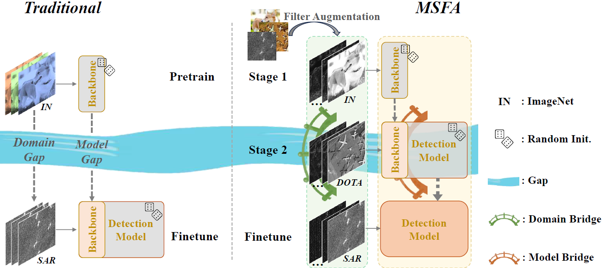
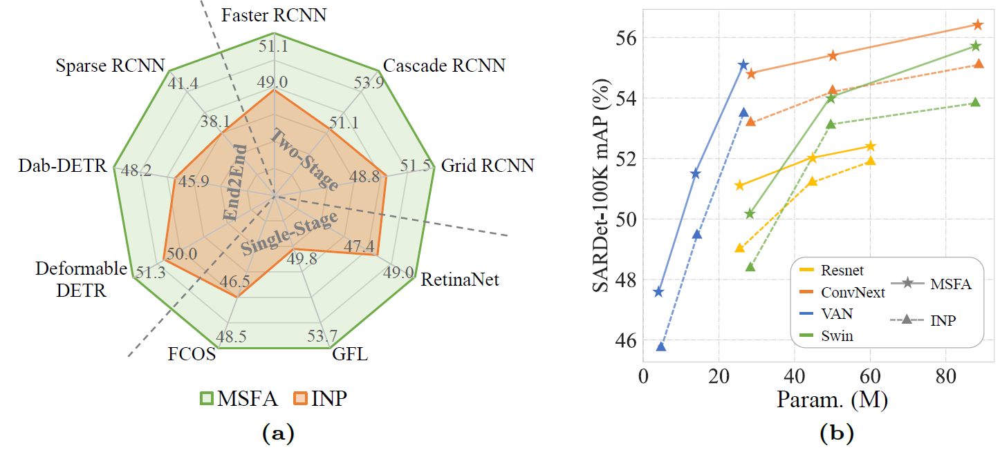

## SARDet-100K: Towards Open-Source Benchmark and ToolKit for Large-Scale SAR Object Detection" at: [https://arxiv.org/pdf/2403.06534.pdf](https://arxiv.org/pdf/2403.06534.pdf)
Yuxuan Li, Xiang Li*, Weijie Li, Qibin Hou, Li Liu, Ming-ming Cheng, Jian Yang*

李宇轩，李翔*，李玮杰，侯淇彬，刘丽，程明明，杨健*

[](https://paperswithcode.com/sota/2d-object-detection-on-sardet-100k?p=sardet-100k-towards-open-source-benchmark-and)




## This repository now supports DenoDet!! ##

"DenoDet: Attention as Deformable Multi-Subspace Feature Denoising for Target Detection in SAR Images" at: [https://arxiv.org/pdf/2406.02833](https://arxiv.org/pdf/2406.02833)

## Abstract

Synthetic Aperture Radar (SAR) object detection has gained significant attention recently due to its irreplaceable all-weather imaging capabilities. However, this research field suffers from both limited public datasets (mostly comprising <2K images with only mono-category objects) and inaccessible source code. To tackle these challenges, we establish a new benchmark dataset and an open-source method for large-scale SAR object detection. Our dataset, SARDet-100K, is a result of intense surveying, collecting, and standardizing 10 existing SAR detection datasets, providing a large-scale and diverse dataset for research purposes. To the best of our knowledge, SARDet-100K is the first COCO-level large-scale multi-class SAR object detection dataset ever created. With this high-quality dataset, we conducted comprehensive experiments and uncovered a crucial challenge in SAR object detection: the substantial disparities between the pretraining on RGB datasets and finetuning on SAR datasets in terms of both data domain and model structure. To bridge these gaps, we propose a novel Multi-Stage with Filter Augmentation (MSFA) pretraining framework that tackles the problems from the perspective of data input, domain transition, and model migration. The proposed MSFA method significantly enhances the performance of SAR object detection models while demonstrating exceptional generalizability and flexibility across diverse models. This work aims to pave the way for further advancements in SAR object detection. 


## Introduction

This repository is the official implementation of Multi-Stage with Filter Augmentation (MSFA) pretraining framework in "SARDet-100K: Towards Open-Source Benchmark and ToolKit for Large-Scale SAR Object Detection" 
at: [https://arxiv.org/pdf/2403.06534.pdf](https://arxiv.org/pdf/2403.06534.pdf)

Filter Augmentation code is placed under ```msfa/models/backbones/MSFA.py```. 
The code about of SARDet-100K dataset is placed under ```msfa/datasets/SAR_Det.py```.
The train/test configure files used in the main paper are placed under ```local_configs```.


## Results and models




<table style="border-collapse: collapse; border: none; border-spacing: 0px;">
	<caption>
		Comparison of different pretrain strategies using Faster-RCNN and Res50 as the detection model.
	</caption>
	<tr>
		<td rowspan="2" style="border-right: 1px solid black; border-bottom: 1px solid black; text-align: center; padding-right: 3pt; padding-left: 3pt;">
			Model Input
		<td colspan="3" style="border-right: 1px solid black; border-bottom: 1px solid black; text-align: center; padding-right: 3pt; padding-left: 3pt;">
			Pretrain
		<td rowspan="2" style="border-bottom: 1px solid black; border-right: 1px solid rgb(0, 0, 0); text-align: center; padding-right: 3pt; padding-left: 3pt;">
			mAP&nbsp;
		<td rowspan="2" style="border-right: 1px solid rgb(0, 0, 0); padding-right: 3pt; padding-left: 3pt;">
			Config
		<td rowspan="2" style="border-left: 1px solid rgb(0, 0, 0); padding-right: 3pt; padding-left: 3pt;">
			Weight
	<tr>
		<td style="border-right: 1px solid black; border-bottom: 1px solid black; text-align: center; padding-right: 3pt; padding-left: 3pt;">
			Multi-stage
		<td style="border-right: 1px solid black; border-bottom: 1px solid black; text-align: center; padding-right: 3pt; padding-left: 3pt;">
			Dataset
		<td style="border-right: 1px solid black; border-bottom: 1px solid black; text-align: center; padding-right: 3pt; padding-left: 3pt;">
			Component
	<tr>
		<td rowspan="4" style="border-right: 1px solid black; border-bottom: 1px solid black; text-align: center; padding-right: 3pt; padding-left: 3pt;">
			SAR
			<br>
			    (Raw pixels)
		<td style="border-right: 1px solid black; border-bottom: 1px solid rgb(0, 0, 0); text-align: center; padding-right: 3pt; padding-left: 3pt;">
			✕
			<br>
		<td style="border-right: 1px solid black; border-bottom: 1px solid black; text-align: center; padding-right: 3pt; padding-left: 3pt;">
			ImageNet
		<td style="border-right: 1px solid black; border-bottom: 1px solid black; text-align: center; padding-right: 3pt; padding-left: 3pt;">
			Backbone
		<td style="border-right: 1px solid rgb(0, 0, 0); text-align: center; padding-right: 3pt; padding-left: 3pt;">
			49.0
		<td style="border-right: 1px solid rgb(0, 0, 0); padding-right: 3pt; padding-left: 3pt;">
            <a href="local_configs\SARDet\r50_IN_sup\fg_frcnn_IN_sup_sar_r50.py"> config </a>
		<td style="border-left: 1px solid rgb(0, 0, 0); padding-right: 3pt; padding-left: 3pt;">
            <a href="https://pan.baidu.com/s/1SuEOl_ImqjoT5Y3pYxZt4w?pwd=c6fo"> weight </a>
	<tr>
		<td style="border-right: 1px solid black; border-bottom: 1px solid black; border-top: 1px solid rgb(0, 0, 0); text-align: center; padding-right: 3pt; padding-left: 3pt;">
			√<wbr>
		<td style="border-right: 1px solid black; border-bottom: 1px solid black; text-align: center; padding-right: 3pt; padding-left: 3pt;">
			ImageNet + DIOR
		<td style="border-right: 1px solid black; border-bottom: 1px solid black; text-align: center; padding-right: 3pt; padding-left: 3pt;">
			Framework
		<td style="border-right: 1px solid rgb(0, 0, 0); text-align: center; padding-right: 3pt; padding-left: 3pt;">
			49.5
		<td style="border-right: 1px solid rgb(0, 0, 0); padding-right: 3pt; padding-left: 3pt;">
            <a href="local_configs\SARDet\r50_dota_pretrain\fg_frcnn_dior_pretrain_sar_r50.py"> config </a>
		<td style="border-left: 1px solid rgb(0, 0, 0); padding-right: 3pt; padding-left: 3pt;">
            <a href="https://pan.baidu.com/s/1SuEOl_ImqjoT5Y3pYxZt4w?pwd=c6fo"> weight </a>
	<tr>
		<td rowspan="2" style="border-right: 1px solid black; border-bottom: 1px solid black; text-align: center; padding-right: 3pt; padding-left: 3pt;">
			√<wbr>
		<td rowspan="2" style="border-right: 1px solid black; border-bottom: 1px solid black; text-align: center; padding-right: 3pt; padding-left: 3pt;">
			ImageNet + DOTA
		<td style="border-right: 1px solid black; text-align: center; padding-right: 3pt; padding-left: 3pt;">
			Backbone
		<td style="border-right: 1px solid rgb(0, 0, 0); text-align: center; padding-right: 3pt; padding-left: 3pt;">
			49.3
		<td style="border-right: 1px solid rgb(0, 0, 0); padding-right: 3pt; padding-left: 3pt;">
            <a href="local_configs\SARDet\r50_dota_backbone_only\fg_frcnn_dota_pretrain_backboneonly_sar_r50.py"> config </a>
		<td style="border-left: 1px solid rgb(0, 0, 0); padding-right: 3pt; padding-left: 3pt;">
            <a href="https://pan.baidu.com/s/1SuEOl_ImqjoT5Y3pYxZt4w?pwd=c6fo"> weight </a>
	<tr>
		<td style="border-right: 1px solid black; border-bottom: 1px solid black; text-align: center; padding-right: 3pt; padding-left: 3pt;">
			Framework
		<td style="border-bottom: 1px solid black; border-right: 1px solid rgb(0, 0, 0); text-align: center; padding-right: 3pt; padding-left: 3pt;">
			<b>50.2</b>
		<td style="border-right: 1px solid rgb(0, 0, 0); padding-right: 3pt; padding-left: 3pt;">
            <a href="local_configs\SARDet\r50_dota_pretrain\fg_frcnn_dota_pretrain_sar_r50.py"> config </a>
		<td style="border-left: 1px solid rgb(0, 0, 0); padding-right: 3pt; padding-left: 3pt;">
            <a href="https://pan.baidu.com/s/1SuEOl_ImqjoT5Y3pYxZt4w?pwd=c6fo"> weight </a>
	<tr>
		<td rowspan="4" style="border-right: 1px solid black; text-align: center; padding-right: 3pt; padding-left: 3pt;">
			SAR+WST
			<br>
			   (Filter Augmented)
		<td style="border-right: 1px solid black; border-bottom: 1px solid black; text-align: center; padding-right: 3pt; padding-left: 3pt;">
			✕<wbr>
		<td style="border-right: 1px solid black; border-bottom: 1px solid black; text-align: center; padding-right: 3pt; padding-left: 3pt;">
			ImageNet
		<td style="border-right: 1px solid black; border-bottom: 1px solid black; text-align: center; padding-right: 3pt; padding-left: 3pt;">
			Backbone
		<td style="border-right: 1px solid rgb(0, 0, 0); text-align: center; padding-right: 3pt; padding-left: 3pt;">
			49.2
		<td style="border-right: 1px solid rgb(0, 0, 0); padding-right: 3pt; padding-left: 3pt;">
            <a href="local_configs\SARDet\r50_IN_sup\fg_frcnn_IN_sup_sar_wavelet_r50.py"> config </a>
		<td style="border-left: 1px solid rgb(0, 0, 0); padding-right: 3pt; padding-left: 3pt;">
            <a href="https://pan.baidu.com/s/1SuEOl_ImqjoT5Y3pYxZt4w?pwd=c6fo"> weight </a>
	<tr>
		<td style="border-right: 1px solid black; border-bottom: 1px solid black; text-align: center; padding-right: 3pt; padding-left: 3pt;">
			√<wbr>
		<td style="border-right: 1px solid black; border-bottom: 1px solid black; text-align: center; padding-right: 3pt; padding-left: 3pt;">
			ImageNet + DIOR
		<td style="border-right: 1px solid black; border-bottom: 1px solid black; text-align: center; padding-right: 3pt; padding-left: 3pt;">
			Framework
		<td style="border-right: 1px solid rgb(0, 0, 0); text-align: center; padding-right: 3pt; padding-left: 3pt;">
			50.1
		<td style="border-right: 1px solid rgb(0, 0, 0); padding-right: 3pt; padding-left: 3pt;">
            <a href="local_configs\SARDet\r50_dota_pretrain\fg_frcnn_dior_pretrain_sar_wavelet_r50.py"> config </a>
		<td style="border-left: 1px solid rgb(0, 0, 0); padding-right: 3pt; padding-left: 3pt;">
            <a href="https://pan.baidu.com/s/1SuEOl_ImqjoT5Y3pYxZt4w?pwd=c6fo"> weight </a>
	<tr>
		<td rowspan="2" style="border-right: 1px solid black; text-align: center; padding-right: 3pt; padding-left: 3pt;">
			√<wbr>
		<td rowspan="2" style="border-right: 1px solid black; text-align: center; padding-right: 3pt; padding-left: 3pt;">
			ImageNet + DOTA
		<td style="border-right: 1px solid black; text-align: center; padding-right: 3pt; padding-left: 3pt;">
			Backbone
		<td style="border-right: 1px solid rgb(0, 0, 0); text-align: center; padding-right: 3pt; padding-left: 3pt;">
			49.6
		<td style="border-right: 1px solid rgb(0, 0, 0); padding-right: 3pt; padding-left: 3pt;">
            <a href="local_configs\SARDet\r50_dota_backbone_only\fg_frcnn_dota_pretrain_backboneonly_sar_wavelet_r50.py"> config </a>
		<td style="border-left: 1px solid rgb(0, 0, 0); padding-right: 3pt; padding-left: 3pt;">
            <a href="https://pan.baidu.com/s/1SuEOl_ImqjoT5Y3pYxZt4w?pwd=c6fo"> weight </a>
	<tr>
		<td style="border-right: 1px solid black; text-align: center; padding-right: 3pt; padding-left: 3pt;">
			Framework
		<td style="border-right: 1px solid rgb(0, 0, 0); text-align: center; padding-right: 3pt; padding-left: 3pt;">
			<b>51.1</b>
		<td style="border-right: 1px solid rgb(0, 0, 0); padding-right: 3pt; padding-left: 3pt;">
            <a href="local_configs\SARDet\r50_dota_pretrain\fg_frcnn_dota_pretrain_sar_wavelet_r50.py"> config </a>
		<td style="border-left: 1px solid rgb(0, 0, 0); padding-right: 3pt; padding-left: 3pt;">
            <a href="https://pan.baidu.com/s/1SuEOl_ImqjoT5Y3pYxZt4w?pwd=c6fo"> weight </a>
</table>


<table style="border-collapse: collapse; border: none; border-spacing: 0px;">
	<caption>
		Generalization of MSFA on different detection frameworks. IMP: Traditional ImageNet Pretrain on backbone network only.
	</caption>
	<tr>
		<td rowspan="2" colspan="2" style="border-right: 1px solid black; border-bottom: 1px solid black; text-align: center; padding-right: 3pt; padding-left: 3pt;">
			Framework
		<td rowspan="2" style="border-right: 1px solid black; border-bottom: 1px solid black; text-align: center; padding-right: 3pt; padding-left: 3pt;">
			Pretrain/Model
		<td colspan="6" style="border-bottom: 1px solid black; border-right: 1px solid rgb(0, 0, 0); text-align: center; padding-right: 3pt; padding-left: 3pt;">
			Test
		<td style="border-right: 1px solid rgb(0, 0, 0); border-bottom: 1px solid rgb(0, 0, 0); padding-right: 3pt; padding-left: 3pt;">
			Config
		<td style="border-bottom: 1px solid rgb(0, 0, 0); padding-right: 3pt; padding-left: 3pt;">
			Weight
	<tr>
		<td style="border-bottom: 1px solid black; text-align: center; padding-right: 3pt; padding-left: 3pt;">
			<b>mAP</b>
		<td style="border-bottom: 1px solid black; padding-right: 3pt; padding-left: 3pt;">
			@50
		<td style="border-bottom: 1px solid black; text-align: center; padding-right: 3pt; padding-left: 3pt;">
			@75
		<td style="border-bottom: 1px solid black; text-align: center; padding-right: 3pt; padding-left: 3pt;">
			@s
		<td style="border-bottom: 1px solid black; text-align: center; padding-right: 3pt; padding-left: 3pt;">
			@m
		<td style="border-bottom: 1px solid black; border-right: 1px solid rgb(0, 0, 0); text-align: center; padding-right: 3pt; padding-left: 3pt;">
			@l
		<td style="border-right: 1px solid rgb(0, 0, 0); border-top: 1px solid rgb(0, 0, 0); padding-right: 3pt; padding-left: 3pt;">
		<td style="border-top: 1px solid rgb(0, 0, 0); padding-right: 3pt; padding-left: 3pt;">
	<tr>
		<td rowspan="6" style="border-right: 1px solid black; border-bottom: 1px solid black; text-align: center; padding-right: 3pt; padding-left: 3pt;">
			Two
			<br>
			    Stage
		<td rowspan="2" style="border-right: 1px solid black; border-bottom: 1px solid black; text-align: center; padding-right: 3pt; padding-left: 3pt;">
			Faster RCNN&nbsp;
		<td style="border-right: 1px solid black; text-align: center; padding-right: 3pt; padding-left: 3pt;">
			IMP
		<td style="padding-right: 3pt; padding-left: 3pt;">
			49.0
		<td style="text-align: center; padding-right: 3pt; padding-left: 3pt;">
			82.2
		<td style="text-align: center; padding-right: 3pt; padding-left: 3pt;">
			52.9
		<td style="text-align: center; padding-right: 3pt; padding-left: 3pt;">
			43.5
		<td style="text-align: center; padding-right: 3pt; padding-left: 3pt;">
			60.6
		<td style="border-right: 1px solid rgb(0, 0, 0); text-align: center; padding-right: 3pt; padding-left: 3pt;">
			55.0
		<td style="border-right: 1px solid rgb(0, 0, 0); padding-right: 3pt; padding-left: 3pt;">
            <a href="local_configs\SARDet\r50_IN_sup\fg_frcnn_IN_sup_sar_r50.py"> config </a>
		<td style="padding-right: 3pt; padding-left: 3pt;">
            <a href="https://pan.baidu.com/s/1SuEOl_ImqjoT5Y3pYxZt4w?pwd=c6fo"> weight </a>
	<tr>
		<td style="border-right: 1px solid black; border-bottom: 1px solid black; text-align: center; padding-right: 3pt; padding-left: 3pt;">
			MSFA
		<td style="border-bottom: 1px solid black; padding-right: 3pt; padding-left: 3pt;">
			51.1<b> (+2.1)</b>
		<td style="border-bottom: 1px solid black; text-align: center; padding-right: 3pt; padding-left: 3pt;">
			83.9
		<td style="border-bottom: 1px solid black; text-align: center; padding-right: 3pt; padding-left: 3pt;">
			54.7
		<td style="border-bottom: 1px solid black; text-align: center; padding-right: 3pt; padding-left: 3pt;">
			45.2
		<td style="border-bottom: 1px solid black; text-align: center; padding-right: 3pt; padding-left: 3pt;">
			62.3
		<td style="border-bottom: 1px solid black; border-right: 1px solid rgb(0, 0, 0); text-align: center; padding-right: 3pt; padding-left: 3pt;">
			57.5
		<td style="border-right: 1px solid rgb(0, 0, 0); padding-right: 3pt; padding-left: 3pt;">
            <a href="local_configs\SARDet\r50_dota_pretrain\fg_frcnn_dota_pretrain_sar_wavelet_r50.py"> config </a>
		<td style="padding-right: 3pt; padding-left: 3pt;">
            <a href="https://pan.baidu.com/s/1SuEOl_ImqjoT5Y3pYxZt4w?pwd=c6fo"> weight </a>
	<tr>
		<td rowspan="2" style="border-right: 1px solid black; border-bottom: 1px solid black; text-align: center; padding-right: 3pt; padding-left: 3pt;">
			Cascade RCNN&nbsp;
		<td style="border-right: 1px solid black; text-align: center; padding-right: 3pt; padding-left: 3pt;">
			IMP
		<td style="padding-right: 3pt; padding-left: 3pt;">
			51.1
		<td style="text-align: center; padding-right: 3pt; padding-left: 3pt;">
			81.9
		<td style="text-align: center; padding-right: 3pt; padding-left: 3pt;">
			55.8
		<td style="text-align: center; padding-right: 3pt; padding-left: 3pt;">
			44.9
		<td style="text-align: center; padding-right: 3pt; padding-left: 3pt;">
			62.9
		<td style="border-right: 1px solid rgb(0, 0, 0); text-align: center; padding-right: 3pt; padding-left: 3pt;">
			60.3
		<td style="border-right: 1px solid rgb(0, 0, 0); padding-right: 3pt; padding-left: 3pt;">
            <a href="local_configs\SARDet\other_detectors\mrcnn_cascade_IN_sup_r50_sar.py.py"> config </a>
		<td style="padding-right: 3pt; padding-left: 3pt;">
            <a href="https://pan.baidu.com/s/1SuEOl_ImqjoT5Y3pYxZt4w?pwd=c6fo"> weight </a>
	<tr>
		<td style="border-right: 1px solid black; border-bottom: 1px solid black; text-align: center; padding-right: 3pt; padding-left: 3pt;">
			MSFA
		<td style="border-bottom: 1px solid black; padding-right: 3pt; padding-left: 3pt;">
			53.9 <b> (+2.8)</b>
		<td style="border-bottom: 1px solid black; text-align: center; padding-right: 3pt; padding-left: 3pt;">
			83.4
		<td style="border-bottom: 1px solid black; text-align: center; padding-right: 3pt; padding-left: 3pt;">
			59.8
		<td style="border-bottom: 1px solid black; text-align: center; padding-right: 3pt; padding-left: 3pt;">
			47.2
		<td style="border-bottom: 1px solid black; text-align: center; padding-right: 3pt; padding-left: 3pt;">
			66.1
		<td style="border-bottom: 1px solid black; border-right: 1px solid rgb(0, 0, 0); text-align: center; padding-right: 3pt; padding-left: 3pt;">
			63.2
		<td style="border-right: 1px solid rgb(0, 0, 0); padding-right: 3pt; padding-left: 3pt;">
            <a href="local_configs\SARDet\other_detectors\mrcnn_cascade_r50_dota_pretrained_sar_wavelet.py"> config </a>
		<td style="padding-right: 3pt; padding-left: 3pt;">
            <a href="https://pan.baidu.com/s/1SuEOl_ImqjoT5Y3pYxZt4w?pwd=c6fo"> weight </a>
	<tr>
		<td rowspan="2" style="border-right: 1px solid black; border-bottom: 1px solid black; text-align: center; padding-right: 3pt; padding-left: 3pt;">
			Grid RCNN&nbsp;
		<td style="border-right: 1px solid black; text-align: center; padding-right: 3pt; padding-left: 3pt;">
			IMP
		<td style="padding-right: 3pt; padding-left: 3pt;">
			48.8
		<td style="text-align: center; padding-right: 3pt; padding-left: 3pt;">
			79.1
		<td style="text-align: center; padding-right: 3pt; padding-left: 3pt;">
			52.9
		<td style="text-align: center; padding-right: 3pt; padding-left: 3pt;">
			42.4
		<td style="text-align: center; padding-right: 3pt; padding-left: 3pt;">
			61.9
		<td style="border-right: 1px solid rgb(0, 0, 0); text-align: center; padding-right: 3pt; padding-left: 3pt;">
			55.5
		<td style="border-right: 1px solid rgb(0, 0, 0); padding-right: 3pt; padding-left: 3pt;">
            <a href="local_configs\SARDet\other_detectors\grcnn_IN_sup_r50_sar.py"> config </a>
		<td style="padding-right: 3pt; padding-left: 3pt;">
            <a href="https://pan.baidu.com/s/1SuEOl_ImqjoT5Y3pYxZt4w?pwd=c6fo"> weight </a>
	<tr>
		<td style="border-right: 1px solid black; border-bottom: 1px solid black; text-align: center; padding-right: 3pt; padding-left: 3pt;">
			MSFA
		<td style="border-bottom: 1px solid black; padding-right: 3pt; padding-left: 3pt;">
			<b>51.5 (+2.7)</b>
		<td style="border-bottom: 1px solid black; text-align: center; padding-right: 3pt; padding-left: 3pt;">
			81.7
		<td style="border-bottom: 1px solid black; text-align: center; padding-right: 3pt; padding-left: 3pt;">
			56.3
		<td style="border-bottom: 1px solid black; text-align: center; padding-right: 3pt; padding-left: 3pt;">
			45.1
		<td style="border-bottom: 1px solid black; text-align: center; padding-right: 3pt; padding-left: 3pt;">
			64.1
		<td style="border-bottom: 1px solid black; border-right: 1px solid rgb(0, 0, 0); text-align: center; padding-right: 3pt; padding-left: 3pt;">
			60.0
		<td style="border-right: 1px solid rgb(0, 0, 0); padding-right: 3pt; padding-left: 3pt;">
            <a href="local_configs\SARDet\other_detectors\grcnn_r50_dota_pretrained_sar_wavelet.py"> config </a>
		<td style="padding-right: 3pt; padding-left: 3pt;">
            <a href="https://pan.baidu.com/s/1SuEOl_ImqjoT5Y3pYxZt4w?pwd=c6fo"> weight </a>
	<tr>
		<td rowspan="7" style="border-right: 1px solid black; border-bottom: 1px solid black; text-align: center; padding-right: 3pt; padding-left: 3pt;">
			Single
			<br>
			    Stage
		<td rowspan="2" style="border-right: 1px solid black; border-bottom: 1px solid black; text-align: center; padding-right: 3pt; padding-left: 3pt;">
			RetinaNet&nbsp;
		<td style="border-right: 1px solid black; text-align: center; padding-right: 3pt; padding-left: 3pt;">
			IMP
		<td style="padding-right: 3pt; padding-left: 3pt;">
			47.4
		<td style="text-align: center; padding-right: 3pt; padding-left: 3pt;">
			79.3
		<td style="text-align: center; padding-right: 3pt; padding-left: 3pt;">
			49.7
		<td style="text-align: center; padding-right: 3pt; padding-left: 3pt;">
			40.0
		<td style="text-align: center; padding-right: 3pt; padding-left: 3pt;">
			59.2
		<td style="border-right: 1px solid rgb(0, 0, 0); text-align: center; padding-right: 3pt; padding-left: 3pt;">
			57.5
		<td style="border-right: 1px solid rgb(0, 0, 0); padding-right: 3pt; padding-left: 3pt;">
            <a href="local_configs\SARDet\other_detectors\retinanet_r50_IN_sup_sar.py"> config </a>
		<td style="padding-right: 3pt; padding-left: 3pt;">
            <a href="https://pan.baidu.com/s/1SuEOl_ImqjoT5Y3pYxZt4w?pwd=c6fo"> weight </a>
	<tr>
		<td style="border-right: 1px solid black; border-bottom: 1px solid black; text-align: center; padding-right: 3pt; padding-left: 3pt;">
			MSFA
		<td style="border-bottom: 1px solid black; padding-right: 3pt; padding-left: 3pt;">
			49.0<b> (+1.6)</b>
		<td style="border-bottom: 1px solid black; text-align: center; padding-right: 3pt; padding-left: 3pt;">
			80.1
		<td style="border-bottom: 1px solid black; text-align: center; padding-right: 3pt; padding-left: 3pt;">
			52.6
		<td style="border-bottom: 1px solid black; text-align: center; padding-right: 3pt; padding-left: 3pt;">
			41.3
		<td style="border-bottom: 1px solid black; text-align: center; padding-right: 3pt; padding-left: 3pt;">
			61.1
		<td style="border-bottom: 1px solid black; border-right: 1px solid rgb(0, 0, 0); text-align: center; padding-right: 3pt; padding-left: 3pt;">
			59.4
		<td style="border-right: 1px solid rgb(0, 0, 0); padding-right: 3pt; padding-left: 3pt;">
            <a href="local_configs\SARDet\other_detectors\retinanet_r50_dota_pretrained_sar_wavelet.py"> config </a>
		<td style="padding-right: 3pt; padding-left: 3pt;">
            <a href="https://pan.baidu.com/s/1SuEOl_ImqjoT5Y3pYxZt4w?pwd=c6fo"> weight </a>
	<tr>
		<td rowspan="3" style="border-right: 1px solid black; border-bottom: 1px solid black; text-align: center; padding-right: 3pt; padding-left: 3pt;">
			GFL&nbsp;
		<td style="border-right: 1px solid black; text-align: center; padding-right: 3pt; padding-left: 3pt;">
			IMP
		<td style="padding-right: 3pt; padding-left: 3pt;">
			49.8
		<td style="text-align: center; padding-right: 3pt; padding-left: 3pt;">
			80.9
		<td style="text-align: center; padding-right: 3pt; padding-left: 3pt;">
			53.3
		<td style="text-align: center; padding-right: 3pt; padding-left: 3pt;">
			42.3
		<td style="text-align: center; padding-right: 3pt; padding-left: 3pt;">
			62.4
		<td style="border-right: 1px solid rgb(0, 0, 0); text-align: center; padding-right: 3pt; padding-left: 3pt;">
			58.1
		<td style="border-right: 1px solid rgb(0, 0, 0); padding-right: 3pt; padding-left: 3pt;">
            <a href="local_configs\SARDet\other_detectors\gfl_r50_IN_sup_sar.py"> config </a>
		<td style="padding-right: 3pt; padding-left: 3pt;">
            <a href="https://pan.baidu.com/s/1SuEOl_ImqjoT5Y3pYxZt4w?pwd=c6fo"> weight </a>
	<tr>
		<td style="border-right: 1px solid black; border-bottom: 1px solid black; text-align: center; padding-right: 3pt; padding-left: 3pt;">
			MSFA
		<td style="border-bottom: 1px solid black; padding-right: 3pt; padding-left: 3pt;">
			53.7<b> (+3.9)</b>
		<td style="border-bottom: 1px solid black; text-align: center; padding-right: 3pt; padding-left: 3pt;">
			84.2
		<td style="border-bottom: 1px solid black; text-align: center; padding-right: 3pt; padding-left: 3pt;">
			57.8
		<td style="border-bottom: 1px solid black; text-align: center; padding-right: 3pt; padding-left: 3pt;">
			47.8
		<td style="border-bottom: 1px solid black; text-align: center; padding-right: 3pt; padding-left: 3pt;">
			66.2
		<td style="border-bottom: 1px solid black; border-right: 1px solid rgb(0, 0, 0); text-align: center; padding-right: 3pt; padding-left: 3pt;">
			59.5
		<td style="border-right: 1px solid rgb(0, 0, 0); padding-right: 3pt; padding-left: 3pt;">
            <a href="local_configs\SARDet\other_detectors\gfl_r50_dota_pretrained_sar_wavelet.py"> config </a>
		<td style="padding-right: 3pt; padding-left: 3pt;">
            <a href="https://pan.baidu.com/s/1SuEOl_ImqjoT5Y3pYxZt4w?pwd=c6fo"> weight </a>
	<tr>
		<td style="border-right: 1px solid black; border-bottom: 1px solid black; text-align: center; padding-right: 3pt; padding-left: 3pt;">
			DenoDet
		<td style="border-bottom: 1px solid black; padding-right: 3pt; padding-left: 3pt;">
			55.4<b> (+5.6)</b>
		<td style="border-bottom: 1px solid black; text-align: center; padding-right: 3pt; padding-left: 3pt;">
			84.7
		<td style="border-bottom: 1px solid black; text-align: center; padding-right: 3pt; padding-left: 3pt;">
			58.3
		<td style="border-bottom: 1px solid black; text-align: center; padding-right: 3pt; padding-left: 3pt;">
			49.5
		<td style="border-bottom: 1px solid black; text-align: center; padding-right: 3pt; padding-left: 3pt;">
			67.6
		<td style="border-bottom: 1px solid black; border-right: 1px solid rgb(0, 0, 0); text-align: center; padding-right: 3pt; padding-left: 3pt;">
			63.2
		<td style="border-right: 1px solid rgb(0, 0, 0); padding-right: 3pt; padding-left: 3pt;">
            <a href="local_configs\SARDet\other_detectors\gfl_r50_dota_pretrained_sar_wavelet.py"> config </a>
		<td style="padding-right: 3pt; padding-left: 3pt;">
            <a href="https://pan.baidu.com/s/1SuEOl_ImqjoT5Y3pYxZt4w?pwd=c6fo"> weight </a>
	<tr>
		<td rowspan="2" style="border-right: 1px solid black; border-bottom: 1px solid black; text-align: center; padding-right: 3pt; padding-left: 3pt;">
			FCOS&nbsp;
		<td style="border-right: 1px solid black; text-align: center; padding-right: 3pt; padding-left: 3pt;">
			IMP
		<td style="padding-right: 3pt; padding-left: 3pt;">
			46.5
		<td style="text-align: center; padding-right: 3pt; padding-left: 3pt;">
			80.9
		<td style="text-align: center; padding-right: 3pt; padding-left: 3pt;">
			49.0
		<td style="text-align: center; padding-right: 3pt; padding-left: 3pt;">
			41.1
		<td style="text-align: center; padding-right: 3pt; padding-left: 3pt;">
			59.2
		<td style="border-right: 1px solid rgb(0, 0, 0); text-align: center; padding-right: 3pt; padding-left: 3pt;">
			50.4
		<td style="border-right: 1px solid rgb(0, 0, 0); padding-right: 3pt; padding-left: 3pt;">
            <a href="local_configs\SARDet\other_detectors\fcos_r50_IN_sup_sar.py"> config </a>
		<td style="padding-right: 3pt; padding-left: 3pt;">
            <a href="https://pan.baidu.com/s/1SuEOl_ImqjoT5Y3pYxZt4w?pwd=c6fo"> weight </a>
	<tr>
		<td style="border-right: 1px solid black; border-bottom: 1px solid black; text-align: center; padding-right: 3pt; padding-left: 3pt;">
			MSFA
		<td style="border-bottom: 1px solid black; padding-right: 3pt; padding-left: 3pt;">
			48.5<b> (+2.0)</b>
		<td style="border-bottom: 1px solid black; text-align: center; padding-right: 3pt; padding-left: 3pt;">
			82.1
		<td style="border-bottom: 1px solid black; text-align: center; padding-right: 3pt; padding-left: 3pt;">
			51.4
		<td style="border-bottom: 1px solid black; text-align: center; padding-right: 3pt; padding-left: 3pt;">
			42.9
		<td style="border-bottom: 1px solid black; text-align: center; padding-right: 3pt; padding-left: 3pt;">
			60.4
		<td style="border-bottom: 1px solid black; border-right: 1px solid rgb(0, 0, 0); text-align: center; padding-right: 3pt; padding-left: 3pt;">
			56.0
		<td style="border-right: 1px solid rgb(0, 0, 0); padding-right: 3pt; padding-left: 3pt;">
            <a href="local_configs\SARDet\other_detectors\fcos_r50_dota_pretrained_sar_wavelet.py"> config </a>
		<td style="padding-right: 3pt; padding-left: 3pt;">
            <a href="https://pan.baidu.com/s/1SuEOl_ImqjoT5Y3pYxZt4w?pwd=c6fo"> weight </a>
	<tr>
		<td rowspan="6" style="border-right: 1px solid black; text-align: center; padding-right: 3pt; padding-left: 3pt;">
			End to
			<br>
			    End
		<td rowspan="2" style="border-right: 1px solid black; border-bottom: 1px solid black; text-align: center; padding-right: 3pt; padding-left: 3pt;">
			DETR&nbsp;
		<td style="border-right: 1px solid black; text-align: center; padding-right: 3pt; padding-left: 3pt;">
			IMP
		<td style="padding-right: 3pt; padding-left: 3pt;">
			31.8
		<td style="text-align: center; padding-right: 3pt; padding-left: 3pt;">
			62.3
		<td style="text-align: center; padding-right: 3pt; padding-left: 3pt;">
			30.0
		<td style="text-align: center; padding-right: 3pt; padding-left: 3pt;">
			22.2
		<td style="text-align: center; padding-right: 3pt; padding-left: 3pt;">
			44.9
		<td style="border-right: 1px solid rgb(0, 0, 0); text-align: center; padding-right: 3pt; padding-left: 3pt;">
			41.1
		<td style="border-right: 1px solid rgb(0, 0, 0); padding-right: 3pt; padding-left: 3pt;">
            <a href="local_configs\SARDet\other_detectors\detr_r50_IN_sup_sar.py"> config </a>
		<td style="padding-right: 3pt; padding-left: 3pt;">
            <a href="https://pan.baidu.com/s/1SuEOl_ImqjoT5Y3pYxZt4w?pwd=c6fo"> weight </a>
	<tr>
		<td style="border-right: 1px solid black; border-bottom: 1px solid black; text-align: center; padding-right: 3pt; padding-left: 3pt;">
			MSFA
		<td style="border-bottom: 1px solid black; padding-right: 3pt; padding-left: 3pt;">
			47.2<b> (+15.4)</b>
		<td style="border-bottom: 1px solid black; text-align: center; padding-right: 3pt; padding-left: 3pt;">
			77.5
		<td style="border-bottom: 1px solid black; text-align: center; padding-right: 3pt; padding-left: 3pt;">
			49.8
		<td style="border-bottom: 1px solid black; text-align: center; padding-right: 3pt; padding-left: 3pt;">
			37.9
		<td style="border-bottom: 1px solid black; text-align: center; padding-right: 3pt; padding-left: 3pt;">
			62.9
		<td style="border-bottom: 1px solid black; border-right: 1px solid rgb(0, 0, 0); text-align: center; padding-right: 3pt; padding-left: 3pt;">
			58.2
		<td style="border-right: 1px solid rgb(0, 0, 0); padding-right: 3pt; padding-left: 3pt;">
            <a href="local_configs\SARDet\other_detectors\detr_r50_dota_pretrained_sar_wavelet.py"> config </a>
		<td style="padding-right: 3pt; padding-left: 3pt;">
            <a href="https://pan.baidu.com/s/1SuEOl_ImqjoT5Y3pYxZt4w?pwd=c6fo"> weight </a>
	<tr>
		<td rowspan="2" style="border-right: 1px solid black; border-bottom: 1px solid black; text-align: center; padding-right: 3pt; padding-left: 3pt;">
			Deformable DETR&nbsp;
		<td style="border-right: 1px solid black; text-align: center; padding-right: 3pt; padding-left: 3pt;">
			IMP
		<td style="padding-right: 3pt; padding-left: 3pt;">
			50.0
		<td style="text-align: center; padding-right: 3pt; padding-left: 3pt;">
			85.1
		<td style="text-align: center; padding-right: 3pt; padding-left: 3pt;">
			51.7
		<td style="text-align: center; padding-right: 3pt; padding-left: 3pt;">
			44.0
		<td style="text-align: center; padding-right: 3pt; padding-left: 3pt;">
			65.1
		<td style="border-right: 1px solid rgb(0, 0, 0); text-align: center; padding-right: 3pt; padding-left: 3pt;">
			61.2
		<td style="border-right: 1px solid rgb(0, 0, 0); padding-right: 3pt; padding-left: 3pt;">
            <a href="local_configs\SARDet\other_detectors\deformable-detr_r50_IN_sup_sar.py"> config </a>
		<td style="padding-right: 3pt; padding-left: 3pt;">
            <a href="https://pan.baidu.com/s/1SuEOl_ImqjoT5Y3pYxZt4w?pwd=c6fo"> weight </a>
	<tr>
		<td style="border-right: 1px solid black; border-bottom: 1px solid black; text-align: center; padding-right: 3pt; padding-left: 3pt;">
			MSFA
		<td style="border-bottom: 1px solid black; padding-right: 3pt; padding-left: 3pt;">
			51.3<b> (+1.3)</b>
		<td style="border-bottom: 1px solid black; text-align: center; padding-right: 3pt; padding-left: 3pt;">
			85.3
		<td style="border-bottom: 1px solid black; text-align: center; padding-right: 3pt; padding-left: 3pt;">
			54.0
		<td style="border-bottom: 1px solid black; text-align: center; padding-right: 3pt; padding-left: 3pt;">
			44.9
		<td style="border-bottom: 1px solid black; text-align: center; padding-right: 3pt; padding-left: 3pt;">
			65.6
		<td style="border-bottom: 1px solid black; border-right: 1px solid rgb(0, 0, 0); text-align: center; padding-right: 3pt; padding-left: 3pt;">
			61.7
		<td style="border-right: 1px solid rgb(0, 0, 0); padding-right: 3pt; padding-left: 3pt;">
            <a href="local_configs\SARDet\other_detectors\deformable-detr_r50_dota_pretrain_sar_wavelet.py"> config </a>
		<td style="padding-right: 3pt; padding-left: 3pt;">
            <a href="https://pan.baidu.com/s/1SuEOl_ImqjoT5Y3pYxZt4w?pwd=c6fo"> weight </a>
	<tr>
		<td rowspan="2" style="border-right: 1px solid black; border-bottom: 1px solid black; text-align: center; padding-right: 3pt; padding-left: 3pt;">
			Sparse RCNN&nbsp;
		<td style="border-right: 1px solid black; text-align: center; padding-right: 3pt; padding-left: 3pt;">
			IMP
		<td style="padding-right: 3pt; padding-left: 3pt;">
			38.1
		<td style="text-align: center; padding-right: 3pt; padding-left: 3pt;">
			68.8
		<td style="text-align: center; padding-right: 3pt; padding-left: 3pt;">
			38.8
		<td style="text-align: center; padding-right: 3pt; padding-left: 3pt;">
			29.0
		<td style="text-align: center; padding-right: 3pt; padding-left: 3pt;">
			51.3
		<td style="border-right: 1px solid rgb(0, 0, 0); text-align: center; padding-right: 3pt; padding-left: 3pt;">
			48.7
		<td style="border-right: 1px solid rgb(0, 0, 0); padding-right: 3pt; padding-left: 3pt;">
            <a href="local_configs\SARDet\other_detectors\sparse-rcnn_r50_IN_spu_sar.py"> config </a>
		<td style="padding-right: 3pt; padding-left: 3pt;">
            <a href="https://pan.baidu.com/s/1SuEOl_ImqjoT5Y3pYxZt4w?pwd=c6fo"> weight </a>
	<tr>
		<td style="border-right: 1px solid black; border-bottom: 1px solid black; text-align: center; padding-right: 3pt; padding-left: 3pt;">
			MSFA
		<td style="border-bottom: 1px solid black; padding-right: 3pt; padding-left: 3pt;">
			41.4<b> (+3.3)</b>
		<td style="border-bottom: 1px solid black; text-align: center; padding-right: 3pt; padding-left: 3pt;">
			74.1
		<td style="border-bottom: 1px solid black; text-align: center; padding-right: 3pt; padding-left: 3pt;">
			41.8
		<td style="border-bottom: 1px solid black; text-align: center; padding-right: 3pt; padding-left: 3pt;">
			33.6
		<td style="border-bottom: 1px solid black; text-align: center; padding-right: 3pt; padding-left: 3pt;">
			53.9
		<td style="border-bottom: 1px solid black; border-right: 1px solid rgb(0, 0, 0); text-align: center; padding-right: 3pt; padding-left: 3pt;">
			53.4
		<td style="border-right: 1px solid rgb(0, 0, 0); padding-right: 3pt; padding-left: 3pt;">
            <a href="local_configs\SARDet\other_detectors\sparse-rcnn_r50_dota_pretrain_sar_wavelet.py"> config </a>
		<td style="padding-right: 3pt; padding-left: 3pt;">
            <a href="https://pan.baidu.com/s/1SuEOl_ImqjoT5Y3pYxZt4w?pwd=c6fo"> weight </a>
	<tr>
		<td style="border-right: 1px solid black; text-align: center; padding-right: 3pt; padding-left: 3pt;">
		<td rowspan="2" style="border-right: 1px solid black; text-align: center; padding-right: 3pt; padding-left: 3pt;">
			Dab-DETR&nbsp;
		<td style="border-right: 1px solid black; text-align: center; padding-right: 3pt; padding-left: 3pt;">
			IMP
		<td style="padding-right: 3pt; padding-left: 3pt;">
			45.9
		<td style="text-align: center; padding-right: 3pt; padding-left: 3pt;">
			79.0
		<td style="text-align: center; padding-right: 3pt; padding-left: 3pt;">
			47.9
		<td style="text-align: center; padding-right: 3pt; padding-left: 3pt;">
			38.0
		<td style="text-align: center; padding-right: 3pt; padding-left: 3pt;">
			61.1
		<td style="border-right: 1px solid rgb(0, 0, 0); text-align: center; padding-right: 3pt; padding-left: 3pt;">
			55.0
		<td style="border-right: 1px solid rgb(0, 0, 0); padding-right: 3pt; padding-left: 3pt;">
            <a href="local_configs\SARDet\other_detectors\dab-detr_r50_IN_sup_sar.py"> config </a>
		<td style="padding-right: 3pt; padding-left: 3pt;">
            <a href="https://pan.baidu.com/s/1SuEOl_ImqjoT5Y3pYxZt4w?pwd=c6fo"> weight </a>
	<tr>
		<td style="border-right: 1px solid black; text-align: center; padding-right: 3pt; padding-left: 3pt;">
		<td style="border-right: 1px solid black; text-align: center; padding-right: 3pt; padding-left: 3pt;">
			MSFA
		<td style="padding-right: 3pt; padding-left: 3pt;">
			48.2<b> (+2.3)</b>
		<td style="text-align: center; padding-right: 3pt; padding-left: 3pt;">
			81.1
		<td style="text-align: center; padding-right: 3pt; padding-left: 3pt;">
			51.0
		<td style="text-align: center; padding-right: 3pt; padding-left: 3pt;">
			41.2
		<td style="text-align: center; padding-right: 3pt; padding-left: 3pt;">
			63.1
		<td style="border-right: 1px solid rgb(0, 0, 0); text-align: center; padding-right: 3pt; padding-left: 3pt;">
			55.4
		<td style="border-right: 1px solid rgb(0, 0, 0); padding-right: 3pt; padding-left: 3pt;">
            <a href="local_configs\SARDet\other_detectors\dab-detr_r50_dota_pretrain_sar_wavelet.py"> config </a>
		<td style="padding-right: 3pt; padding-left: 3pt;">
            <a href="https://pan.baidu.com/s/1SuEOl_ImqjoT5Y3pYxZt4w?pwd=c6fo"> weight </a>
</table>


<table style="border-collapse: collapse; border: none; border-spacing: 0px;">
	<caption>
		Generalization of MSFA on different detection backbones. IMP: Traditional ImageNet Pretrain on backbone network only.
	</caption>
	<tr>
		<td rowspan="2" style="border-right: 1px solid black; border-bottom: 1px solid black; text-align: center; padding-right: 3pt; padding-left: 3pt;">
			Framework
		<td rowspan="2" style="border-right: 1px solid black; border-bottom: 1px solid black; text-align: center; padding-right: 3pt; padding-left: 3pt;">
			#P(M)
		<td rowspan="2" style="border-right: 1px solid black; border-bottom: 1px solid black; text-align: center; padding-right: 3pt; padding-left: 3pt;">
			Pretrain
		<td colspan="6" style="border-bottom: 1px solid black; border-right: 1px solid rgb(0, 0, 0); text-align: center; padding-right: 3pt; padding-left: 3pt;">
			Test
		<td style="border-left: 1px solid rgb(0, 0, 0); border-right: 1px solid rgb(0, 0, 0); padding-right: 3pt; padding-left: 3pt;">
			Config
		<td style="border-left: 1px solid rgb(0, 0, 0); padding-right: 3pt; padding-left: 3pt;">
			Weight
	<tr>
		<td style="border-bottom: 1px solid black; padding-right: 3pt; padding-left: 3pt;">
			<b>mAP</b>
		<td style="border-bottom: 1px solid black; text-align: center; padding-right: 3pt; padding-left: 3pt;">
			@50
		<td style="border-bottom: 1px solid black; text-align: center; padding-right: 3pt; padding-left: 3pt;">
			@75
		<td style="border-bottom: 1px solid black; text-align: center; padding-right: 3pt; padding-left: 3pt;">
			@s
		<td style="border-bottom: 1px solid black; text-align: center; padding-right: 3pt; padding-left: 3pt;">
			@m
		<td style="border-bottom: 1px solid black; border-right: 1px solid rgb(0, 0, 0); text-align: center; padding-right: 3pt; padding-left: 3pt;">
			@l
		<td style="border-left: 1px solid rgb(0, 0, 0); border-right: 1px solid rgb(0, 0, 0); padding-right: 3pt; padding-left: 3pt;">
		<td style="border-left: 1px solid rgb(0, 0, 0); padding-right: 3pt; padding-left: 3pt;">
	<tr>
		<td rowspan="2" style="border-right: 1px solid black; border-bottom: 1px solid black; text-align: center; padding-right: 3pt; padding-left: 3pt;">
			R50&nbsp;
		<td rowspan="2" style="border-right: 1px solid black; border-bottom: 1px solid black; text-align: center; padding-right: 3pt; padding-left: 3pt;">
			25.6
		<td style="border-right: 1px solid black; text-align: center; padding-right: 3pt; padding-left: 3pt;">
			IMP
		<td style="padding-right: 3pt; padding-left: 3pt;">
			49.0
		<td style="text-align: center; padding-right: 3pt; padding-left: 3pt;">
			82.2
		<td style="text-align: center; padding-right: 3pt; padding-left: 3pt;">
			52.9
		<td style="text-align: center; padding-right: 3pt; padding-left: 3pt;">
			43.5
		<td style="text-align: center; padding-right: 3pt; padding-left: 3pt;">
			60.6
		<td style="border-right: 1px solid rgb(0, 0, 0); text-align: center; padding-right: 3pt; padding-left: 3pt;">
			55.0
		<td style="border-left: 1px solid rgb(0, 0, 0); border-right: 1px solid rgb(0, 0, 0); padding-right: 3pt; padding-left: 3pt;">
            <a href="local_configs\SARDet\r50_IN_sup\fg_frcnn_IN_sup_sar_r50.py"> config </a>
		<td style="border-left: 1px solid rgb(0, 0, 0); padding-right: 3pt; padding-left: 3pt;">
            <a href="https://pan.baidu.com/s/1SuEOl_ImqjoT5Y3pYxZt4w?pwd=c6fo"> weight </a>
	<tr>
		<td style="border-right: 1px solid black; border-bottom: 1px solid black; text-align: center; padding-right: 3pt; padding-left: 3pt;">
			MSFA
		<td style="border-bottom: 1px solid black; padding-right: 3pt; padding-left: 3pt;">
			51.1<b> (+2.1)</b>
		<td style="border-bottom: 1px solid black; text-align: center; padding-right: 3pt; padding-left: 3pt;">
			83.9
		<td style="border-bottom: 1px solid black; text-align: center; padding-right: 3pt; padding-left: 3pt;">
			54.7
		<td style="border-bottom: 1px solid black; text-align: center; padding-right: 3pt; padding-left: 3pt;">
			45.2
		<td style="border-bottom: 1px solid black; text-align: center; padding-right: 3pt; padding-left: 3pt;">
			62.3
		<td style="border-bottom: 1px solid black; border-right: 1px solid rgb(0, 0, 0); text-align: center; padding-right: 3pt; padding-left: 3pt;">
			57.5
		<td style="border-left: 1px solid rgb(0, 0, 0); border-right: 1px solid rgb(0, 0, 0); padding-right: 3pt; padding-left: 3pt;">
            <a href="local_configs\SARDet\r50_dota_pretrain\fg_frcnn_dota_pretrain_sar_wavelet_r50.py"> config </a>
		<td style="border-left: 1px solid rgb(0, 0, 0); padding-right: 3pt; padding-left: 3pt;">
            <a href="https://pan.baidu.com/s/1SuEOl_ImqjoT5Y3pYxZt4w?pwd=c6fo"> weight </a>
	<tr>
		<td rowspan="2" style="border-right: 1px solid black; border-bottom: 1px solid black; text-align: center; padding-right: 3pt; padding-left: 3pt;">
			R101&nbsp;
		<td rowspan="2" style="border-right: 1px solid black; border-bottom: 1px solid black; text-align: center; padding-right: 3pt; padding-left: 3pt;">
			44.7
		<td style="border-right: 1px solid black; text-align: center; padding-right: 3pt; padding-left: 3pt;">
			IMP
		<td style="padding-right: 3pt; padding-left: 3pt;">
			51.2
		<td style="text-align: center; padding-right: 3pt; padding-left: 3pt;">
			84.1
		<td style="text-align: center; padding-right: 3pt; padding-left: 3pt;">
			55.6
		<td style="text-align: center; padding-right: 3pt; padding-left: 3pt;">
			45.9
		<td style="text-align: center; padding-right: 3pt; padding-left: 3pt;">
			61.9
		<td style="border-right: 1px solid rgb(0, 0, 0); text-align: center; padding-right: 3pt; padding-left: 3pt;">
			56.3
		<td style="border-left: 1px solid rgb(0, 0, 0); border-right: 1px solid rgb(0, 0, 0); padding-right: 3pt; padding-left: 3pt;">
            <a href="local_configs\SARDet\other_backbones\fg_frcnn_IN_sup_sar_r101.py"> config </a>
		<td style="border-left: 1px solid rgb(0, 0, 0); padding-right: 3pt; padding-left: 3pt;">
            <a href="https://pan.baidu.com/s/1SuEOl_ImqjoT5Y3pYxZt4w?pwd=c6fo"> weight </a>
	<tr>
		<td style="border-right: 1px solid black; border-bottom: 1px solid black; text-align: center; padding-right: 3pt; padding-left: 3pt;">
			MSFA
		<td style="border-bottom: 1px solid black; padding-right: 3pt; padding-left: 3pt;">
			52.0<b> (+0.8)</b>
		<td style="border-bottom: 1px solid black; text-align: center; padding-right: 3pt; padding-left: 3pt;">
			84.6
		<td style="border-bottom: 1px solid black; text-align: center; padding-right: 3pt; padding-left: 3pt;">
			56.6
		<td style="border-bottom: 1px solid black; text-align: center; padding-right: 3pt; padding-left: 3pt;">
			46.6
		<td style="border-bottom: 1px solid black; text-align: center; padding-right: 3pt; padding-left: 3pt;">
			63.4
		<td style="border-bottom: 1px solid black; border-right: 1px solid rgb(0, 0, 0); text-align: center; padding-right: 3pt; padding-left: 3pt;">
			57.7
		<td style="border-left: 1px solid rgb(0, 0, 0); border-right: 1px solid rgb(0, 0, 0); padding-right: 3pt; padding-left: 3pt;">
            <a href="local_configs\SARDet\other_backbones\fg_frcnn_dota_pretrain_sar_r101_wavelet.py"> config </a>
		<td style="border-left: 1px solid rgb(0, 0, 0); padding-right: 3pt; padding-left: 3pt;">
            <a href="https://pan.baidu.com/s/1SuEOl_ImqjoT5Y3pYxZt4w?pwd=c6fo"> weight </a>
	<tr>
		<td rowspan="2" style="border-right: 1px solid black; border-bottom: 1px solid black; text-align: center; padding-right: 3pt; padding-left: 3pt;">
			R152&nbsp;
		<td rowspan="2" style="border-right: 1px solid black; border-bottom: 1px solid black; text-align: center; padding-right: 3pt; padding-left: 3pt;">
			60.2
		<td style="border-right: 1px solid black; text-align: center; padding-right: 3pt; padding-left: 3pt;">
			IMP
		<td style="padding-right: 3pt; padding-left: 3pt;">
			51.9
		<td style="text-align: center; padding-right: 3pt; padding-left: 3pt;">
			85.2
		<td style="text-align: center; padding-right: 3pt; padding-left: 3pt;">
			55.9
		<td style="text-align: center; padding-right: 3pt; padding-left: 3pt;">
			46.4
		<td style="text-align: center; padding-right: 3pt; padding-left: 3pt;">
			62.5
		<td style="border-right: 1px solid rgb(0, 0, 0); text-align: center; padding-right: 3pt; padding-left: 3pt;">
			57.9
		<td style="border-left: 1px solid rgb(0, 0, 0); border-right: 1px solid rgb(0, 0, 0); padding-right: 3pt; padding-left: 3pt;">
            <a href="local_configs\SARDet\other_backbones\fg_frcnn_IN_sup_sar_r152.py"> config </a>
		<td style="border-left: 1px solid rgb(0, 0, 0); padding-right: 3pt; padding-left: 3pt;">
            <a href="https://pan.baidu.com/s/1SuEOl_ImqjoT5Y3pYxZt4w?pwd=c6fo"> weight </a>
	<tr>
		<td style="border-right: 1px solid black; border-bottom: 1px solid black; text-align: center; padding-right: 3pt; padding-left: 3pt;">
			MSFA
		<td style="border-bottom: 1px solid black; padding-right: 3pt; padding-left: 3pt;">
			52.4<b> (+0.5)</b>
		<td style="border-bottom: 1px solid black; text-align: center; padding-right: 3pt; padding-left: 3pt;">
			85.4
		<td style="border-bottom: 1px solid black; text-align: center; padding-right: 3pt; padding-left: 3pt;">
			57.2
		<td style="border-bottom: 1px solid black; text-align: center; padding-right: 3pt; padding-left: 3pt;">
			47.4
		<td style="border-bottom: 1px solid black; text-align: center; padding-right: 3pt; padding-left: 3pt;">
			63.3
		<td style="border-bottom: 1px solid black; border-right: 1px solid rgb(0, 0, 0); text-align: center; padding-right: 3pt; padding-left: 3pt;">
			58.7
		<td style="border-left: 1px solid rgb(0, 0, 0); border-right: 1px solid rgb(0, 0, 0); padding-right: 3pt; padding-left: 3pt;">
            <a href="local_configs\SARDet\other_backbones\fg_frcnn_dota_pretrain_sar_r152_wavelet.py"> config </a>
		<td style="border-left: 1px solid rgb(0, 0, 0); padding-right: 3pt; padding-left: 3pt;">
            <a href="https://pan.baidu.com/s/1SuEOl_ImqjoT5Y3pYxZt4w?pwd=c6fo"> weight </a>
	<tr>
		<td rowspan="2" style="border-right: 1px solid black; border-bottom: 1px solid black; text-align: center; padding-right: 3pt; padding-left: 3pt;">
			ConvNext-T&nbsp;
		<td rowspan="2" style="border-right: 1px solid black; border-bottom: 1px solid black; text-align: center; padding-right: 3pt; padding-left: 3pt;">
			28.6
		<td style="border-right: 1px solid black; text-align: center; padding-right: 3pt; padding-left: 3pt;">
			IMP
		<td style="padding-right: 3pt; padding-left: 3pt;">
			53.2
		<td style="text-align: center; padding-right: 3pt; padding-left: 3pt;">
			86.3
		<td style="text-align: center; padding-right: 3pt; padding-left: 3pt;">
			58.1
		<td style="text-align: center; padding-right: 3pt; padding-left: 3pt;">
			47.2
		<td style="text-align: center; padding-right: 3pt; padding-left: 3pt;">
			65.2
		<td style="border-right: 1px solid rgb(0, 0, 0); text-align: center; padding-right: 3pt; padding-left: 3pt;">
			59.6
		<td style="border-left: 1px solid rgb(0, 0, 0); border-right: 1px solid rgb(0, 0, 0); padding-right: 3pt; padding-left: 3pt;">
            <a href="local_configs\SARDet\other_backbones\fg_frcnn_IN_sup_sar_convnext_t.py"> config </a>
		<td style="border-left: 1px solid rgb(0, 0, 0); padding-right: 3pt; padding-left: 3pt;">
            <a href="https://pan.baidu.com/s/1SuEOl_ImqjoT5Y3pYxZt4w?pwd=c6fo"> weight </a>
	<tr>
		<td style="border-right: 1px solid black; border-bottom: 1px solid black; text-align: center; padding-right: 3pt; padding-left: 3pt;">
			MSFA
		<td style="border-bottom: 1px solid black; padding-right: 3pt; padding-left: 3pt;">
			54.8<b> (+1.6)</b>
		<td style="border-bottom: 1px solid black; text-align: center; padding-right: 3pt; padding-left: 3pt;">
			87.1
		<td style="border-bottom: 1px solid black; text-align: center; padding-right: 3pt; padding-left: 3pt;">
			59.8
		<td style="border-bottom: 1px solid black; text-align: center; padding-right: 3pt; padding-left: 3pt;">
			48.8
		<td style="border-bottom: 1px solid black; text-align: center; padding-right: 3pt; padding-left: 3pt;">
			66.7
		<td style="border-bottom: 1px solid black; border-right: 1px solid rgb(0, 0, 0); text-align: center; padding-right: 3pt; padding-left: 3pt;">
			62.1
		<td style="border-left: 1px solid rgb(0, 0, 0); border-right: 1px solid rgb(0, 0, 0); padding-right: 3pt; padding-left: 3pt;">
            <a href="local_configs\SARDet\other_backbones\fg_frcnn_dota_pretrain_sar_convnext_t_wavelet.py"> config </a>
		<td style="border-left: 1px solid rgb(0, 0, 0); padding-right: 3pt; padding-left: 3pt;">
            <a href="https://pan.baidu.com/s/1SuEOl_ImqjoT5Y3pYxZt4w?pwd=c6fo"> weight </a>
	<tr>
		<td rowspan="2" style="border-right: 1px solid black; border-bottom: 1px solid black; text-align: center; padding-right: 3pt; padding-left: 3pt;">
			ConvNext-S&nbsp;
		<td rowspan="2" style="border-right: 1px solid black; border-bottom: 1px solid black; text-align: center; padding-right: 3pt; padding-left: 3pt;">
			50.1
		<td style="border-right: 1px solid black; text-align: center; padding-right: 3pt; padding-left: 3pt;">
			IMP
		<td style="padding-right: 3pt; padding-left: 3pt;">
			54.2
		<td style="text-align: center; padding-right: 3pt; padding-left: 3pt;">
			87.8
		<td style="text-align: center; padding-right: 3pt; padding-left: 3pt;">
			59.2
		<td style="text-align: center; padding-right: 3pt; padding-left: 3pt;">
			49.2
		<td style="text-align: center; padding-right: 3pt; padding-left: 3pt;">
			65.8
		<td style="border-right: 1px solid rgb(0, 0, 0); text-align: center; padding-right: 3pt; padding-left: 3pt;">
			59.8
		<td style="border-left: 1px solid rgb(0, 0, 0); border-right: 1px solid rgb(0, 0, 0); padding-right: 3pt; padding-left: 3pt;">
            <a href="local_configs\SARDet\other_backbones\fg_frcnn_IN_sup_sar_convnext_s.py"> config </a>
		<td style="border-left: 1px solid rgb(0, 0, 0); padding-right: 3pt; padding-left: 3pt;">
            <a href="https://pan.baidu.com/s/1SuEOl_ImqjoT5Y3pYxZt4w?pwd=c6fo"> weight </a>
	<tr>
		<td style="border-right: 1px solid black; border-bottom: 1px solid black; text-align: center; padding-right: 3pt; padding-left: 3pt;">
			MSFA
		<td style="border-bottom: 1px solid black; padding-right: 3pt; padding-left: 3pt;">
			55.4<b> (+1.2)</b>
		<td style="border-bottom: 1px solid black; text-align: center; padding-right: 3pt; padding-left: 3pt;">
			87.6
		<td style="border-bottom: 1px solid black; text-align: center; padding-right: 3pt; padding-left: 3pt;">
			60.7
		<td style="border-bottom: 1px solid black; text-align: center; padding-right: 3pt; padding-left: 3pt;">
			50.1
		<td style="border-bottom: 1px solid black; text-align: center; padding-right: 3pt; padding-left: 3pt;">
			67.1
		<td style="border-bottom: 1px solid black; border-right: 1px solid rgb(0, 0, 0); text-align: center; padding-right: 3pt; padding-left: 3pt;">
			61.3
		<td style="border-left: 1px solid rgb(0, 0, 0); border-right: 1px solid rgb(0, 0, 0); padding-right: 3pt; padding-left: 3pt;">
            <a href="local_configs\SARDet\other_backbones\fg_frcnn_dota_pretrain_sar_convnext_s_wavelet.py"> config </a>
		<td style="border-left: 1px solid rgb(0, 0, 0); padding-right: 3pt; padding-left: 3pt;">
            <a href="https://pan.baidu.com/s/1SuEOl_ImqjoT5Y3pYxZt4w?pwd=c6fo"> weight </a>
	<tr>
		<td rowspan="2" style="border-right: 1px solid black; border-bottom: 1px solid black; text-align: center; padding-right: 3pt; padding-left: 3pt;">
			ConvNext-B&nbsp;
		<td rowspan="2" style="border-right: 1px solid black; border-bottom: 1px solid black; text-align: center; padding-right: 3pt; padding-left: 3pt;">
			88.6
		<td style="border-right: 1px solid black; text-align: center; padding-right: 3pt; padding-left: 3pt;">
			IMP
		<td style="padding-right: 3pt; padding-left: 3pt;">
			55.1
		<td style="text-align: center; padding-right: 3pt; padding-left: 3pt;">
			87.8
		<td style="text-align: center; padding-right: 3pt; padding-left: 3pt;">
			59.5
		<td style="text-align: center; padding-right: 3pt; padding-left: 3pt;">
			48.9
		<td style="text-align: center; padding-right: 3pt; padding-left: 3pt;">
			66.9
		<td style="border-right: 1px solid rgb(0, 0, 0); text-align: center; padding-right: 3pt; padding-left: 3pt;">
			61.1
		<td style="border-left: 1px solid rgb(0, 0, 0); border-right: 1px solid rgb(0, 0, 0); padding-right: 3pt; padding-left: 3pt;">
            <a href="local_configs\SARDet\other_backbones\fg_frcnn_IN_sup_sar_convnext_b.py"> config </a>
		<td style="border-left: 1px solid rgb(0, 0, 0); padding-right: 3pt; padding-left: 3pt;">
            <a href="https://pan.baidu.com/s/1SuEOl_ImqjoT5Y3pYxZt4w?pwd=c6fo"> weight </a>
	<tr>
		<td style="border-right: 1px solid black; border-bottom: 1px solid black; text-align: center; padding-right: 3pt; padding-left: 3pt;">
			MSFA
		<td style="border-bottom: 1px solid black; padding-right: 3pt; padding-left: 3pt;">
			56.4<b> (+1.3)</b>
		<td style="border-bottom: 1px solid black; text-align: center; padding-right: 3pt; padding-left: 3pt;">
			88.2
		<td style="border-bottom: 1px solid black; text-align: center; padding-right: 3pt; padding-left: 3pt;">
			61.5
		<td style="border-bottom: 1px solid black; text-align: center; padding-right: 3pt; padding-left: 3pt;">
			51.1
		<td style="border-bottom: 1px solid black; text-align: center; padding-right: 3pt; padding-left: 3pt;">
			68.3
		<td style="border-bottom: 1px solid black; border-right: 1px solid rgb(0, 0, 0); text-align: center; padding-right: 3pt; padding-left: 3pt;">
			62.4
		<td style="border-left: 1px solid rgb(0, 0, 0); border-right: 1px solid rgb(0, 0, 0); padding-right: 3pt; padding-left: 3pt;">
            <a href="local_configs\SARDet\other_backbones\fg_frcnn_dota_pretrain_sar_convnext_b_wavelet.py"> config </a>
		<td style="border-left: 1px solid rgb(0, 0, 0); padding-right: 3pt; padding-left: 3pt;">
            <a href="https://pan.baidu.com/s/1SuEOl_ImqjoT5Y3pYxZt4w?pwd=c6fo"> weight </a>
	<tr>
		<td rowspan="2" style="border-right: 1px solid black; border-bottom: 1px solid black; text-align: center; padding-right: 3pt; padding-left: 3pt;">
			VAN-T&nbsp;
		<td rowspan="2" style="border-right: 1px solid black; border-bottom: 1px solid black; text-align: center; padding-right: 3pt; padding-left: 3pt;">
			&nbsp;4.1
		<td style="border-right: 1px solid black; text-align: center; padding-right: 3pt; padding-left: 3pt;">
			IMP
		<td style="padding-right: 3pt; padding-left: 3pt;">
			45.8
		<td style="text-align: center; padding-right: 3pt; padding-left: 3pt;">
			79.8
		<td style="text-align: center; padding-right: 3pt; padding-left: 3pt;">
			48.0
		<td style="text-align: center; padding-right: 3pt; padding-left: 3pt;">
			38.6
		<td style="text-align: center; padding-right: 3pt; padding-left: 3pt;">
			57.9
		<td style="border-right: 1px solid rgb(0, 0, 0); text-align: center; padding-right: 3pt; padding-left: 3pt;">
			53.3
		<td style="border-left: 1px solid rgb(0, 0, 0); border-right: 1px solid rgb(0, 0, 0); padding-right: 3pt; padding-left: 3pt;">
            <a href="local_configs\SARDet\other_backbones\fg_frcnn_IN_sup_sar_van_t.py"> config </a>
		<td style="border-left: 1px solid rgb(0, 0, 0); padding-right: 3pt; padding-left: 3pt;">
            <a href="https://pan.baidu.com/s/1SuEOl_ImqjoT5Y3pYxZt4w?pwd=c6fo"> weight </a>
	<tr>
		<td style="border-right: 1px solid black; border-bottom: 1px solid black; text-align: center; padding-right: 3pt; padding-left: 3pt;">
			MSFA
		<td style="border-bottom: 1px solid black; padding-right: 3pt; padding-left: 3pt;">
			47.6 <b>(+1.8)</b>
		<td style="border-bottom: 1px solid black; text-align: center; padding-right: 3pt; padding-left: 3pt;">
			81.4
		<td style="border-bottom: 1px solid black; text-align: center; padding-right: 3pt; padding-left: 3pt;">
			50.6
		<td style="border-bottom: 1px solid black; text-align: center; padding-right: 3pt; padding-left: 3pt;">
			40.5
		<td style="border-bottom: 1px solid black; text-align: center; padding-right: 3pt; padding-left: 3pt;">
			59.4
		<td style="border-bottom: 1px solid black; border-right: 1px solid rgb(0, 0, 0); text-align: center; padding-right: 3pt; padding-left: 3pt;">
			56.7
		<td style="border-left: 1px solid rgb(0, 0, 0); border-right: 1px solid rgb(0, 0, 0); padding-right: 3pt; padding-left: 3pt;">
            <a href="local_configs\SARDet\other_backbones\fg_frcnn_dota_pretrain_sar_van_t_wavelet.py"> config </a>
		<td style="border-left: 1px solid rgb(0, 0, 0); padding-right: 3pt; padding-left: 3pt;">
            <a href="https://pan.baidu.com/s/1SuEOl_ImqjoT5Y3pYxZt4w?pwd=c6fo"> weight </a>
	<tr>
		<td rowspan="2" style="border-right: 1px solid black; border-bottom: 1px solid black; text-align: center; padding-right: 3pt; padding-left: 3pt;">
			VAN-S&nbsp;
		<td rowspan="2" style="border-right: 1px solid black; border-bottom: 1px solid black; text-align: center; padding-right: 3pt; padding-left: 3pt;">
			13.9
		<td style="border-right: 1px solid black; text-align: center; padding-right: 3pt; padding-left: 3pt;">
			IMP
		<td style="padding-right: 3pt; padding-left: 3pt;">
			49.5
		<td style="text-align: center; padding-right: 3pt; padding-left: 3pt;">
			83.8
		<td style="text-align: center; padding-right: 3pt; padding-left: 3pt;">
			52.8
		<td style="text-align: center; padding-right: 3pt; padding-left: 3pt;">
			43.2
		<td style="text-align: center; padding-right: 3pt; padding-left: 3pt;">
			61.6
		<td style="border-right: 1px solid rgb(0, 0, 0); text-align: center; padding-right: 3pt; padding-left: 3pt;">
			56.4
		<td style="border-left: 1px solid rgb(0, 0, 0); border-right: 1px solid rgb(0, 0, 0); padding-right: 3pt; padding-left: 3pt;">
            <a href="local_configs\SARDet\other_backbones\fg_frcnn_IN_sup_sar_van_s.py"> config </a>
		<td style="border-left: 1px solid rgb(0, 0, 0); padding-right: 3pt; padding-left: 3pt;">
            <a href="https://pan.baidu.com/s/1SuEOl_ImqjoT5Y3pYxZt4w?pwd=c6fo"> weight </a>
	<tr>
		<td style="border-right: 1px solid black; border-bottom: 1px solid black; text-align: center; padding-right: 3pt; padding-left: 3pt;">
			MSFA
		<td style="border-bottom: 1px solid black; padding-right: 3pt; padding-left: 3pt;">
			51.5<b> (+2.0)</b>
		<td style="border-bottom: 1px solid black; text-align: center; padding-right: 3pt; padding-left: 3pt;">
			85.0
		<td style="border-bottom: 1px solid black; text-align: center; padding-right: 3pt; padding-left: 3pt;">
			55.6
		<td style="border-bottom: 1px solid black; text-align: center; padding-right: 3pt; padding-left: 3pt;">
			44.8
		<td style="border-bottom: 1px solid black; text-align: center; padding-right: 3pt; padding-left: 3pt;">
			63.4
		<td style="border-bottom: 1px solid black; border-right: 1px solid rgb(0, 0, 0); text-align: center; padding-right: 3pt; padding-left: 3pt;">
			60.4
		<td style="border-left: 1px solid rgb(0, 0, 0); border-right: 1px solid rgb(0, 0, 0); padding-right: 3pt; padding-left: 3pt;">
            <a href="local_configs\SARDet\other_backbones\fg_frcnn_dota_pretrain_sar_van_s_wavelet.py"> config </a>
		<td style="border-left: 1px solid rgb(0, 0, 0); padding-right: 3pt; padding-left: 3pt;">
            <a href="https://pan.baidu.com/s/1SuEOl_ImqjoT5Y3pYxZt4w?pwd=c6fo"> weight </a>
	<tr>
		<td rowspan="2" style="border-right: 1px solid black; border-bottom: 1px solid black; text-align: center; padding-right: 3pt; padding-left: 3pt;">
			VAN-B&nbsp;
		<td rowspan="2" style="border-right: 1px solid black; border-bottom: 1px solid black; text-align: center; padding-right: 3pt; padding-left: 3pt;">
			26.6
		<td style="border-right: 1px solid black; text-align: center; padding-right: 3pt; padding-left: 3pt;">
			IMP
		<td style="padding-right: 3pt; padding-left: 3pt;">
			53.5
		<td style="text-align: center; padding-right: 3pt; padding-left: 3pt;">
			86.8
		<td style="text-align: center; padding-right: 3pt; padding-left: 3pt;">
			58.0
		<td style="text-align: center; padding-right: 3pt; padding-left: 3pt;">
			47.3
		<td style="text-align: center; padding-right: 3pt; padding-left: 3pt;">
			65.5
		<td style="border-right: 1px solid rgb(0, 0, 0); text-align: center; padding-right: 3pt; padding-left: 3pt;">
			60.6
		<td style="border-left: 1px solid rgb(0, 0, 0); border-right: 1px solid rgb(0, 0, 0); padding-right: 3pt; padding-left: 3pt;">
            <a href="local_configs\SARDet\other_backbones\fg_frcnn_IN_sup_sar_van_b.py"> config </a>
		<td style="border-left: 1px solid rgb(0, 0, 0); padding-right: 3pt; padding-left: 3pt;">
            <a href="https://pan.baidu.com/s/1SuEOl_ImqjoT5Y3pYxZt4w?pwd=c6fo"> weight </a>
	<tr>
		<td style="border-right: 1px solid black; border-bottom: 1px solid black; text-align: center; padding-right: 3pt; padding-left: 3pt;">
			MSFA
		<td style="border-bottom: 1px solid black; padding-right: 3pt; padding-left: 3pt;">
			55.1<b> (+1.6)</b>
		<td style="border-bottom: 1px solid black; text-align: center; padding-right: 3pt; padding-left: 3pt;">
			87.7
		<td style="border-bottom: 1px solid black; text-align: center; padding-right: 3pt; padding-left: 3pt;">
			60.2
		<td style="border-bottom: 1px solid black; text-align: center; padding-right: 3pt; padding-left: 3pt;">
			48.8
		<td style="border-bottom: 1px solid black; text-align: center; padding-right: 3pt; padding-left: 3pt;">
			67.3
		<td style="border-bottom: 1px solid black; border-right: 1px solid rgb(0, 0, 0); text-align: center; padding-right: 3pt; padding-left: 3pt;">
			62.2
		<td style="border-left: 1px solid rgb(0, 0, 0); border-right: 1px solid rgb(0, 0, 0); padding-right: 3pt; padding-left: 3pt;">
            <a href="local_configs\SARDet\other_backbones\fg_frcnn_dota_pretrain_sar_van_b_wavelet.py"> config </a>
		<td style="border-left: 1px solid rgb(0, 0, 0); padding-right: 3pt; padding-left: 3pt;">
            <a href="https://pan.baidu.com/s/1SuEOl_ImqjoT5Y3pYxZt4w?pwd=c6fo"> weight </a>
	<tr>
		<td rowspan="2" style="border-right: 1px solid black; border-bottom: 1px solid black; text-align: center; padding-right: 3pt; padding-left: 3pt;">
			Swin-T&nbsp;
		<td rowspan="2" style="border-right: 1px solid black; border-bottom: 1px solid black; text-align: center; padding-right: 3pt; padding-left: 3pt;">
			28.3
		<td style="border-right: 1px solid black; text-align: center; padding-right: 3pt; padding-left: 3pt;">
			IMP
		<td style="padding-right: 3pt; padding-left: 3pt;">
			48.4
		<td style="text-align: center; padding-right: 3pt; padding-left: 3pt;">
			83.5
		<td style="text-align: center; padding-right: 3pt; padding-left: 3pt;">
			50.8
		<td style="text-align: center; padding-right: 3pt; padding-left: 3pt;">
			42.8
		<td style="text-align: center; padding-right: 3pt; padding-left: 3pt;">
			59.7
		<td style="border-right: 1px solid rgb(0, 0, 0); text-align: center; padding-right: 3pt; padding-left: 3pt;">
			55.7
		<td style="border-left: 1px solid rgb(0, 0, 0); border-right: 1px solid rgb(0, 0, 0); padding-right: 3pt; padding-left: 3pt;">
            <a href="local_configs\SARDet\other_backbones\fg_frcnn_IN_sup_sar_swin_t.py"> config </a>
		<td style="border-left: 1px solid rgb(0, 0, 0); padding-right: 3pt; padding-left: 3pt;">
            <a href="https://pan.baidu.com/s/1SuEOl_ImqjoT5Y3pYxZt4w?pwd=c6fo"> weight </a>
	<tr>
		<td style="border-right: 1px solid black; border-bottom: 1px solid black; text-align: center; padding-right: 3pt; padding-left: 3pt;">
			MSFA
		<td style="border-bottom: 1px solid black; padding-right: 3pt; padding-left: 3pt;">
			50.2<b> (+1.8)</b>
		<td style="border-bottom: 1px solid black; text-align: center; padding-right: 3pt; padding-left: 3pt;">
			84.1
		<td style="border-bottom: 1px solid black; text-align: center; padding-right: 3pt; padding-left: 3pt;">
			53.9
		<td style="border-bottom: 1px solid black; text-align: center; padding-right: 3pt; padding-left: 3pt;">
			44.1
		<td style="border-bottom: 1px solid black; text-align: center; padding-right: 3pt; padding-left: 3pt;">
			61.3
		<td style="border-bottom: 1px solid black; border-right: 1px solid rgb(0, 0, 0); text-align: center; padding-right: 3pt; padding-left: 3pt;">
			58.8
		<td style="border-left: 1px solid rgb(0, 0, 0); border-right: 1px solid rgb(0, 0, 0); padding-right: 3pt; padding-left: 3pt;">
            <a href="local_configs\SARDet\other_backbones\fg_frcnn_dota_pretrain_sar_swin_t_wavelet.py"> config </a>
		<td style="border-left: 1px solid rgb(0, 0, 0); padding-right: 3pt; padding-left: 3pt;">
            <a href="https://pan.baidu.com/s/1SuEOl_ImqjoT5Y3pYxZt4w?pwd=c6fo"> weight </a>
	<tr>
		<td rowspan="2" style="border-right: 1px solid black; border-bottom: 1px solid black; text-align: center; padding-right: 3pt; padding-left: 3pt;">
			Swin-S&nbsp;
		<td rowspan="2" style="border-right: 1px solid black; border-bottom: 1px solid black; text-align: center; padding-right: 3pt; padding-left: 3pt;">
			49.6
		<td style="border-right: 1px solid black; text-align: center; padding-right: 3pt; padding-left: 3pt;">
			IMP
		<td style="padding-right: 3pt; padding-left: 3pt;">
			53.1
		<td style="text-align: center; padding-right: 3pt; padding-left: 3pt;">
			87.3
		<td style="text-align: center; padding-right: 3pt; padding-left: 3pt;">
			57.8
		<td style="text-align: center; padding-right: 3pt; padding-left: 3pt;">
			47.4
		<td style="text-align: center; padding-right: 3pt; padding-left: 3pt;">
			63.9
		<td style="border-right: 1px solid rgb(0, 0, 0); text-align: center; padding-right: 3pt; padding-left: 3pt;">
			60.6
		<td style="border-left: 1px solid rgb(0, 0, 0); border-right: 1px solid rgb(0, 0, 0); padding-right: 3pt; padding-left: 3pt;">
            <a href="local_configs\SARDet\other_backbones\fg_frcnn_IN_sup_sar_swin_s.py"> config </a>
		<td style="border-left: 1px solid rgb(0, 0, 0); padding-right: 3pt; padding-left: 3pt;">
            <a href="https://pan.baidu.com/s/1SuEOl_ImqjoT5Y3pYxZt4w?pwd=c6fo"> weight </a>
	<tr>
		<td style="border-right: 1px solid black; border-bottom: 1px solid black; text-align: center; padding-right: 3pt; padding-left: 3pt;">
			MSFA
		<td style="border-bottom: 1px solid black; padding-right: 3pt; padding-left: 3pt;">
			54.0<b> (+0.9) </b>
		<td style="border-bottom: 1px solid black; text-align: center; padding-right: 3pt; padding-left: 3pt;">
			87.0
		<td style="border-bottom: 1px solid black; text-align: center; padding-right: 3pt; padding-left: 3pt;">
			59.2
		<td style="border-bottom: 1px solid black; text-align: center; padding-right: 3pt; padding-left: 3pt;">
			48.2
		<td style="border-bottom: 1px solid black; text-align: center; padding-right: 3pt; padding-left: 3pt;">
			64.5
		<td style="border-bottom: 1px solid black; border-right: 1px solid rgb(0, 0, 0); text-align: center; padding-right: 3pt; padding-left: 3pt;">
			61.9
		<td style="border-left: 1px solid rgb(0, 0, 0); border-right: 1px solid rgb(0, 0, 0); padding-right: 3pt; padding-left: 3pt;">
            <a href="local_configs\SARDet\other_backbones\fg_frcnn_dota_pretrain_sar_swin_s_wavelet.py"> config </a>
		<td style="border-left: 1px solid rgb(0, 0, 0); padding-right: 3pt; padding-left: 3pt;">
            <a href="https://pan.baidu.com/s/1SuEOl_ImqjoT5Y3pYxZt4w?pwd=c6fo"> weight </a>
	<tr>
		<td rowspan="2" style="border-right: 1px solid black; text-align: center; padding-right: 3pt; padding-left: 3pt;">
			Swin-B&nbsp;
		<td rowspan="2" style="border-right: 1px solid black; text-align: center; padding-right: 3pt; padding-left: 3pt;">
			87.8
		<td style="border-right: 1px solid black; text-align: center; padding-right: 3pt; padding-left: 3pt;">
			IMP
		<td style="padding-right: 3pt; padding-left: 3pt;">
			53.8
		<td style="text-align: center; padding-right: 3pt; padding-left: 3pt;">
			87.8
		<td style="text-align: center; padding-right: 3pt; padding-left: 3pt;">
			59.0
		<td style="text-align: center; padding-right: 3pt; padding-left: 3pt;">
			49.1
		<td style="text-align: center; padding-right: 3pt; padding-left: 3pt;">
			64.6
		<td style="border-right: 1px solid rgb(0, 0, 0); text-align: center; padding-right: 3pt; padding-left: 3pt;">
			60.0
		<td style="border-left: 1px solid rgb(0, 0, 0); border-right: 1px solid rgb(0, 0, 0); padding-right: 3pt; padding-left: 3pt;">
            <a href="local_configs\SARDet\other_backbones\fg_frcnn_IN_sup_sar_swin_b.py"> config </a>
		<td style="border-left: 1px solid rgb(0, 0, 0); padding-right: 3pt; padding-left: 3pt;">
            <a href="https://pan.baidu.com/s/1SuEOl_ImqjoT5Y3pYxZt4w?pwd=c6fo"> weight </a>
	<tr>
		<td style="border-right: 1px solid black; text-align: center; padding-right: 3pt; padding-left: 3pt;">
			MSFA
		<td style="padding-right: 3pt; padding-left: 3pt;">
			55.7<b> (+1.9)</b>
		<td style="text-align: center; padding-right: 3pt; padding-left: 3pt;">
			87.8
		<td style="text-align: center; padding-right: 3pt; padding-left: 3pt;">
			61.4
		<td style="text-align: center; padding-right: 3pt; padding-left: 3pt;">
			50.5
		<td style="text-align: center; padding-right: 3pt; padding-left: 3pt;">
			66.5
		<td style="border-right: 1px solid rgb(0, 0, 0); text-align: center; padding-right: 3pt; padding-left: 3pt;">
			62.5
		<td style="border-left: 1px solid rgb(0, 0, 0); border-right: 1px solid rgb(0, 0, 0); padding-right: 3pt; padding-left: 3pt;">
            <a href="local_configs\SARDet\other_backbones\fg_frcnn_dota_pretrain_sar_swin_b_wavelet.py"> config </a>
		<td style="border-left: 1px solid rgb(0, 0, 0); padding-right: 3pt; padding-left: 3pt;">
            <a href="https://pan.baidu.com/s/1SuEOl_ImqjoT5Y3pYxZt4w?pwd=c6fo"> weight </a>
</table>
  
## Installation

Our code depends on [PyTorch](https://pytorch.org/), [MMCV](https://github.com/open-mmlab/mmcv) and [MMDetection](https://github.com/open-mmlab/mmdetection).
Below are quick steps for installation.
Please refer to [Install Guide](https://mmrotate.readthedocs.io/en/latest/install.html) for more detailed instruction.
```
# create env
conda create -y -n MSFA python=3.8
conda activate MSFA

# install pytorch
conda install pytorch==2.0.1 torchvision==0.15.2 torchaudio==2.0.2 pytorch-cuda=11.8 -c pytorch -c nvidia
# or 
pip install torch==2.0.1 torchvision==0.15.2 torchaudio==2.0.2 --index-url https://download.pytorch.org/whl/cu118

# install dependencies of openmmlab
pip install -U openmim
mim install "mmengine==0.8.4"
mim install "mmcv==2.0.1"
mim install "mmdet==3.1.0"

# install other dependencies
pip install -r requirements.txt

# install MSFA
pip install -v -e .
```

## Get Started

Please see [get_started.md](https://github.com/open-mmlab/mmdetection/blob/main/docs/en/get_started.md) for the basic usage of MMDetection.


## Acknowledgement


## Citation

If you use this toolbox or benchmark in your research, please cite this project.

```bibtex
@inproceedings{li2024sardet100k,
	title={SARDet-100K: Towards Open-Source Benchmark and ToolKit for Large-Scale SAR Object Detection}, 
	author={Yuxuan Li and Xiang Li and Weijie Li and Qibin Hou and Li Liu and Ming-Ming Cheng and Jian Yang},
	year={2024},
	booktitle={The Thirty-eighth Annual Conference on Neural Information Processing Systems (NeurIPS)},
}

@article{dai2024denodet,
	title={DenoDet: Attention as Deformable Multi-Subspace Feature Denoising for Target Detection in SAR Images},
	author={Dai, Yimian and Zou, Minrui and Li, Yuxuan and Li, Xiang and Ni, Kang and Yang, Jian},
	journal={arXiv preprint arXiv:2406.02833},
	year={2024}
}

```

## License

This project is released under the [Attribution-NonCommercial 4.0 International](../LICENSE).

 
