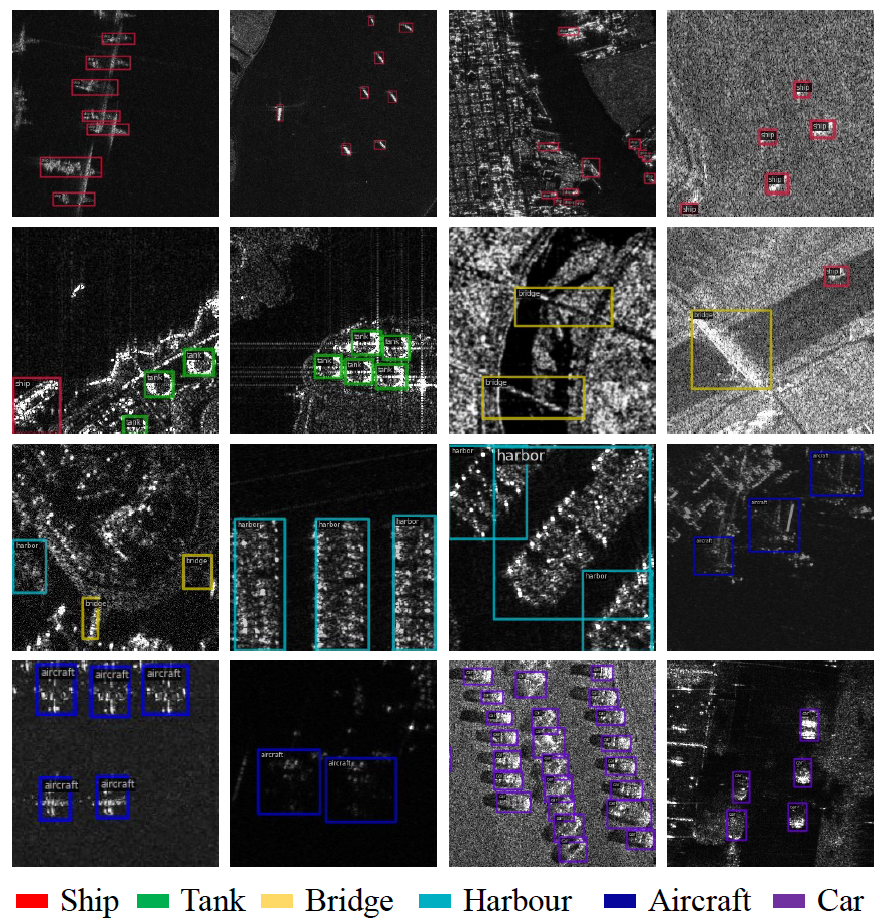
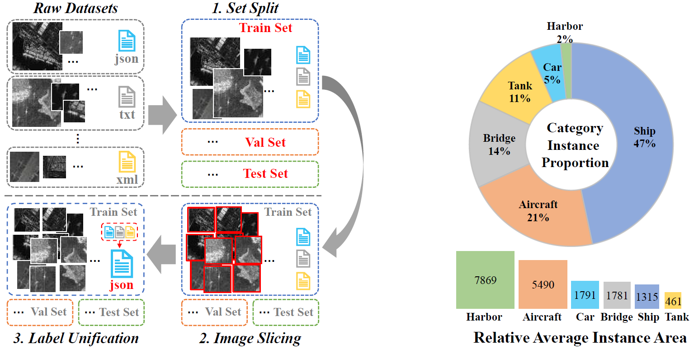

# 🔥🔥 SARDet-100K has been accepted at NeurIPS 2024 as a spotlight!!  

# 🔥🔥 Our new work [RSAR](https://github.com/zhasion/RSAR) is accepted by CVPR2025!!! 
"RSAR: Restricted State Angle Resolver and Rotated SAR Benchmark"  [](https://arxiv.org/abs/2501.04440)  [](https://github.com/zhasion/RSAR)

It contains a large multi-class rotated SAR object detection dataset, which is an approximate rotation-labeled version of SARDet-100K.

## This repository now supports DenoDet!! ##
"DenoDet: Attention as Deformable Multi-Subspace Feature Denoising for Target Detection in SAR Images" at: [https://arxiv.org/pdf/2406.02833](https://arxiv.org/pdf/2406.02833)

---

## Jittor version implementation at [NK-JittorCV/nk-det](https://github.com/NK-JittorCV/nk-det) ## 

---

## "SARDet-100K: Towards Open-Source Benchmark and ToolKit for Large-Scale SAR Object Detection" at: [https://arxiv.org/pdf/2403.06534.pdf](https://arxiv.org/pdf/2403.06534.pdf)
Yuxuan Li, Xiang Li*, Weijie Li, Qibin Hou, Li Liu, Ming-ming Cheng, Jian Yang*

李宇轩，李翔*，李玮杰，侯淇彬，刘丽，程明明，杨健*

[](https://paperswithcode.com/sota/2d-object-detection-on-sardet-100k?p=sardet-100k-towards-open-source-benchmark-and)

## 走过路过不要错过！！
面对2024年的科研战场，你是否感到了前所未有的科研压力？计算机视觉的各大任务仿佛已经达到了饱和点，榜单一次又一次被那些拥有海量数据和计算资源的大模型所主宰。对于我们这些还在校园里奋斗的学生来说，手头的资源始终显得那么微不足道，似乎永远也竞争不过那些垄断科研的巨头。每一个方向似乎都被人挖得满满的，想发表一篇paper变得越来越难，快毕业的你是否也在焦虑地寻找一个真正属于自己的研究方向？多少次，我们都幻想能回到15年前ImageNet发布的那个夜晚，那时候没有群魔乱舞的注意力机制，也没有数以Billion计参数的大模型，每一个任务都是一片待开垦的蓝海……

但是今天，告诉你，有这么一个方向，曾一度因为缺乏大规模数据集和寥寥无几的开源代码而默默无闻，它的发展似乎一直滞后。但随着开源大规模数据集的诞生和完善的代码库的出现，之前的难题统统烟消云散。现在，就如同被一道闪电击中，穿越回了数年前，还有一片未被充分开发的蓝海正展现在你的眼前，等待你去探索、去征服。

所以，你想知道我说的是什么领域吗？今天，你不需要支付998，也不需要98，只需在 GitHub 上给我们一个Star，SAR目标检测的大礼包就能免费带回家！这里有你需要的一切：从大规模数据集到详尽的实现代码，我们都为你准备好了。是的，我在说的就是遥感目标检测的掌上明珠：SAR（合成孔径雷达）目标检测！可能听起来有些神秘，但这个领域的潜力和含金量，真正懂的人都心照不宣，DDDD，YYDS！它不仅完美契合当前的国家战略需求，而且无论是在科研界还是工业界，都有着广阔的应用前景和无限的可能性。近年来，在SAR检测领域发表文章变得更加容易，这预示着这一领域的迅速发展和对新思想、新技术的渴求。现在就加入SAR目标检测的行列吧！它就像15年前的比特币，20年前的房地产，现在入局不后悔！让我们一起驰骋在这片广袤的蓝海之中，探索它的未知之处，共同开拓它的无限可能！

## Don't miss out as you pass by! 
Facing the scientific research battlefield of 2024, do you feel unprecedented pressure in research? The major tasks in Computer Vision seem to have reached a saturation point, with the charts being dominated time and again by large models that have access to massive data and computational resources. For those of us still striving in academia, our resources always seem so insignificant, as if we could never compete with those giants monopolizing research. Every direction seems to be thoroughly explored, making it increasingly difficult to publish a paper. Are you, about to graduate, also anxiously looking for a research direction that truly belongs to you? How many times have we fantasized about going back to the night when ImageNet was released 15 years ago, when there was no chaotic dance of attention mechanisms, no models with billions of parameters, and every task was an uncharted blue ocean...

But today, let me tell you my friend, about a direction that once lingered in obscurity due to the lack of large-scale datasets and scarce open-source codes, its development seemed to be always lagging. But with the emergence of open-source large-scale datasets and comprehensive code libraries, all previous problems have vanished like smoke. Now, as if struck by lightning and transported back several years, there is an undeveloped blue ocean in front of you, waiting for you to explore and conquer.

So, do you want to know what field I am talking about? Today, you don't need to pay 998, not even 98, just give us a Star on GitHub, and the SAR object detection big gift pack can be taken home for free! Here you have everything you need: from large-scale datasets to detailed implementation codes, we have prepared everything for you. Yes, I am talking about the jewel in the crown of remote sensing target detection: SAR (Synthetic Aperture Radar) object detection! It might sound mysterious, but the potential and value of this field are well understood by those in the know. It not only perfectly matches the current national strategic needs but also has a wide range of applications and limitless possibilities in both the scientific and industrial communities. In recent years, publishing articles in the SAR detection field has become easier, indicating the rapid development of this field and its thirst for new ideas and technologies. Join the ranks of SAR object detection now! It's like Bitcoin 15 years ago, real estate 20 years ago, getting involved now is something you won't regret! Let's gallop together in this vast blue ocean, explore its unknowns, and jointly tap into its limitless possibilities!



## Abstract

Synthetic Aperture Radar (SAR) object detection has gained significant attention recently due to its irreplaceable all-weather imaging capabilities. However, this research field suffers from both limited public datasets (mostly comprising <2K images with only mono-category objects) and inaccessible source code. To tackle these challenges, we establish a new benchmark dataset and an open-source method for large-scale SAR object detection. Our dataset, SARDet-100K, is a result of intense surveying, collecting, and standardizing 10 existing SAR detection datasets, providing a large-scale and diverse dataset for research purposes. To the best of our knowledge, SARDet-100K is the first COCO-level large-scale multi-class SAR object detection dataset ever created. With this high-quality dataset, we conducted comprehensive experiments and uncovered a crucial challenge in SAR object detection: the substantial disparities between the pretraining on RGB datasets and finetuning on SAR datasets in terms of both data domain and model structure. To bridge these gaps, we propose a novel Multi-Stage with Filter Augmentation (MSFA) pretraining framework that tackles the problems from the perspective of data input, domain transition, and model migration. The proposed MSFA method significantly enhances the performance of SAR object detection models while demonstrating exceptional generalizability and flexibility across diverse models. This work aims to pave the way for further advancements in SAR object detection. 




## Introduction

This repository is the official site for "SARDet-100K: Towards Open-Source Benchmark and ToolKit for Large-Scale SAR Object Detection" 
at: [https://arxiv.org/pdf/2403.06534.pdf](https://arxiv.org/pdf/2403.06534.pdf)

**DATASET DOWNLOAD at:** 

(Train, Val, Test)

* Baidu Disk: [Dataset](https://pan.baidu.com/s/1dIFOm4V2pM_AjhmkD1-Usw?pwd=SARD)
* OneDrive: [Dataset](https://liveuclac-my.sharepoint.com/:f:/g/personal/zcablii_ucl_ac_uk/EuYYZWXL_bJGvd8s9rGH2KYBV1GM5pIOCngnzlyuB_3e5A?e=bgoINm)


**Model Weights DOWNLOAD at:** 

* Baidu Disk: [Models](https://pan.baidu.com/s/1SuEOl_ImqjoT5Y3pYxZt4w?pwd=c6fo)
* OneDrive: [Models](https://liveuclac-my.sharepoint.com/:f:/g/personal/zcablii_ucl_ac_uk/EsCsvTBzlGlJkQogQ2_svKcB9K-0LXfgZPoUJBySPP2L5g?e=RsL0VA)


**(Only Train and Val sets are released so far.)**


<table style="border-collapse: collapse; border: none; border-spacing: 0px;">
	<caption>
		Image and instance level statistics of SARDet-100K dataset. *: Origin datasets are cropped into 512 x 512 patches.
	</caption>
	<tr>
		<td rowspan="2" style="border-right: 1px solid black; border-bottom: 1px solid black; text-align: center; padding-right: 3pt; padding-left: 3pt;">
			 <b>Dataset</b>
		<td colspan="4" style="border-right: 1px solid black; border-bottom: 1px solid black; text-align: center; padding-right: 3pt; padding-left: 3pt;">
			 <b>Images</b>
		<td colspan="4" style="border-right: 1px solid black; border-bottom: 1px solid black; text-align: center; padding-right: 3pt; padding-left: 3pt;">
			<b>Instances</b>
		<td rowspan="2" style="border-bottom: 1px solid black; text-align: center; padding-right: 3pt; padding-left: 3pt;">
			Ins/Img
	<tr>
		<td style="border-bottom: 1px solid black; text-align: right; padding-right: 3pt; padding-left: 3pt;">
			Train
		<td style="border-bottom: 1px solid black; text-align: right; padding-right: 3pt; padding-left: 3pt;">
			Val
		<td style="border-bottom: 1px solid black; text-align: right; padding-right: 3pt; padding-left: 3pt;">
			Test
		<td style="border-right: 1px solid black; border-bottom: 1px solid black; text-align: right; padding-right: 3pt; padding-left: 3pt;">
			ALL
		<td style="border-bottom: 1px solid black; text-align: right; padding-right: 3pt; padding-left: 3pt;">
			Train
		<td style="border-bottom: 1px solid black; text-align: right; padding-right: 3pt; padding-left: 3pt;">
			Val
		<td style="border-bottom: 1px solid black; text-align: right; padding-right: 3pt; padding-left: 3pt;">
			Test
		<td style="border-right: 1px solid black; border-bottom: 1px solid black; text-align: right; padding-right: 3pt; padding-left: 3pt;">
			ALL
	<tr>
		<td style="border-right: 1px solid black; text-align: center; padding-right: 3pt; padding-left: 3pt;">
			AIR_SARShip 1*&nbsp;
		<td style="text-align: right; padding-right: 3pt; padding-left: 3pt;">
			438
		<td style="text-align: right; padding-right: 3pt; padding-left: 3pt;">
			23
		<td style="text-align: right; padding-right: 3pt; padding-left: 3pt;">
			40
		<td style="border-right: 1px solid black; text-align: right; padding-right: 3pt; padding-left: 3pt;">
			501
		<td style="text-align: right; padding-right: 3pt; padding-left: 3pt;">
			816
		<td style="text-align: right; padding-right: 3pt; padding-left: 3pt;">
			33
		<td style="text-align: right; padding-right: 3pt; padding-left: 3pt;">
			209
		<td style="border-right: 1px solid black; text-align: right; padding-right: 3pt; padding-left: 3pt;">
			1,058
		<td style="text-align: center; padding-right: 3pt; padding-left: 3pt;">
			2.11
	<tr>
		<td style="border-right: 1px solid black; text-align: center; padding-right: 3pt; padding-left: 3pt;">
			AIR_SARShip 2&nbsp;
		<td style="text-align: right; padding-right: 3pt; padding-left: 3pt;">
			270
		<td style="text-align: right; padding-right: 3pt; padding-left: 3pt;">
			15
		<td style="text-align: right; padding-right: 3pt; padding-left: 3pt;">
			15
		<td style="border-right: 1px solid black; text-align: right; padding-right: 3pt; padding-left: 3pt;">
			300
		<td style="text-align: right; padding-right: 3pt; padding-left: 3pt;">
			1,819
		<td style="text-align: right; padding-right: 3pt; padding-left: 3pt;">
			127
		<td style="text-align: right; padding-right: 3pt; padding-left: 3pt;">
			94
		<td style="border-right: 1px solid black; text-align: right; padding-right: 3pt; padding-left: 3pt;">
			2,040
		<td style="text-align: center; padding-right: 3pt; padding-left: 3pt;">
			6.80
	<tr>
		<td style="border-right: 1px solid black; text-align: center; padding-right: 3pt; padding-left: 3pt;">
			HRSID&nbsp;
		<td style="text-align: right; padding-right: 3pt; padding-left: 3pt;">
			3,642
		<td style="text-align: right; padding-right: 3pt; padding-left: 3pt;">
			981
		<td style="text-align: right; padding-right: 3pt; padding-left: 3pt;">
			981
		<td style="border-right: 1px solid black; text-align: right; padding-right: 3pt; padding-left: 3pt;">
			5,604
		<td style="text-align: right; padding-right: 3pt; padding-left: 3pt;">
			11,047
		<td style="text-align: right; padding-right: 3pt; padding-left: 3pt;">
			2,975
		<td style="text-align: right; padding-right: 3pt; padding-left: 3pt;">
			2,947
		<td style="border-right: 1px solid black; text-align: right; padding-right: 3pt; padding-left: 3pt;">
			16,969
		<td style="text-align: center; padding-right: 3pt; padding-left: 3pt;">
			3.03
	<tr>
		<td style="border-right: 1px solid black; text-align: center; padding-right: 3pt; padding-left: 3pt;">
			MSAR*&nbsp;
		<td style="text-align: right; padding-right: 3pt; padding-left: 3pt;">
			27,159
		<td style="text-align: right; padding-right: 3pt; padding-left: 3pt;">
			1,479
		<td style="text-align: right; padding-right: 3pt; padding-left: 3pt;">
			1,520
		<td style="border-right: 1px solid black; text-align: right; padding-right: 3pt; padding-left: 3pt;">
			30,158
		<td style="text-align: right; padding-right: 3pt; padding-left: 3pt;">
			58,988
		<td style="text-align: right; padding-right: 3pt; padding-left: 3pt;">
			3,091
		<td style="text-align: right; padding-right: 3pt; padding-left: 3pt;">
			3,123
		<td style="border-right: 1px solid black; text-align: right; padding-right: 3pt; padding-left: 3pt;">
			65,202
		<td style="text-align: center; padding-right: 3pt; padding-left: 3pt;">
			2.16
	<tr>
		<td style="border-right: 1px solid black; text-align: center; padding-right: 3pt; padding-left: 3pt;">
			SADD&nbsp;
		<td style="text-align: right; padding-right: 3pt; padding-left: 3pt;">
			795
		<td style="text-align: right; padding-right: 3pt; padding-left: 3pt;">
			44
		<td style="text-align: right; padding-right: 3pt; padding-left: 3pt;">
			44
		<td style="border-right: 1px solid black; text-align: right; padding-right: 3pt; padding-left: 3pt;">
			883
		<td style="text-align: right; padding-right: 3pt; padding-left: 3pt;">
			6,891
		<td style="text-align: right; padding-right: 3pt; padding-left: 3pt;">
			448
		<td style="text-align: right; padding-right: 3pt; padding-left: 3pt;">
			496
		<td style="border-right: 1px solid black; text-align: right; padding-right: 3pt; padding-left: 3pt;">
			7,835
		<td style="text-align: center; padding-right: 3pt; padding-left: 3pt;">
			8.87
	<tr>
		<td style="border-right: 1px solid black; text-align: center; padding-right: 3pt; padding-left: 3pt;">
			SAR-AIRcraft*&nbsp;
		<td style="text-align: right; padding-right: 3pt; padding-left: 3pt;">
			13,976
		<td style="text-align: right; padding-right: 3pt; padding-left: 3pt;">
			1,923
		<td style="text-align: right; padding-right: 3pt; padding-left: 3pt;">
			2,989
		<td style="border-right: 1px solid black; text-align: right; padding-right: 3pt; padding-left: 3pt;">
			18,888
		<td style="text-align: right; padding-right: 3pt; padding-left: 3pt;">
			27,848
		<td style="text-align: right; padding-right: 3pt; padding-left: 3pt;">
			4,631
		<td style="text-align: right; padding-right: 3pt; padding-left: 3pt;">
			5,996
		<td style="border-right: 1px solid black; text-align: right; padding-right: 3pt; padding-left: 3pt;">
			38,475
		<td style="text-align: center; padding-right: 3pt; padding-left: 3pt;">
			2.04
	<tr>
		<td style="border-right: 1px solid black; text-align: center; padding-right: 3pt; padding-left: 3pt;">
			ShipDataset&nbsp;
		<td style="text-align: right; padding-right: 3pt; padding-left: 3pt;">
			31,784
		<td style="text-align: right; padding-right: 3pt; padding-left: 3pt;">
			3,973
		<td style="text-align: right; padding-right: 3pt; padding-left: 3pt;">
			3,972
		<td style="border-right: 1px solid black; text-align: right; padding-right: 3pt; padding-left: 3pt;">
			39,729
		<td style="text-align: right; padding-right: 3pt; padding-left: 3pt;">
			40,761
		<td style="text-align: right; padding-right: 3pt; padding-left: 3pt;">
			5,080
		<td style="text-align: right; padding-right: 3pt; padding-left: 3pt;">
			5,044
		<td style="border-right: 1px solid black; text-align: right; padding-right: 3pt; padding-left: 3pt;">
			50,885
		<td style="text-align: center; padding-right: 3pt; padding-left: 3pt;">
			1.28
	<tr>
		<td style="border-right: 1px solid black; text-align: center; padding-right: 3pt; padding-left: 3pt;">
			SSDD&nbsp;
		<td style="text-align: right; padding-right: 3pt; padding-left: 3pt;">
			928
		<td style="text-align: right; padding-right: 3pt; padding-left: 3pt;">
			116
		<td style="text-align: right; padding-right: 3pt; padding-left: 3pt;">
			116
		<td style="border-right: 1px solid black; text-align: right; padding-right: 3pt; padding-left: 3pt;">
			1,160
		<td style="text-align: right; padding-right: 3pt; padding-left: 3pt;">
			2,041
		<td style="text-align: right; padding-right: 3pt; padding-left: 3pt;">
			252
		<td style="text-align: right; padding-right: 3pt; padding-left: 3pt;">
			294
		<td style="border-right: 1px solid black; text-align: right; padding-right: 3pt; padding-left: 3pt;">
			2,587
		<td style="text-align: center; padding-right: 3pt; padding-left: 3pt;">
			2.23
	<tr>
		<td style="border-right: 1px solid black; text-align: center; padding-right: 3pt; padding-left: 3pt;">
			OGSOD&nbsp;
		<td style="text-align: right; padding-right: 3pt; padding-left: 3pt;">
			14,664
		<td style="text-align: right; padding-right: 3pt; padding-left: 3pt;">
			1,834
		<td style="text-align: right; padding-right: 3pt; padding-left: 3pt;">
			1,833
		<td style="border-right: 1px solid black; text-align: right; padding-right: 3pt; padding-left: 3pt;">
			18,331
		<td style="text-align: right; padding-right: 3pt; padding-left: 3pt;">
			38,975
		<td style="text-align: right; padding-right: 3pt; padding-left: 3pt;">
			4,844
		<td style="text-align: right; padding-right: 3pt; padding-left: 3pt;">
			4,770
		<td style="border-right: 1px solid black; text-align: right; padding-right: 3pt; padding-left: 3pt;">
			48,589
		<td style="text-align: center; padding-right: 3pt; padding-left: 3pt;">
			2.65
	<tr>
		<td style="border-right: 1px solid black; border-bottom: 1px solid black; text-align: center; padding-right: 3pt; padding-left: 3pt;">
			SIVED&nbsp;
		<td style="border-bottom: 1px solid black; text-align: right; padding-right: 3pt; padding-left: 3pt;">
			837
		<td style="border-bottom: 1px solid black; text-align: right; padding-right: 3pt; padding-left: 3pt;">
			104
		<td style="border-bottom: 1px solid black; text-align: right; padding-right: 3pt; padding-left: 3pt;">
			103
		<td style="border-right: 1px solid black; border-bottom: 1px solid black; text-align: right; padding-right: 3pt; padding-left: 3pt;">
			1,044
		<td style="border-bottom: 1px solid black; text-align: right; padding-right: 3pt; padding-left: 3pt;">
			9,561
		<td style="border-bottom: 1px solid black; text-align: right; padding-right: 3pt; padding-left: 3pt;">
			1,222
		<td style="border-bottom: 1px solid black; text-align: right; padding-right: 3pt; padding-left: 3pt;">
			1,230
		<td style="border-right: 1px solid black; border-bottom: 1px solid black; text-align: right; padding-right: 3pt; padding-left: 3pt;">
			12,013
		<td style="border-bottom: 1px solid black; text-align: center; padding-right: 3pt; padding-left: 3pt;">
			11.51&nbsp;
	<tr>
		<td style="border-right: 1px solid black; text-align: center; padding-right: 3pt; padding-left: 3pt;">
			<b>SARDet-100k</b>
		<td style="text-align: right; padding-right: 3pt; padding-left: 3pt;">
			94,493
		<td style="text-align: right; padding-right: 3pt; padding-left: 3pt;">
			10,492
		<td style="text-align: right; padding-right: 3pt; padding-left: 3pt;">
			11,613
		<td style="border-right: 1px solid black; text-align: right; padding-right: 3pt; padding-left: 3pt;">
			116,598
		<td style="text-align: right; padding-right: 3pt; padding-left: 3pt;">
			198,747
		<td style="text-align: right; padding-right: 3pt; padding-left: 3pt;">
			22,703
		<td style="text-align: right; padding-right: 3pt; padding-left: 3pt;">
			24,023
		<td style="border-right: 1px solid black; text-align: right; padding-right: 3pt; padding-left: 3pt;">
			245,653
		<td style="text-align: center; padding-right: 3pt; padding-left: 3pt;">
			2.11
</table>


<table style="border-collapse: collapse; border: none; border-spacing: 0px;">
	<caption>
		SARDet-100K source datasets information. GF-3: Gaofen-3, S-1: Sentinel-1. Target categories S: ship, A: aircraft, C: car, B: bridge, H: harbour, T: tank.
	</caption>
	<tr>
		<td style="border-right: 1px solid black; border-bottom: 1px solid black; padding-right: 3pt; padding-left: 3pt;">
			Datasets
		<td style="border-right: 1px solid black; border-bottom: 1px solid black; padding-right: 3pt; padding-left: 3pt;">
			Target
		<td style="border-right: 1px solid black; border-bottom: 1px solid black; padding-right: 3pt; padding-left: 3pt;">
			Res.&nbsp;(m)
		<td style="border-right: 1px solid black; border-bottom: 1px solid black; padding-right: 3pt; padding-left: 3pt;">
			Band
		<td style="border-right: 1px solid black; border-bottom: 1px solid black; padding-right: 3pt; padding-left: 3pt;">
			Polarization
		<td style="border-bottom: 1px solid black; padding-right: 3pt; padding-left: 3pt;">
			Satellites
	<tr>
		<td style="border-right: 1px solid black; padding-right: 3pt; padding-left: 3pt;">
			AIR_SARShip
		<td style="border-right: 1px solid black; padding-right: 3pt; padding-left: 3pt;">
			S
		<td style="border-right: 1px solid black; padding-right: 3pt; padding-left: 3pt;">
			1,3m
		<td style="border-right: 1px solid black; padding-right: 3pt; padding-left: 3pt;">
			C
		<td style="border-right: 1px solid black; padding-right: 3pt; padding-left: 3pt;">
			VV
		<td style="padding-right: 3pt; padding-left: 3pt;">
			GF-3
	<tr>
		<td style="border-right: 1px solid black; padding-right: 3pt; padding-left: 3pt;">
			HRSID
		<td style="border-right: 1px solid black; padding-right: 3pt; padding-left: 3pt;">
			S
		<td style="border-right: 1px solid black; padding-right: 3pt; padding-left: 3pt;">
			0.5~3m
		<td style="border-right: 1px solid black; padding-right: 3pt; padding-left: 3pt;">
			C/X
		<td style="border-right: 1px solid black; padding-right: 3pt; padding-left: 3pt;">
			HH, HV, VH, VV
		<td style="padding-right: 3pt; padding-left: 3pt;">
			S-1B,TerraSAR-X,TanDEMX
	<tr>
		<td style="border-right: 1px solid black; padding-right: 3pt; padding-left: 3pt;">
			MSAR
		<td style="border-right: 1px solid black; padding-right: 3pt; padding-left: 3pt;">
			A, T, B, S
		<td style="border-right: 1px solid black; padding-right: 3pt; padding-left: 3pt;">
			&lt; 1m
		<td style="border-right: 1px solid black; padding-right: 3pt; padding-left: 3pt;">
			C
		<td style="border-right: 1px solid black; padding-right: 3pt; padding-left: 3pt;">
			HH, HV, VH, VV
		<td style="padding-right: 3pt; padding-left: 3pt;">
			HISEA-1
	<tr>
		<td style="border-right: 1px solid black; padding-right: 3pt; padding-left: 3pt;">
			SADD
		<td style="border-right: 1px solid black; padding-right: 3pt; padding-left: 3pt;">
			A
		<td style="border-right: 1px solid black; padding-right: 3pt; padding-left: 3pt;">
			0.5~3m
		<td style="border-right: 1px solid black; padding-right: 3pt; padding-left: 3pt;">
			X
		<td style="border-right: 1px solid black; padding-right: 3pt; padding-left: 3pt;">
			HH
		<td style="padding-right: 3pt; padding-left: 3pt;">
			TerraSAR-X
	<tr>
		<td style="border-right: 1px solid black; padding-right: 3pt; padding-left: 3pt;">
			SAR-AIRcraft
		<td style="border-right: 1px solid black; padding-right: 3pt; padding-left: 3pt;">
			A
		<td style="border-right: 1px solid black; padding-right: 3pt; padding-left: 3pt;">
			1m
		<td style="border-right: 1px solid black; padding-right: 3pt; padding-left: 3pt;">
			C
		<td style="border-right: 1px solid black; padding-right: 3pt; padding-left: 3pt;">
			Uni-polar
		<td style="padding-right: 3pt; padding-left: 3pt;">
			GF-3
	<tr>
		<td style="border-right: 1px solid black; padding-right: 3pt; padding-left: 3pt;">
			ShipDataset
		<td style="border-right: 1px solid black; padding-right: 3pt; padding-left: 3pt;">
			S
		<td style="border-right: 1px solid black; padding-right: 3pt; padding-left: 3pt;">
			3~25m
		<td style="border-right: 1px solid black; padding-right: 3pt; padding-left: 3pt;">
			C
		<td style="border-right: 1px solid black; padding-right: 3pt; padding-left: 3pt;">
			HH, VV, VH, HV
		<td style="padding-right: 3pt; padding-left: 3pt;">
			S-1,GF-3
	<tr>
		<td style="border-right: 1px solid black; padding-right: 3pt; padding-left: 3pt;">
			SSDD
		<td style="border-right: 1px solid black; padding-right: 3pt; padding-left: 3pt;">
			S
		<td style="border-right: 1px solid black; padding-right: 3pt; padding-left: 3pt;">
			1~15m
		<td style="border-right: 1px solid black; padding-right: 3pt; padding-left: 3pt;">
			C/X
		<td style="border-right: 1px solid black; padding-right: 3pt; padding-left: 3pt;">
			HH, VV, VH, HV
		<td style="padding-right: 3pt; padding-left: 3pt;">
			S-1,RadarSat-2,TerraSAR-X
	<tr>
		<td style="border-right: 1px solid black; padding-right: 3pt; padding-left: 3pt;">
			OGSOD
		<td style="border-right: 1px solid black; padding-right: 3pt; padding-left: 3pt;">
			B, H, T
		<td style="border-right: 1px solid black; padding-right: 3pt; padding-left: 3pt;">
			3m
		<td style="border-right: 1px solid black; padding-right: 3pt; padding-left: 3pt;">
			C
		<td style="border-right: 1px solid black; padding-right: 3pt; padding-left: 3pt;">
			VV/VH
		<td style="padding-right: 3pt; padding-left: 3pt;">
			GF-3
	<tr>
		<td style="border-right: 1px solid black; padding-right: 3pt; padding-left: 3pt;">
			SIVED
		<td style="border-right: 1px solid black; padding-right: 3pt; padding-left: 3pt;">
			C
		<td style="border-right: 1px solid black; padding-right: 3pt; padding-left: 3pt;">
			0.1,0.3m
		<td style="border-right: 1px solid black; padding-right: 3pt; padding-left: 3pt;">
			Ka,Ku,X
		<td style="border-right: 1px solid black; padding-right: 3pt; padding-left: 3pt;">
			VV/HH
		<td style="padding-right: 3pt; padding-left: 3pt;">
			Airborne SAR synthetic slice
</table>

##

# MSFA: Multi-Stage with Filter Augmentation pretraining framework 


## Introduction

This repository is the official implementation of Multi-Stage with Filter Augmentation (MSFA) pretraining framework in "SARDet-100K: Towards Open-Source Benchmark and ToolKit for Large-Scale SAR Object Detection" 

Filter Augmentation code is placed under ```MSFA/msfa/models/backbones/MSFA.py```. 
The code about SARDet-100K dataset is placed under ```MSFA/msfa/datasets/SAR_Det.py```.
The train/test configure files used in the main paper are placed under ```local_configs```.


## Results and models


<table style="border-collapse: collapse; border: none; border-spacing: 0px;">
	<caption>
		Comparison of different pretrain strategies using Faster-RCNN and Res50 as the detection model.
	</caption>
	<tr>
		<td rowspan="2" style="border-right: 1px solid black; border-bottom: 1px solid black; text-align: center; padding-right: 3pt; padding-left: 3pt;">
			Model Input
		<td colspan="3" style="border-right: 1px solid black; border-bottom: 1px solid black; text-align: center; padding-right: 3pt; padding-left: 3pt;">
			Pretrain
		<td rowspan="2" style="border-bottom: 1px solid black; border-right: 1px solid rgb(0, 0, 0); text-align: center; padding-right: 3pt; padding-left: 3pt;">
			mAP&nbsp;
		<td rowspan="2" style="border-right: 1px solid rgb(0, 0, 0); padding-right: 3pt; padding-left: 3pt;">
			Config
		<td rowspan="2" style="border-left: 1px solid rgb(0, 0, 0); padding-right: 3pt; padding-left: 3pt;">
			Weight
	<tr>
		<td style="border-right: 1px solid black; border-bottom: 1px solid black; text-align: center; padding-right: 3pt; padding-left: 3pt;">
			Multi-stage
		<td style="border-right: 1px solid black; border-bottom: 1px solid black; text-align: center; padding-right: 3pt; padding-left: 3pt;">
			Dataset
		<td style="border-right: 1px solid black; border-bottom: 1px solid black; text-align: center; padding-right: 3pt; padding-left: 3pt;">
			Component
	<tr>
		<td rowspan="4" style="border-right: 1px solid black; border-bottom: 1px solid black; text-align: center; padding-right: 3pt; padding-left: 3pt;">
			SAR
			<br>
			    (Raw pixels)
		<td style="border-right: 1px solid black; border-bottom: 1px solid rgb(0, 0, 0); text-align: center; padding-right: 3pt; padding-left: 3pt;">
			✕
			<br>
		<td style="border-right: 1px solid black; border-bottom: 1px solid black; text-align: center; padding-right: 3pt; padding-left: 3pt;">
			ImageNet
		<td style="border-right: 1px solid black; border-bottom: 1px solid black; text-align: center; padding-right: 3pt; padding-left: 3pt;">
			Backbone
		<td style="border-right: 1px solid rgb(0, 0, 0); text-align: center; padding-right: 3pt; padding-left: 3pt;">
			49.0
		<td style="border-right: 1px solid rgb(0, 0, 0); padding-right: 3pt; padding-left: 3pt;">
            <a href="local_configs\SARDet\r50_IN_sup\fg_frcnn_IN_sup_sar_r50.py"> config </a>
		<td style="border-left: 1px solid rgb(0, 0, 0); padding-right: 3pt; padding-left: 3pt;">
            <a href="https://pan.baidu.com/s/1SuEOl_ImqjoT5Y3pYxZt4w?pwd=c6fo"> weight </a>
	<tr>
		<td style="border-right: 1px solid black; border-bottom: 1px solid black; border-top: 1px solid rgb(0, 0, 0); text-align: center; padding-right: 3pt; padding-left: 3pt;">
			√<wbr>
		<td style="border-right: 1px solid black; border-bottom: 1px solid black; text-align: center; padding-right: 3pt; padding-left: 3pt;">
			ImageNet + DIOR
		<td style="border-right: 1px solid black; border-bottom: 1px solid black; text-align: center; padding-right: 3pt; padding-left: 3pt;">
			Framework
		<td style="border-right: 1px solid rgb(0, 0, 0); text-align: center; padding-right: 3pt; padding-left: 3pt;">
			49.5
		<td style="border-right: 1px solid rgb(0, 0, 0); padding-right: 3pt; padding-left: 3pt;">
            <a href="local_configs\SARDet\r50_dota_pretrain\fg_frcnn_dior_pretrain_sar_r50.py"> config </a>
		<td style="border-left: 1px solid rgb(0, 0, 0); padding-right: 3pt; padding-left: 3pt;">
            <a href="https://pan.baidu.com/s/1SuEOl_ImqjoT5Y3pYxZt4w?pwd=c6fo"> weight </a>
	<tr>
		<td rowspan="2" style="border-right: 1px solid black; border-bottom: 1px solid black; text-align: center; padding-right: 3pt; padding-left: 3pt;">
			√<wbr>
		<td rowspan="2" style="border-right: 1px solid black; border-bottom: 1px solid black; text-align: center; padding-right: 3pt; padding-left: 3pt;">
			ImageNet + DOTA
		<td style="border-right: 1px solid black; text-align: center; padding-right: 3pt; padding-left: 3pt;">
			Backbone
		<td style="border-right: 1px solid rgb(0, 0, 0); text-align: center; padding-right: 3pt; padding-left: 3pt;">
			49.3
		<td style="border-right: 1px solid rgb(0, 0, 0); padding-right: 3pt; padding-left: 3pt;">
            <a href="local_configs\SARDet\r50_dota_backbone_only\fg_frcnn_dota_pretrain_backboneonly_sar_r50.py"> config </a>
		<td style="border-left: 1px solid rgb(0, 0, 0); padding-right: 3pt; padding-left: 3pt;">
            <a href="https://pan.baidu.com/s/1SuEOl_ImqjoT5Y3pYxZt4w?pwd=c6fo"> weight </a>
	<tr>
		<td style="border-right: 1px solid black; border-bottom: 1px solid black; text-align: center; padding-right: 3pt; padding-left: 3pt;">
			Framework
		<td style="border-bottom: 1px solid black; border-right: 1px solid rgb(0, 0, 0); text-align: center; padding-right: 3pt; padding-left: 3pt;">
			<b>50.2</b>
		<td style="border-right: 1px solid rgb(0, 0, 0); padding-right: 3pt; padding-left: 3pt;">
            <a href="local_configs\SARDet\r50_dota_pretrain\fg_frcnn_dota_pretrain_sar_r50.py"> config </a>
		<td style="border-left: 1px solid rgb(0, 0, 0); padding-right: 3pt; padding-left: 3pt;">
            <a href="https://pan.baidu.com/s/1SuEOl_ImqjoT5Y3pYxZt4w?pwd=c6fo"> weight </a>
	<tr>
		<td rowspan="4" style="border-right: 1px solid black; text-align: center; padding-right: 3pt; padding-left: 3pt;">
			SAR+WST
			<br>
			   (Filter Augmented)
		<td style="border-right: 1px solid black; border-bottom: 1px solid black; text-align: center; padding-right: 3pt; padding-left: 3pt;">
			✕<wbr>
		<td style="border-right: 1px solid black; border-bottom: 1px solid black; text-align: center; padding-right: 3pt; padding-left: 3pt;">
			ImageNet
		<td style="border-right: 1px solid black; border-bottom: 1px solid black; text-align: center; padding-right: 3pt; padding-left: 3pt;">
			Backbone
		<td style="border-right: 1px solid rgb(0, 0, 0); text-align: center; padding-right: 3pt; padding-left: 3pt;">
			49.2
		<td style="border-right: 1px solid rgb(0, 0, 0); padding-right: 3pt; padding-left: 3pt;">
            <a href="local_configs\SARDet\r50_IN_sup\fg_frcnn_IN_sup_sar_wavelet_r50.py"> config </a>
		<td style="border-left: 1px solid rgb(0, 0, 0); padding-right: 3pt; padding-left: 3pt;">
            <a href="https://pan.baidu.com/s/1SuEOl_ImqjoT5Y3pYxZt4w?pwd=c6fo"> weight </a>
	<tr>
		<td style="border-right: 1px solid black; border-bottom: 1px solid black; text-align: center; padding-right: 3pt; padding-left: 3pt;">
			√<wbr>
		<td style="border-right: 1px solid black; border-bottom: 1px solid black; text-align: center; padding-right: 3pt; padding-left: 3pt;">
			ImageNet + DIOR
		<td style="border-right: 1px solid black; border-bottom: 1px solid black; text-align: center; padding-right: 3pt; padding-left: 3pt;">
			Framework
		<td style="border-right: 1px solid rgb(0, 0, 0); text-align: center; padding-right: 3pt; padding-left: 3pt;">
			50.1
		<td style="border-right: 1px solid rgb(0, 0, 0); padding-right: 3pt; padding-left: 3pt;">
            <a href="local_configs\SARDet\r50_dota_pretrain\fg_frcnn_dior_pretrain_sar_wavelet_r50.py"> config </a>
		<td style="border-left: 1px solid rgb(0, 0, 0); padding-right: 3pt; padding-left: 3pt;">
            <a href="https://pan.baidu.com/s/1SuEOl_ImqjoT5Y3pYxZt4w?pwd=c6fo"> weight </a>
	<tr>
		<td rowspan="2" style="border-right: 1px solid black; text-align: center; padding-right: 3pt; padding-left: 3pt;">
			√<wbr>
		<td rowspan="2" style="border-right: 1px solid black; text-align: center; padding-right: 3pt; padding-left: 3pt;">
			ImageNet + DOTA
		<td style="border-right: 1px solid black; text-align: center; padding-right: 3pt; padding-left: 3pt;">
			Backbone
		<td style="border-right: 1px solid rgb(0, 0, 0); text-align: center; padding-right: 3pt; padding-left: 3pt;">
			49.6
		<td style="border-right: 1px solid rgb(0, 0, 0); padding-right: 3pt; padding-left: 3pt;">
            <a href="local_configs\SARDet\r50_dota_backbone_only\fg_frcnn_dota_pretrain_backboneonly_sar_wavelet_r50.py"> config </a>
		<td style="border-left: 1px solid rgb(0, 0, 0); padding-right: 3pt; padding-left: 3pt;">
            <a href="https://pan.baidu.com/s/1SuEOl_ImqjoT5Y3pYxZt4w?pwd=c6fo"> weight </a>
	<tr>
		<td style="border-right: 1px solid black; text-align: center; padding-right: 3pt; padding-left: 3pt;">
			Framework
		<td style="border-right: 1px solid rgb(0, 0, 0); text-align: center; padding-right: 3pt; padding-left: 3pt;">
			<b>51.1</b>
		<td style="border-right: 1px solid rgb(0, 0, 0); padding-right: 3pt; padding-left: 3pt;">
            <a href="local_configs\SARDet\r50_dota_pretrain\fg_frcnn_dota_pretrain_sar_wavelet_r50.py"> config </a>
		<td style="border-left: 1px solid rgb(0, 0, 0); padding-right: 3pt; padding-left: 3pt;">
            <a href="https://pan.baidu.com/s/1SuEOl_ImqjoT5Y3pYxZt4w?pwd=c6fo"> weight </a>
</table>

## 


<table style="border-collapse: collapse; border: none; border-spacing: 0px;">
	<caption>
		Generalization of MSFA on different detection frameworks. IMP: Traditional ImageNet Pretrain on backbone network only.
	</caption>
	<tr>
		<td rowspan="2" colspan="2" style="border-right: 1px solid black; border-bottom: 1px solid black; text-align: center; padding-right: 3pt; padding-left: 3pt;">
			Framework
		<td rowspan="2" style="border-right: 1px solid black; border-bottom: 1px solid black; text-align: center; padding-right: 3pt; padding-left: 3pt;">
			Pretrain/Model
		<td colspan="6" style="border-bottom: 1px solid black; border-right: 1px solid rgb(0, 0, 0); text-align: center; padding-right: 3pt; padding-left: 3pt;">
			Test
		<td style="border-right: 1px solid rgb(0, 0, 0); border-bottom: 1px solid rgb(0, 0, 0); padding-right: 3pt; padding-left: 3pt;">
			Config
		<td style="border-bottom: 1px solid rgb(0, 0, 0); padding-right: 3pt; padding-left: 3pt;">
			Weight
	<tr>
		<td style="border-bottom: 1px solid black; text-align: center; padding-right: 3pt; padding-left: 3pt;">
			<b>mAP</b>
		<td style="border-bottom: 1px solid black; padding-right: 3pt; padding-left: 3pt;">
			@50
		<td style="border-bottom: 1px solid black; text-align: center; padding-right: 3pt; padding-left: 3pt;">
			@75
		<td style="border-bottom: 1px solid black; text-align: center; padding-right: 3pt; padding-left: 3pt;">
			@s
		<td style="border-bottom: 1px solid black; text-align: center; padding-right: 3pt; padding-left: 3pt;">
			@m
		<td style="border-bottom: 1px solid black; border-right: 1px solid rgb(0, 0, 0); text-align: center; padding-right: 3pt; padding-left: 3pt;">
			@l
		<td style="border-right: 1px solid rgb(0, 0, 0); border-top: 1px solid rgb(0, 0, 0); padding-right: 3pt; padding-left: 3pt;">
		<td style="border-top: 1px solid rgb(0, 0, 0); padding-right: 3pt; padding-left: 3pt;">
	<tr>
		<td rowspan="6" style="border-right: 1px solid black; border-bottom: 1px solid black; text-align: center; padding-right: 3pt; padding-left: 3pt;">
			Two
			<br>
			    Stage
		<td rowspan="2" style="border-right: 1px solid black; border-bottom: 1px solid black; text-align: center; padding-right: 3pt; padding-left: 3pt;">
			Faster RCNN&nbsp;
		<td style="border-right: 1px solid black; text-align: center; padding-right: 3pt; padding-left: 3pt;">
			IMP
		<td style="padding-right: 3pt; padding-left: 3pt;">
			49.0
		<td style="text-align: center; padding-right: 3pt; padding-left: 3pt;">
			82.2
		<td style="text-align: center; padding-right: 3pt; padding-left: 3pt;">
			52.9
		<td style="text-align: center; padding-right: 3pt; padding-left: 3pt;">
			43.5
		<td style="text-align: center; padding-right: 3pt; padding-left: 3pt;">
			60.6
		<td style="border-right: 1px solid rgb(0, 0, 0); text-align: center; padding-right: 3pt; padding-left: 3pt;">
			55.0
		<td style="border-right: 1px solid rgb(0, 0, 0); padding-right: 3pt; padding-left: 3pt;">
            <a href="local_configs\SARDet\r50_IN_sup\fg_frcnn_IN_sup_sar_r50.py"> config </a>
		<td style="padding-right: 3pt; padding-left: 3pt;">
            <a href="https://pan.baidu.com/s/1SuEOl_ImqjoT5Y3pYxZt4w?pwd=c6fo"> weight </a>
	<tr>
		<td style="border-right: 1px solid black; border-bottom: 1px solid black; text-align: center; padding-right: 3pt; padding-left: 3pt;">
			MSFA
		<td style="border-bottom: 1px solid black; padding-right: 3pt; padding-left: 3pt;">
			51.1<b> (+2.1)</b>
		<td style="border-bottom: 1px solid black; text-align: center; padding-right: 3pt; padding-left: 3pt;">
			83.9
		<td style="border-bottom: 1px solid black; text-align: center; padding-right: 3pt; padding-left: 3pt;">
			54.7
		<td style="border-bottom: 1px solid black; text-align: center; padding-right: 3pt; padding-left: 3pt;">
			45.2
		<td style="border-bottom: 1px solid black; text-align: center; padding-right: 3pt; padding-left: 3pt;">
			62.3
		<td style="border-bottom: 1px solid black; border-right: 1px solid rgb(0, 0, 0); text-align: center; padding-right: 3pt; padding-left: 3pt;">
			57.5
		<td style="border-right: 1px solid rgb(0, 0, 0); padding-right: 3pt; padding-left: 3pt;">
            <a href="local_configs\SARDet\r50_dota_pretrain\fg_frcnn_dota_pretrain_sar_wavelet_r50.py"> config </a>
		<td style="padding-right: 3pt; padding-left: 3pt;">
            <a href="https://pan.baidu.com/s/1SuEOl_ImqjoT5Y3pYxZt4w?pwd=c6fo"> weight </a>
	<tr>
		<td rowspan="2" style="border-right: 1px solid black; border-bottom: 1px solid black; text-align: center; padding-right: 3pt; padding-left: 3pt;">
			Cascade RCNN&nbsp;
		<td style="border-right: 1px solid black; text-align: center; padding-right: 3pt; padding-left: 3pt;">
			IMP
		<td style="padding-right: 3pt; padding-left: 3pt;">
			51.1
		<td style="text-align: center; padding-right: 3pt; padding-left: 3pt;">
			81.9
		<td style="text-align: center; padding-right: 3pt; padding-left: 3pt;">
			55.8
		<td style="text-align: center; padding-right: 3pt; padding-left: 3pt;">
			44.9
		<td style="text-align: center; padding-right: 3pt; padding-left: 3pt;">
			62.9
		<td style="border-right: 1px solid rgb(0, 0, 0); text-align: center; padding-right: 3pt; padding-left: 3pt;">
			60.3
		<td style="border-right: 1px solid rgb(0, 0, 0); padding-right: 3pt; padding-left: 3pt;">
            <a href="local_configs\SARDet\other_detectors\mrcnn_cascade_IN_sup_r50_sar.py.py"> config </a>
		<td style="padding-right: 3pt; padding-left: 3pt;">
            <a href="https://pan.baidu.com/s/1SuEOl_ImqjoT5Y3pYxZt4w?pwd=c6fo"> weight </a>
	<tr>
		<td style="border-right: 1px solid black; border-bottom: 1px solid black; text-align: center; padding-right: 3pt; padding-left: 3pt;">
			MSFA
		<td style="border-bottom: 1px solid black; padding-right: 3pt; padding-left: 3pt;">
			53.9 <b> (+2.8)</b>
		<td style="border-bottom: 1px solid black; text-align: center; padding-right: 3pt; padding-left: 3pt;">
			83.4
		<td style="border-bottom: 1px solid black; text-align: center; padding-right: 3pt; padding-left: 3pt;">
			59.8
		<td style="border-bottom: 1px solid black; text-align: center; padding-right: 3pt; padding-left: 3pt;">
			47.2
		<td style="border-bottom: 1px solid black; text-align: center; padding-right: 3pt; padding-left: 3pt;">
			66.1
		<td style="border-bottom: 1px solid black; border-right: 1px solid rgb(0, 0, 0); text-align: center; padding-right: 3pt; padding-left: 3pt;">
			63.2
		<td style="border-right: 1px solid rgb(0, 0, 0); padding-right: 3pt; padding-left: 3pt;">
            <a href="local_configs\SARDet\other_detectors\mrcnn_cascade_r50_dota_pretrained_sar_wavelet.py"> config </a>
		<td style="padding-right: 3pt; padding-left: 3pt;">
            <a href="https://pan.baidu.com/s/1SuEOl_ImqjoT5Y3pYxZt4w?pwd=c6fo"> weight </a>
	<tr>
		<td rowspan="2" style="border-right: 1px solid black; border-bottom: 1px solid black; text-align: center; padding-right: 3pt; padding-left: 3pt;">
			Grid RCNN&nbsp;
		<td style="border-right: 1px solid black; text-align: center; padding-right: 3pt; padding-left: 3pt;">
			IMP
		<td style="padding-right: 3pt; padding-left: 3pt;">
			48.8
		<td style="text-align: center; padding-right: 3pt; padding-left: 3pt;">
			79.1
		<td style="text-align: center; padding-right: 3pt; padding-left: 3pt;">
			52.9
		<td style="text-align: center; padding-right: 3pt; padding-left: 3pt;">
			42.4
		<td style="text-align: center; padding-right: 3pt; padding-left: 3pt;">
			61.9
		<td style="border-right: 1px solid rgb(0, 0, 0); text-align: center; padding-right: 3pt; padding-left: 3pt;">
			55.5
		<td style="border-right: 1px solid rgb(0, 0, 0); padding-right: 3pt; padding-left: 3pt;">
            <a href="local_configs\SARDet\other_detectors\grcnn_IN_sup_r50_sar.py"> config </a>
		<td style="padding-right: 3pt; padding-left: 3pt;">
            <a href="https://pan.baidu.com/s/1SuEOl_ImqjoT5Y3pYxZt4w?pwd=c6fo"> weight </a>
	<tr>
		<td style="border-right: 1px solid black; border-bottom: 1px solid black; text-align: center; padding-right: 3pt; padding-left: 3pt;">
			MSFA
		<td style="border-bottom: 1px solid black; padding-right: 3pt; padding-left: 3pt;">
			<b>51.5 (+2.7)</b>
		<td style="border-bottom: 1px solid black; text-align: center; padding-right: 3pt; padding-left: 3pt;">
			81.7
		<td style="border-bottom: 1px solid black; text-align: center; padding-right: 3pt; padding-left: 3pt;">
			56.3
		<td style="border-bottom: 1px solid black; text-align: center; padding-right: 3pt; padding-left: 3pt;">
			45.1
		<td style="border-bottom: 1px solid black; text-align: center; padding-right: 3pt; padding-left: 3pt;">
			64.1
		<td style="border-bottom: 1px solid black; border-right: 1px solid rgb(0, 0, 0); text-align: center; padding-right: 3pt; padding-left: 3pt;">
			60.0
		<td style="border-right: 1px solid rgb(0, 0, 0); padding-right: 3pt; padding-left: 3pt;">
            <a href="local_configs\SARDet\other_detectors\grcnn_r50_dota_pretrained_sar_wavelet.py"> config </a>
		<td style="padding-right: 3pt; padding-left: 3pt;">
            <a href="https://pan.baidu.com/s/1SuEOl_ImqjoT5Y3pYxZt4w?pwd=c6fo"> weight </a>
	<tr>
		<td rowspan="7" style="border-right: 1px solid black; border-bottom: 1px solid black; text-align: center; padding-right: 3pt; padding-left: 3pt;">
			Single
			<br>
			    Stage
		<td rowspan="2" style="border-right: 1px solid black; border-bottom: 1px solid black; text-align: center; padding-right: 3pt; padding-left: 3pt;">
			RetinaNet&nbsp;
		<td style="border-right: 1px solid black; text-align: center; padding-right: 3pt; padding-left: 3pt;">
			IMP
		<td style="padding-right: 3pt; padding-left: 3pt;">
			47.4
		<td style="text-align: center; padding-right: 3pt; padding-left: 3pt;">
			79.3
		<td style="text-align: center; padding-right: 3pt; padding-left: 3pt;">
			49.7
		<td style="text-align: center; padding-right: 3pt; padding-left: 3pt;">
			40.0
		<td style="text-align: center; padding-right: 3pt; padding-left: 3pt;">
			59.2
		<td style="border-right: 1px solid rgb(0, 0, 0); text-align: center; padding-right: 3pt; padding-left: 3pt;">
			57.5
		<td style="border-right: 1px solid rgb(0, 0, 0); padding-right: 3pt; padding-left: 3pt;">
            <a href="local_configs\SARDet\other_detectors\retinanet_r50_IN_sup_sar.py"> config </a>
		<td style="padding-right: 3pt; padding-left: 3pt;">
            <a href="https://pan.baidu.com/s/1SuEOl_ImqjoT5Y3pYxZt4w?pwd=c6fo"> weight </a>
	<tr>
		<td style="border-right: 1px solid black; border-bottom: 1px solid black; text-align: center; padding-right: 3pt; padding-left: 3pt;">
			MSFA
		<td style="border-bottom: 1px solid black; padding-right: 3pt; padding-left: 3pt;">
			49.0<b> (+1.6)</b>
		<td style="border-bottom: 1px solid black; text-align: center; padding-right: 3pt; padding-left: 3pt;">
			80.1
		<td style="border-bottom: 1px solid black; text-align: center; padding-right: 3pt; padding-left: 3pt;">
			52.6
		<td style="border-bottom: 1px solid black; text-align: center; padding-right: 3pt; padding-left: 3pt;">
			41.3
		<td style="border-bottom: 1px solid black; text-align: center; padding-right: 3pt; padding-left: 3pt;">
			61.1
		<td style="border-bottom: 1px solid black; border-right: 1px solid rgb(0, 0, 0); text-align: center; padding-right: 3pt; padding-left: 3pt;">
			59.4
		<td style="border-right: 1px solid rgb(0, 0, 0); padding-right: 3pt; padding-left: 3pt;">
            <a href="local_configs\SARDet\other_detectors\retinanet_r50_dota_pretrained_sar_wavelet.py"> config </a>
		<td style="padding-right: 3pt; padding-left: 3pt;">
            <a href="https://pan.baidu.com/s/1SuEOl_ImqjoT5Y3pYxZt4w?pwd=c6fo"> weight </a>
	<tr>
		<td rowspan="3" style="border-right: 1px solid black; border-bottom: 1px solid black; text-align: center; padding-right: 3pt; padding-left: 3pt;">
			GFL&nbsp;
		<td style="border-right: 1px solid black; text-align: center; padding-right: 3pt; padding-left: 3pt;">
			IMP
		<td style="padding-right: 3pt; padding-left: 3pt;">
			49.8
		<td style="text-align: center; padding-right: 3pt; padding-left: 3pt;">
			80.9
		<td style="text-align: center; padding-right: 3pt; padding-left: 3pt;">
			53.3
		<td style="text-align: center; padding-right: 3pt; padding-left: 3pt;">
			42.3
		<td style="text-align: center; padding-right: 3pt; padding-left: 3pt;">
			62.4
		<td style="border-right: 1px solid rgb(0, 0, 0); text-align: center; padding-right: 3pt; padding-left: 3pt;">
			58.1
		<td style="border-right: 1px solid rgb(0, 0, 0); padding-right: 3pt; padding-left: 3pt;">
            <a href="local_configs\SARDet\other_detectors\gfl_r50_IN_sup_sar.py"> config </a>
		<td style="padding-right: 3pt; padding-left: 3pt;">
            <a href="https://pan.baidu.com/s/1SuEOl_ImqjoT5Y3pYxZt4w?pwd=c6fo"> weight </a>
	<tr>
		<td style="border-right: 1px solid black; border-bottom: 1px solid black; text-align: center; padding-right: 3pt; padding-left: 3pt;">
			MSFA
		<td style="border-bottom: 1px solid black; padding-right: 3pt; padding-left: 3pt;">
			53.7<b> (+3.9)</b>
		<td style="border-bottom: 1px solid black; text-align: center; padding-right: 3pt; padding-left: 3pt;">
			84.2
		<td style="border-bottom: 1px solid black; text-align: center; padding-right: 3pt; padding-left: 3pt;">
			57.8
		<td style="border-bottom: 1px solid black; text-align: center; padding-right: 3pt; padding-left: 3pt;">
			47.8
		<td style="border-bottom: 1px solid black; text-align: center; padding-right: 3pt; padding-left: 3pt;">
			66.2
		<td style="border-bottom: 1px solid black; border-right: 1px solid rgb(0, 0, 0); text-align: center; padding-right: 3pt; padding-left: 3pt;">
			59.5
		<td style="border-right: 1px solid rgb(0, 0, 0); padding-right: 3pt; padding-left: 3pt;">
            <a href="local_configs\SARDet\other_detectors\gfl_r50_dota_pretrained_sar_wavelet.py"> config </a>
		<td style="padding-right: 3pt; padding-left: 3pt;">
            <a href="https://pan.baidu.com/s/1SuEOl_ImqjoT5Y3pYxZt4w?pwd=c6fo"> weight </a>
	<tr>
		<td style="border-right: 1px solid black; border-bottom: 1px solid black; text-align: center; padding-right: 3pt; padding-left: 3pt;">
			DenoDet
		<td style="border-bottom: 1px solid black; padding-right: 3pt; padding-left: 3pt;">
			55.4<b> (+5.6)</b>
		<td style="border-bottom: 1px solid black; text-align: center; padding-right: 3pt; padding-left: 3pt;">
			84.7
		<td style="border-bottom: 1px solid black; text-align: center; padding-right: 3pt; padding-left: 3pt;">
			58.3
		<td style="border-bottom: 1px solid black; text-align: center; padding-right: 3pt; padding-left: 3pt;">
			49.5
		<td style="border-bottom: 1px solid black; text-align: center; padding-right: 3pt; padding-left: 3pt;">
			67.6
		<td style="border-bottom: 1px solid black; border-right: 1px solid rgb(0, 0, 0); text-align: center; padding-right: 3pt; padding-left: 3pt;">
			63.2
		<td style="border-right: 1px solid rgb(0, 0, 0); padding-right: 3pt; padding-left: 3pt;">
            <a href="https://github.com/zcablii/SARDet_100K/blob/main/MSFA/local_configs/DeonDet/gfl_r50_denodet_sardet.py"> config </a>
		<td style="padding-right: 3pt; padding-left: 3pt;">
            <a href="https://pan.baidu.com/s/1SuEOl_ImqjoT5Y3pYxZt4w?pwd=c6fo"> weight </a>
	<tr>
		<td rowspan="2" style="border-right: 1px solid black; border-bottom: 1px solid black; text-align: center; padding-right: 3pt; padding-left: 3pt;">
			FCOS&nbsp;
		<td style="border-right: 1px solid black; text-align: center; padding-right: 3pt; padding-left: 3pt;">
			IMP
		<td style="padding-right: 3pt; padding-left: 3pt;">
			46.5
		<td style="text-align: center; padding-right: 3pt; padding-left: 3pt;">
			80.9
		<td style="text-align: center; padding-right: 3pt; padding-left: 3pt;">
			49.0
		<td style="text-align: center; padding-right: 3pt; padding-left: 3pt;">
			41.1
		<td style="text-align: center; padding-right: 3pt; padding-left: 3pt;">
			59.2
		<td style="border-right: 1px solid rgb(0, 0, 0); text-align: center; padding-right: 3pt; padding-left: 3pt;">
			50.4
		<td style="border-right: 1px solid rgb(0, 0, 0); padding-right: 3pt; padding-left: 3pt;">
            <a href="local_configs\SARDet\other_detectors\fcos_r50_IN_sup_sar.py"> config </a>
		<td style="padding-right: 3pt; padding-left: 3pt;">
            <a href="https://pan.baidu.com/s/1SuEOl_ImqjoT5Y3pYxZt4w?pwd=c6fo"> weight </a>
	<tr>
		<td style="border-right: 1px solid black; border-bottom: 1px solid black; text-align: center; padding-right: 3pt; padding-left: 3pt;">
			MSFA
		<td style="border-bottom: 1px solid black; padding-right: 3pt; padding-left: 3pt;">
			48.5<b> (+2.0)</b>
		<td style="border-bottom: 1px solid black; text-align: center; padding-right: 3pt; padding-left: 3pt;">
			82.1
		<td style="border-bottom: 1px solid black; text-align: center; padding-right: 3pt; padding-left: 3pt;">
			51.4
		<td style="border-bottom: 1px solid black; text-align: center; padding-right: 3pt; padding-left: 3pt;">
			42.9
		<td style="border-bottom: 1px solid black; text-align: center; padding-right: 3pt; padding-left: 3pt;">
			60.4
		<td style="border-bottom: 1px solid black; border-right: 1px solid rgb(0, 0, 0); text-align: center; padding-right: 3pt; padding-left: 3pt;">
			56.0
		<td style="border-right: 1px solid rgb(0, 0, 0); padding-right: 3pt; padding-left: 3pt;">
            <a href="local_configs\SARDet\other_detectors\fcos_r50_dota_pretrained_sar_wavelet.py"> config </a>
		<td style="padding-right: 3pt; padding-left: 3pt;">
            <a href="https://pan.baidu.com/s/1SuEOl_ImqjoT5Y3pYxZt4w?pwd=c6fo"> weight </a>
	<tr>
		<td rowspan="6" style="border-right: 1px solid black; text-align: center; padding-right: 3pt; padding-left: 3pt;">
			End to
			<br>
			    End
		<td rowspan="2" style="border-right: 1px solid black; border-bottom: 1px solid black; text-align: center; padding-right: 3pt; padding-left: 3pt;">
			DETR&nbsp;
		<td style="border-right: 1px solid black; text-align: center; padding-right: 3pt; padding-left: 3pt;">
			IMP
		<td style="padding-right: 3pt; padding-left: 3pt;">
			31.8
		<td style="text-align: center; padding-right: 3pt; padding-left: 3pt;">
			62.3
		<td style="text-align: center; padding-right: 3pt; padding-left: 3pt;">
			30.0
		<td style="text-align: center; padding-right: 3pt; padding-left: 3pt;">
			22.2
		<td style="text-align: center; padding-right: 3pt; padding-left: 3pt;">
			44.9
		<td style="border-right: 1px solid rgb(0, 0, 0); text-align: center; padding-right: 3pt; padding-left: 3pt;">
			41.1
		<td style="border-right: 1px solid rgb(0, 0, 0); padding-right: 3pt; padding-left: 3pt;">
            <a href="local_configs\SARDet\other_detectors\detr_r50_IN_sup_sar.py"> config </a>
		<td style="padding-right: 3pt; padding-left: 3pt;">
            <a href="https://pan.baidu.com/s/1SuEOl_ImqjoT5Y3pYxZt4w?pwd=c6fo"> weight </a>
	<tr>
		<td style="border-right: 1px solid black; border-bottom: 1px solid black; text-align: center; padding-right: 3pt; padding-left: 3pt;">
			MSFA
		<td style="border-bottom: 1px solid black; padding-right: 3pt; padding-left: 3pt;">
			47.2<b> (+15.4)</b>
		<td style="border-bottom: 1px solid black; text-align: center; padding-right: 3pt; padding-left: 3pt;">
			77.5
		<td style="border-bottom: 1px solid black; text-align: center; padding-right: 3pt; padding-left: 3pt;">
			49.8
		<td style="border-bottom: 1px solid black; text-align: center; padding-right: 3pt; padding-left: 3pt;">
			37.9
		<td style="border-bottom: 1px solid black; text-align: center; padding-right: 3pt; padding-left: 3pt;">
			62.9
		<td style="border-bottom: 1px solid black; border-right: 1px solid rgb(0, 0, 0); text-align: center; padding-right: 3pt; padding-left: 3pt;">
			58.2
		<td style="border-right: 1px solid rgb(0, 0, 0); padding-right: 3pt; padding-left: 3pt;">
            <a href="local_configs\SARDet\other_detectors\detr_r50_dota_pretrained_sar_wavelet.py"> config </a>
		<td style="padding-right: 3pt; padding-left: 3pt;">
            <a href="https://pan.baidu.com/s/1SuEOl_ImqjoT5Y3pYxZt4w?pwd=c6fo"> weight </a>
	<tr>
		<td rowspan="2" style="border-right: 1px solid black; border-bottom: 1px solid black; text-align: center; padding-right: 3pt; padding-left: 3pt;">
			Deformable DETR&nbsp;
		<td style="border-right: 1px solid black; text-align: center; padding-right: 3pt; padding-left: 3pt;">
			IMP
		<td style="padding-right: 3pt; padding-left: 3pt;">
			50.0
		<td style="text-align: center; padding-right: 3pt; padding-left: 3pt;">
			85.1
		<td style="text-align: center; padding-right: 3pt; padding-left: 3pt;">
			51.7
		<td style="text-align: center; padding-right: 3pt; padding-left: 3pt;">
			44.0
		<td style="text-align: center; padding-right: 3pt; padding-left: 3pt;">
			65.1
		<td style="border-right: 1px solid rgb(0, 0, 0); text-align: center; padding-right: 3pt; padding-left: 3pt;">
			61.2
		<td style="border-right: 1px solid rgb(0, 0, 0); padding-right: 3pt; padding-left: 3pt;">
            <a href="local_configs\SARDet\other_detectors\deformable-detr_r50_IN_sup_sar.py"> config </a>
		<td style="padding-right: 3pt; padding-left: 3pt;">
            <a href="https://pan.baidu.com/s/1SuEOl_ImqjoT5Y3pYxZt4w?pwd=c6fo"> weight </a>
	<tr>
		<td style="border-right: 1px solid black; border-bottom: 1px solid black; text-align: center; padding-right: 3pt; padding-left: 3pt;">
			MSFA
		<td style="border-bottom: 1px solid black; padding-right: 3pt; padding-left: 3pt;">
			51.3<b> (+1.3)</b>
		<td style="border-bottom: 1px solid black; text-align: center; padding-right: 3pt; padding-left: 3pt;">
			85.3
		<td style="border-bottom: 1px solid black; text-align: center; padding-right: 3pt; padding-left: 3pt;">
			54.0
		<td style="border-bottom: 1px solid black; text-align: center; padding-right: 3pt; padding-left: 3pt;">
			44.9
		<td style="border-bottom: 1px solid black; text-align: center; padding-right: 3pt; padding-left: 3pt;">
			65.6
		<td style="border-bottom: 1px solid black; border-right: 1px solid rgb(0, 0, 0); text-align: center; padding-right: 3pt; padding-left: 3pt;">
			61.7
		<td style="border-right: 1px solid rgb(0, 0, 0); padding-right: 3pt; padding-left: 3pt;">
            <a href="local_configs\SARDet\other_detectors\deformable-detr_r50_dota_pretrain_sar_wavelet.py"> config </a>
		<td style="padding-right: 3pt; padding-left: 3pt;">
            <a href="https://pan.baidu.com/s/1SuEOl_ImqjoT5Y3pYxZt4w?pwd=c6fo"> weight </a>
	<tr>
		<td rowspan="2" style="border-right: 1px solid black; border-bottom: 1px solid black; text-align: center; padding-right: 3pt; padding-left: 3pt;">
			Sparse RCNN&nbsp;
		<td style="border-right: 1px solid black; text-align: center; padding-right: 3pt; padding-left: 3pt;">
			IMP
		<td style="padding-right: 3pt; padding-left: 3pt;">
			38.1
		<td style="text-align: center; padding-right: 3pt; padding-left: 3pt;">
			68.8
		<td style="text-align: center; padding-right: 3pt; padding-left: 3pt;">
			38.8
		<td style="text-align: center; padding-right: 3pt; padding-left: 3pt;">
			29.0
		<td style="text-align: center; padding-right: 3pt; padding-left: 3pt;">
			51.3
		<td style="border-right: 1px solid rgb(0, 0, 0); text-align: center; padding-right: 3pt; padding-left: 3pt;">
			48.7
		<td style="border-right: 1px solid rgb(0, 0, 0); padding-right: 3pt; padding-left: 3pt;">
            <a href="local_configs\SARDet\other_detectors\sparse-rcnn_r50_IN_spu_sar.py"> config </a>
		<td style="padding-right: 3pt; padding-left: 3pt;">
            <a href="https://pan.baidu.com/s/1SuEOl_ImqjoT5Y3pYxZt4w?pwd=c6fo"> weight </a>
	<tr>
		<td style="border-right: 1px solid black; border-bottom: 1px solid black; text-align: center; padding-right: 3pt; padding-left: 3pt;">
			MSFA
		<td style="border-bottom: 1px solid black; padding-right: 3pt; padding-left: 3pt;">
			41.4<b> (+3.3)</b>
		<td style="border-bottom: 1px solid black; text-align: center; padding-right: 3pt; padding-left: 3pt;">
			74.1
		<td style="border-bottom: 1px solid black; text-align: center; padding-right: 3pt; padding-left: 3pt;">
			41.8
		<td style="border-bottom: 1px solid black; text-align: center; padding-right: 3pt; padding-left: 3pt;">
			33.6
		<td style="border-bottom: 1px solid black; text-align: center; padding-right: 3pt; padding-left: 3pt;">
			53.9
		<td style="border-bottom: 1px solid black; border-right: 1px solid rgb(0, 0, 0); text-align: center; padding-right: 3pt; padding-left: 3pt;">
			53.4
		<td style="border-right: 1px solid rgb(0, 0, 0); padding-right: 3pt; padding-left: 3pt;">
            <a href="local_configs\SARDet\other_detectors\sparse-rcnn_r50_dota_pretrain_sar_wavelet.py"> config </a>
		<td style="padding-right: 3pt; padding-left: 3pt;">
            <a href="https://pan.baidu.com/s/1SuEOl_ImqjoT5Y3pYxZt4w?pwd=c6fo"> weight </a>
	<tr>
		<td style="border-right: 1px solid black; text-align: center; padding-right: 3pt; padding-left: 3pt;">
		<td rowspan="2" style="border-right: 1px solid black; text-align: center; padding-right: 3pt; padding-left: 3pt;">
			Dab-DETR&nbsp;
		<td style="border-right: 1px solid black; text-align: center; padding-right: 3pt; padding-left: 3pt;">
			IMP
		<td style="padding-right: 3pt; padding-left: 3pt;">
			45.9
		<td style="text-align: center; padding-right: 3pt; padding-left: 3pt;">
			79.0
		<td style="text-align: center; padding-right: 3pt; padding-left: 3pt;">
			47.9
		<td style="text-align: center; padding-right: 3pt; padding-left: 3pt;">
			38.0
		<td style="text-align: center; padding-right: 3pt; padding-left: 3pt;">
			61.1
		<td style="border-right: 1px solid rgb(0, 0, 0); text-align: center; padding-right: 3pt; padding-left: 3pt;">
			55.0
		<td style="border-right: 1px solid rgb(0, 0, 0); padding-right: 3pt; padding-left: 3pt;">
            <a href="local_configs\SARDet\other_detectors\dab-detr_r50_IN_sup_sar.py"> config </a>
		<td style="padding-right: 3pt; padding-left: 3pt;">
            <a href="https://pan.baidu.com/s/1SuEOl_ImqjoT5Y3pYxZt4w?pwd=c6fo"> weight </a>
	<tr>
		<td style="border-right: 1px solid black; text-align: center; padding-right: 3pt; padding-left: 3pt;">
		<td style="border-right: 1px solid black; text-align: center; padding-right: 3pt; padding-left: 3pt;">
			MSFA
		<td style="padding-right: 3pt; padding-left: 3pt;">
			48.2<b> (+2.3)</b>
		<td style="text-align: center; padding-right: 3pt; padding-left: 3pt;">
			81.1
		<td style="text-align: center; padding-right: 3pt; padding-left: 3pt;">
			51.0
		<td style="text-align: center; padding-right: 3pt; padding-left: 3pt;">
			41.2
		<td style="text-align: center; padding-right: 3pt; padding-left: 3pt;">
			63.1
		<td style="border-right: 1px solid rgb(0, 0, 0); text-align: center; padding-right: 3pt; padding-left: 3pt;">
			55.4
		<td style="border-right: 1px solid rgb(0, 0, 0); padding-right: 3pt; padding-left: 3pt;">
            <a href="local_configs\SARDet\other_detectors\dab-detr_r50_dota_pretrain_sar_wavelet.py"> config </a>
		<td style="padding-right: 3pt; padding-left: 3pt;">
            <a href="https://pan.baidu.com/s/1SuEOl_ImqjoT5Y3pYxZt4w?pwd=c6fo"> weight </a>
</table>


## 


<table style="border-collapse: collapse; border: none; border-spacing: 0px;">
	<caption>
		Generalization of MSFA on different detection backbones. IMP: Traditional ImageNet Pretrain on backbone network only.
	</caption>
	<tr>
		<td rowspan="2" style="border-right: 1px solid black; border-bottom: 1px solid black; text-align: center; padding-right: 3pt; padding-left: 3pt;">
			Framework
		<td rowspan="2" style="border-right: 1px solid black; border-bottom: 1px solid black; text-align: center; padding-right: 3pt; padding-left: 3pt;">
			#P(M)
		<td rowspan="2" style="border-right: 1px solid black; border-bottom: 1px solid black; text-align: center; padding-right: 3pt; padding-left: 3pt;">
			Pretrain
		<td colspan="6" style="border-bottom: 1px solid black; border-right: 1px solid rgb(0, 0, 0); text-align: center; padding-right: 3pt; padding-left: 3pt;">
			Test
		<td style="border-left: 1px solid rgb(0, 0, 0); border-right: 1px solid rgb(0, 0, 0); padding-right: 3pt; padding-left: 3pt;">
			Config
		<td style="border-left: 1px solid rgb(0, 0, 0); padding-right: 3pt; padding-left: 3pt;">
			Weight
	<tr>
		<td style="border-bottom: 1px solid black; padding-right: 3pt; padding-left: 3pt;">
			<b>mAP</b>
		<td style="border-bottom: 1px solid black; text-align: center; padding-right: 3pt; padding-left: 3pt;">
			@50
		<td style="border-bottom: 1px solid black; text-align: center; padding-right: 3pt; padding-left: 3pt;">
			@75
		<td style="border-bottom: 1px solid black; text-align: center; padding-right: 3pt; padding-left: 3pt;">
			@s
		<td style="border-bottom: 1px solid black; text-align: center; padding-right: 3pt; padding-left: 3pt;">
			@m
		<td style="border-bottom: 1px solid black; border-right: 1px solid rgb(0, 0, 0); text-align: center; padding-right: 3pt; padding-left: 3pt;">
			@l
		<td style="border-left: 1px solid rgb(0, 0, 0); border-right: 1px solid rgb(0, 0, 0); padding-right: 3pt; padding-left: 3pt;">
		<td style="border-left: 1px solid rgb(0, 0, 0); padding-right: 3pt; padding-left: 3pt;">
	<tr>
		<td rowspan="2" style="border-right: 1px solid black; border-bottom: 1px solid black; text-align: center; padding-right: 3pt; padding-left: 3pt;">
			R50&nbsp;
		<td rowspan="2" style="border-right: 1px solid black; border-bottom: 1px solid black; text-align: center; padding-right: 3pt; padding-left: 3pt;">
			25.6
		<td style="border-right: 1px solid black; text-align: center; padding-right: 3pt; padding-left: 3pt;">
			IMP
		<td style="padding-right: 3pt; padding-left: 3pt;">
			49.0
		<td style="text-align: center; padding-right: 3pt; padding-left: 3pt;">
			82.2
		<td style="text-align: center; padding-right: 3pt; padding-left: 3pt;">
			52.9
		<td style="text-align: center; padding-right: 3pt; padding-left: 3pt;">
			43.5
		<td style="text-align: center; padding-right: 3pt; padding-left: 3pt;">
			60.6
		<td style="border-right: 1px solid rgb(0, 0, 0); text-align: center; padding-right: 3pt; padding-left: 3pt;">
			55.0
		<td style="border-left: 1px solid rgb(0, 0, 0); border-right: 1px solid rgb(0, 0, 0); padding-right: 3pt; padding-left: 3pt;">
            <a href="local_configs\SARDet\r50_IN_sup\fg_frcnn_IN_sup_sar_r50.py"> config </a>
		<td style="border-left: 1px solid rgb(0, 0, 0); padding-right: 3pt; padding-left: 3pt;">
            <a href="https://pan.baidu.com/s/1SuEOl_ImqjoT5Y3pYxZt4w?pwd=c6fo"> weight </a>
	<tr>
		<td style="border-right: 1px solid black; border-bottom: 1px solid black; text-align: center; padding-right: 3pt; padding-left: 3pt;">
			MSFA
		<td style="border-bottom: 1px solid black; padding-right: 3pt; padding-left: 3pt;">
			51.1<b> (+2.1)</b>
		<td style="border-bottom: 1px solid black; text-align: center; padding-right: 3pt; padding-left: 3pt;">
			83.9
		<td style="border-bottom: 1px solid black; text-align: center; padding-right: 3pt; padding-left: 3pt;">
			54.7
		<td style="border-bottom: 1px solid black; text-align: center; padding-right: 3pt; padding-left: 3pt;">
			45.2
		<td style="border-bottom: 1px solid black; text-align: center; padding-right: 3pt; padding-left: 3pt;">
			62.3
		<td style="border-bottom: 1px solid black; border-right: 1px solid rgb(0, 0, 0); text-align: center; padding-right: 3pt; padding-left: 3pt;">
			57.5
		<td style="border-left: 1px solid rgb(0, 0, 0); border-right: 1px solid rgb(0, 0, 0); padding-right: 3pt; padding-left: 3pt;">
            <a href="local_configs\SARDet\r50_dota_pretrain\fg_frcnn_dota_pretrain_sar_wavelet_r50.py"> config </a>
		<td style="border-left: 1px solid rgb(0, 0, 0); padding-right: 3pt; padding-left: 3pt;">
            <a href="https://pan.baidu.com/s/1SuEOl_ImqjoT5Y3pYxZt4w?pwd=c6fo"> weight </a>
	<tr>
		<td rowspan="2" style="border-right: 1px solid black; border-bottom: 1px solid black; text-align: center; padding-right: 3pt; padding-left: 3pt;">
			R101&nbsp;
		<td rowspan="2" style="border-right: 1px solid black; border-bottom: 1px solid black; text-align: center; padding-right: 3pt; padding-left: 3pt;">
			44.7
		<td style="border-right: 1px solid black; text-align: center; padding-right: 3pt; padding-left: 3pt;">
			IMP
		<td style="padding-right: 3pt; padding-left: 3pt;">
			51.2
		<td style="text-align: center; padding-right: 3pt; padding-left: 3pt;">
			84.1
		<td style="text-align: center; padding-right: 3pt; padding-left: 3pt;">
			55.6
		<td style="text-align: center; padding-right: 3pt; padding-left: 3pt;">
			45.9
		<td style="text-align: center; padding-right: 3pt; padding-left: 3pt;">
			61.9
		<td style="border-right: 1px solid rgb(0, 0, 0); text-align: center; padding-right: 3pt; padding-left: 3pt;">
			56.3
		<td style="border-left: 1px solid rgb(0, 0, 0); border-right: 1px solid rgb(0, 0, 0); padding-right: 3pt; padding-left: 3pt;">
            <a href="local_configs\SARDet\other_backbones\fg_frcnn_IN_sup_sar_r101.py"> config </a>
		<td style="border-left: 1px solid rgb(0, 0, 0); padding-right: 3pt; padding-left: 3pt;">
            <a href="https://pan.baidu.com/s/1SuEOl_ImqjoT5Y3pYxZt4w?pwd=c6fo"> weight </a>
	<tr>
		<td style="border-right: 1px solid black; border-bottom: 1px solid black; text-align: center; padding-right: 3pt; padding-left: 3pt;">
			MSFA
		<td style="border-bottom: 1px solid black; padding-right: 3pt; padding-left: 3pt;">
			52.0<b> (+0.8)</b>
		<td style="border-bottom: 1px solid black; text-align: center; padding-right: 3pt; padding-left: 3pt;">
			84.6
		<td style="border-bottom: 1px solid black; text-align: center; padding-right: 3pt; padding-left: 3pt;">
			56.6
		<td style="border-bottom: 1px solid black; text-align: center; padding-right: 3pt; padding-left: 3pt;">
			46.6
		<td style="border-bottom: 1px solid black; text-align: center; padding-right: 3pt; padding-left: 3pt;">
			63.4
		<td style="border-bottom: 1px solid black; border-right: 1px solid rgb(0, 0, 0); text-align: center; padding-right: 3pt; padding-left: 3pt;">
			57.7
		<td style="border-left: 1px solid rgb(0, 0, 0); border-right: 1px solid rgb(0, 0, 0); padding-right: 3pt; padding-left: 3pt;">
            <a href="local_configs\SARDet\other_backbones\fg_frcnn_dota_pretrain_sar_r101_wavelet.py"> config </a>
		<td style="border-left: 1px solid rgb(0, 0, 0); padding-right: 3pt; padding-left: 3pt;">
            <a href="https://pan.baidu.com/s/1SuEOl_ImqjoT5Y3pYxZt4w?pwd=c6fo"> weight </a>
	<tr>
		<td rowspan="2" style="border-right: 1px solid black; border-bottom: 1px solid black; text-align: center; padding-right: 3pt; padding-left: 3pt;">
			R152&nbsp;
		<td rowspan="2" style="border-right: 1px solid black; border-bottom: 1px solid black; text-align: center; padding-right: 3pt; padding-left: 3pt;">
			60.2
		<td style="border-right: 1px solid black; text-align: center; padding-right: 3pt; padding-left: 3pt;">
			IMP
		<td style="padding-right: 3pt; padding-left: 3pt;">
			51.9
		<td style="text-align: center; padding-right: 3pt; padding-left: 3pt;">
			85.2
		<td style="text-align: center; padding-right: 3pt; padding-left: 3pt;">
			55.9
		<td style="text-align: center; padding-right: 3pt; padding-left: 3pt;">
			46.4
		<td style="text-align: center; padding-right: 3pt; padding-left: 3pt;">
			62.5
		<td style="border-right: 1px solid rgb(0, 0, 0); text-align: center; padding-right: 3pt; padding-left: 3pt;">
			57.9
		<td style="border-left: 1px solid rgb(0, 0, 0); border-right: 1px solid rgb(0, 0, 0); padding-right: 3pt; padding-left: 3pt;">
            <a href="local_configs\SARDet\other_backbones\fg_frcnn_IN_sup_sar_r152.py"> config </a>
		<td style="border-left: 1px solid rgb(0, 0, 0); padding-right: 3pt; padding-left: 3pt;">
            <a href="https://pan.baidu.com/s/1SuEOl_ImqjoT5Y3pYxZt4w?pwd=c6fo"> weight </a>
	<tr>
		<td style="border-right: 1px solid black; border-bottom: 1px solid black; text-align: center; padding-right: 3pt; padding-left: 3pt;">
			MSFA
		<td style="border-bottom: 1px solid black; padding-right: 3pt; padding-left: 3pt;">
			52.4<b> (+0.5)</b>
		<td style="border-bottom: 1px solid black; text-align: center; padding-right: 3pt; padding-left: 3pt;">
			85.4
		<td style="border-bottom: 1px solid black; text-align: center; padding-right: 3pt; padding-left: 3pt;">
			57.2
		<td style="border-bottom: 1px solid black; text-align: center; padding-right: 3pt; padding-left: 3pt;">
			47.4
		<td style="border-bottom: 1px solid black; text-align: center; padding-right: 3pt; padding-left: 3pt;">
			63.3
		<td style="border-bottom: 1px solid black; border-right: 1px solid rgb(0, 0, 0); text-align: center; padding-right: 3pt; padding-left: 3pt;">
			58.7
		<td style="border-left: 1px solid rgb(0, 0, 0); border-right: 1px solid rgb(0, 0, 0); padding-right: 3pt; padding-left: 3pt;">
            <a href="local_configs\SARDet\other_backbones\fg_frcnn_dota_pretrain_sar_r152_wavelet.py"> config </a>
		<td style="border-left: 1px solid rgb(0, 0, 0); padding-right: 3pt; padding-left: 3pt;">
            <a href="https://pan.baidu.com/s/1SuEOl_ImqjoT5Y3pYxZt4w?pwd=c6fo"> weight </a>
	<tr>
		<td rowspan="2" style="border-right: 1px solid black; border-bottom: 1px solid black; text-align: center; padding-right: 3pt; padding-left: 3pt;">
			ConvNext-T&nbsp;
		<td rowspan="2" style="border-right: 1px solid black; border-bottom: 1px solid black; text-align: center; padding-right: 3pt; padding-left: 3pt;">
			28.6
		<td style="border-right: 1px solid black; text-align: center; padding-right: 3pt; padding-left: 3pt;">
			IMP
		<td style="padding-right: 3pt; padding-left: 3pt;">
			53.2
		<td style="text-align: center; padding-right: 3pt; padding-left: 3pt;">
			86.3
		<td style="text-align: center; padding-right: 3pt; padding-left: 3pt;">
			58.1
		<td style="text-align: center; padding-right: 3pt; padding-left: 3pt;">
			47.2
		<td style="text-align: center; padding-right: 3pt; padding-left: 3pt;">
			65.2
		<td style="border-right: 1px solid rgb(0, 0, 0); text-align: center; padding-right: 3pt; padding-left: 3pt;">
			59.6
		<td style="border-left: 1px solid rgb(0, 0, 0); border-right: 1px solid rgb(0, 0, 0); padding-right: 3pt; padding-left: 3pt;">
            <a href="local_configs\SARDet\other_backbones\fg_frcnn_IN_sup_sar_convnext_t.py"> config </a>
		<td style="border-left: 1px solid rgb(0, 0, 0); padding-right: 3pt; padding-left: 3pt;">
            <a href="https://pan.baidu.com/s/1SuEOl_ImqjoT5Y3pYxZt4w?pwd=c6fo"> weight </a>
	<tr>
		<td style="border-right: 1px solid black; border-bottom: 1px solid black; text-align: center; padding-right: 3pt; padding-left: 3pt;">
			MSFA
		<td style="border-bottom: 1px solid black; padding-right: 3pt; padding-left: 3pt;">
			54.8<b> (+1.6)</b>
		<td style="border-bottom: 1px solid black; text-align: center; padding-right: 3pt; padding-left: 3pt;">
			87.1
		<td style="border-bottom: 1px solid black; text-align: center; padding-right: 3pt; padding-left: 3pt;">
			59.8
		<td style="border-bottom: 1px solid black; text-align: center; padding-right: 3pt; padding-left: 3pt;">
			48.8
		<td style="border-bottom: 1px solid black; text-align: center; padding-right: 3pt; padding-left: 3pt;">
			66.7
		<td style="border-bottom: 1px solid black; border-right: 1px solid rgb(0, 0, 0); text-align: center; padding-right: 3pt; padding-left: 3pt;">
			62.1
		<td style="border-left: 1px solid rgb(0, 0, 0); border-right: 1px solid rgb(0, 0, 0); padding-right: 3pt; padding-left: 3pt;">
            <a href="local_configs\SARDet\other_backbones\fg_frcnn_dota_pretrain_sar_convnext_t_wavelet.py"> config </a>
		<td style="border-left: 1px solid rgb(0, 0, 0); padding-right: 3pt; padding-left: 3pt;">
            <a href="https://pan.baidu.com/s/1SuEOl_ImqjoT5Y3pYxZt4w?pwd=c6fo"> weight </a>
	<tr>
		<td rowspan="2" style="border-right: 1px solid black; border-bottom: 1px solid black; text-align: center; padding-right: 3pt; padding-left: 3pt;">
			ConvNext-S&nbsp;
		<td rowspan="2" style="border-right: 1px solid black; border-bottom: 1px solid black; text-align: center; padding-right: 3pt; padding-left: 3pt;">
			50.1
		<td style="border-right: 1px solid black; text-align: center; padding-right: 3pt; padding-left: 3pt;">
			IMP
		<td style="padding-right: 3pt; padding-left: 3pt;">
			54.2
		<td style="text-align: center; padding-right: 3pt; padding-left: 3pt;">
			87.8
		<td style="text-align: center; padding-right: 3pt; padding-left: 3pt;">
			59.2
		<td style="text-align: center; padding-right: 3pt; padding-left: 3pt;">
			49.2
		<td style="text-align: center; padding-right: 3pt; padding-left: 3pt;">
			65.8
		<td style="border-right: 1px solid rgb(0, 0, 0); text-align: center; padding-right: 3pt; padding-left: 3pt;">
			59.8
		<td style="border-left: 1px solid rgb(0, 0, 0); border-right: 1px solid rgb(0, 0, 0); padding-right: 3pt; padding-left: 3pt;">
            <a href="local_configs\SARDet\other_backbones\fg_frcnn_IN_sup_sar_convnext_s.py"> config </a>
		<td style="border-left: 1px solid rgb(0, 0, 0); padding-right: 3pt; padding-left: 3pt;">
            <a href="https://pan.baidu.com/s/1SuEOl_ImqjoT5Y3pYxZt4w?pwd=c6fo"> weight </a>
	<tr>
		<td style="border-right: 1px solid black; border-bottom: 1px solid black; text-align: center; padding-right: 3pt; padding-left: 3pt;">
			MSFA
		<td style="border-bottom: 1px solid black; padding-right: 3pt; padding-left: 3pt;">
			55.4<b> (+1.2)</b>
		<td style="border-bottom: 1px solid black; text-align: center; padding-right: 3pt; padding-left: 3pt;">
			87.6
		<td style="border-bottom: 1px solid black; text-align: center; padding-right: 3pt; padding-left: 3pt;">
			60.7
		<td style="border-bottom: 1px solid black; text-align: center; padding-right: 3pt; padding-left: 3pt;">
			50.1
		<td style="border-bottom: 1px solid black; text-align: center; padding-right: 3pt; padding-left: 3pt;">
			67.1
		<td style="border-bottom: 1px solid black; border-right: 1px solid rgb(0, 0, 0); text-align: center; padding-right: 3pt; padding-left: 3pt;">
			61.3
		<td style="border-left: 1px solid rgb(0, 0, 0); border-right: 1px solid rgb(0, 0, 0); padding-right: 3pt; padding-left: 3pt;">
            <a href="local_configs\SARDet\other_backbones\fg_frcnn_dota_pretrain_sar_convnext_s_wavelet.py"> config </a>
		<td style="border-left: 1px solid rgb(0, 0, 0); padding-right: 3pt; padding-left: 3pt;">
            <a href="https://pan.baidu.com/s/1SuEOl_ImqjoT5Y3pYxZt4w?pwd=c6fo"> weight </a>
	<tr>
		<td rowspan="2" style="border-right: 1px solid black; border-bottom: 1px solid black; text-align: center; padding-right: 3pt; padding-left: 3pt;">
			ConvNext-B&nbsp;
		<td rowspan="2" style="border-right: 1px solid black; border-bottom: 1px solid black; text-align: center; padding-right: 3pt; padding-left: 3pt;">
			88.6
		<td style="border-right: 1px solid black; text-align: center; padding-right: 3pt; padding-left: 3pt;">
			IMP
		<td style="padding-right: 3pt; padding-left: 3pt;">
			55.1
		<td style="text-align: center; padding-right: 3pt; padding-left: 3pt;">
			87.8
		<td style="text-align: center; padding-right: 3pt; padding-left: 3pt;">
			59.5
		<td style="text-align: center; padding-right: 3pt; padding-left: 3pt;">
			48.9
		<td style="text-align: center; padding-right: 3pt; padding-left: 3pt;">
			66.9
		<td style="border-right: 1px solid rgb(0, 0, 0); text-align: center; padding-right: 3pt; padding-left: 3pt;">
			61.1
		<td style="border-left: 1px solid rgb(0, 0, 0); border-right: 1px solid rgb(0, 0, 0); padding-right: 3pt; padding-left: 3pt;">
            <a href="local_configs\SARDet\other_backbones\fg_frcnn_IN_sup_sar_convnext_b.py"> config </a>
		<td style="border-left: 1px solid rgb(0, 0, 0); padding-right: 3pt; padding-left: 3pt;">
            <a href="https://pan.baidu.com/s/1SuEOl_ImqjoT5Y3pYxZt4w?pwd=c6fo"> weight </a>
	<tr>
		<td style="border-right: 1px solid black; border-bottom: 1px solid black; text-align: center; padding-right: 3pt; padding-left: 3pt;">
			MSFA
		<td style="border-bottom: 1px solid black; padding-right: 3pt; padding-left: 3pt;">
			56.4<b> (+1.3)</b>
		<td style="border-bottom: 1px solid black; text-align: center; padding-right: 3pt; padding-left: 3pt;">
			88.2
		<td style="border-bottom: 1px solid black; text-align: center; padding-right: 3pt; padding-left: 3pt;">
			61.5
		<td style="border-bottom: 1px solid black; text-align: center; padding-right: 3pt; padding-left: 3pt;">
			51.1
		<td style="border-bottom: 1px solid black; text-align: center; padding-right: 3pt; padding-left: 3pt;">
			68.3
		<td style="border-bottom: 1px solid black; border-right: 1px solid rgb(0, 0, 0); text-align: center; padding-right: 3pt; padding-left: 3pt;">
			62.4
		<td style="border-left: 1px solid rgb(0, 0, 0); border-right: 1px solid rgb(0, 0, 0); padding-right: 3pt; padding-left: 3pt;">
            <a href="local_configs\SARDet\other_backbones\fg_frcnn_dota_pretrain_sar_convnext_b_wavelet.py"> config </a>
		<td style="border-left: 1px solid rgb(0, 0, 0); padding-right: 3pt; padding-left: 3pt;">
            <a href="https://pan.baidu.com/s/1SuEOl_ImqjoT5Y3pYxZt4w?pwd=c6fo"> weight </a>
	<tr>
		<td rowspan="2" style="border-right: 1px solid black; border-bottom: 1px solid black; text-align: center; padding-right: 3pt; padding-left: 3pt;">
			VAN-T&nbsp;
		<td rowspan="2" style="border-right: 1px solid black; border-bottom: 1px solid black; text-align: center; padding-right: 3pt; padding-left: 3pt;">
			&nbsp;4.1
		<td style="border-right: 1px solid black; text-align: center; padding-right: 3pt; padding-left: 3pt;">
			IMP
		<td style="padding-right: 3pt; padding-left: 3pt;">
			45.8
		<td style="text-align: center; padding-right: 3pt; padding-left: 3pt;">
			79.8
		<td style="text-align: center; padding-right: 3pt; padding-left: 3pt;">
			48.0
		<td style="text-align: center; padding-right: 3pt; padding-left: 3pt;">
			38.6
		<td style="text-align: center; padding-right: 3pt; padding-left: 3pt;">
			57.9
		<td style="border-right: 1px solid rgb(0, 0, 0); text-align: center; padding-right: 3pt; padding-left: 3pt;">
			53.3
		<td style="border-left: 1px solid rgb(0, 0, 0); border-right: 1px solid rgb(0, 0, 0); padding-right: 3pt; padding-left: 3pt;">
            <a href="local_configs\SARDet\other_backbones\fg_frcnn_IN_sup_sar_van_t.py"> config </a>
		<td style="border-left: 1px solid rgb(0, 0, 0); padding-right: 3pt; padding-left: 3pt;">
            <a href="https://pan.baidu.com/s/1SuEOl_ImqjoT5Y3pYxZt4w?pwd=c6fo"> weight </a>
	<tr>
		<td style="border-right: 1px solid black; border-bottom: 1px solid black; text-align: center; padding-right: 3pt; padding-left: 3pt;">
			MSFA
		<td style="border-bottom: 1px solid black; padding-right: 3pt; padding-left: 3pt;">
			47.6 <b>(+1.8)</b>
		<td style="border-bottom: 1px solid black; text-align: center; padding-right: 3pt; padding-left: 3pt;">
			81.4
		<td style="border-bottom: 1px solid black; text-align: center; padding-right: 3pt; padding-left: 3pt;">
			50.6
		<td style="border-bottom: 1px solid black; text-align: center; padding-right: 3pt; padding-left: 3pt;">
			40.5
		<td style="border-bottom: 1px solid black; text-align: center; padding-right: 3pt; padding-left: 3pt;">
			59.4
		<td style="border-bottom: 1px solid black; border-right: 1px solid rgb(0, 0, 0); text-align: center; padding-right: 3pt; padding-left: 3pt;">
			56.7
		<td style="border-left: 1px solid rgb(0, 0, 0); border-right: 1px solid rgb(0, 0, 0); padding-right: 3pt; padding-left: 3pt;">
            <a href="local_configs\SARDet\other_backbones\fg_frcnn_dota_pretrain_sar_van_t_wavelet.py"> config </a>
		<td style="border-left: 1px solid rgb(0, 0, 0); padding-right: 3pt; padding-left: 3pt;">
            <a href="https://pan.baidu.com/s/1SuEOl_ImqjoT5Y3pYxZt4w?pwd=c6fo"> weight </a>
	<tr>
		<td rowspan="2" style="border-right: 1px solid black; border-bottom: 1px solid black; text-align: center; padding-right: 3pt; padding-left: 3pt;">
			VAN-S&nbsp;
		<td rowspan="2" style="border-right: 1px solid black; border-bottom: 1px solid black; text-align: center; padding-right: 3pt; padding-left: 3pt;">
			13.9
		<td style="border-right: 1px solid black; text-align: center; padding-right: 3pt; padding-left: 3pt;">
			IMP
		<td style="padding-right: 3pt; padding-left: 3pt;">
			49.5
		<td style="text-align: center; padding-right: 3pt; padding-left: 3pt;">
			83.8
		<td style="text-align: center; padding-right: 3pt; padding-left: 3pt;">
			52.8
		<td style="text-align: center; padding-right: 3pt; padding-left: 3pt;">
			43.2
		<td style="text-align: center; padding-right: 3pt; padding-left: 3pt;">
			61.6
		<td style="border-right: 1px solid rgb(0, 0, 0); text-align: center; padding-right: 3pt; padding-left: 3pt;">
			56.4
		<td style="border-left: 1px solid rgb(0, 0, 0); border-right: 1px solid rgb(0, 0, 0); padding-right: 3pt; padding-left: 3pt;">
            <a href="local_configs\SARDet\other_backbones\fg_frcnn_IN_sup_sar_van_s.py"> config </a>
		<td style="border-left: 1px solid rgb(0, 0, 0); padding-right: 3pt; padding-left: 3pt;">
            <a href="https://pan.baidu.com/s/1SuEOl_ImqjoT5Y3pYxZt4w?pwd=c6fo"> weight </a>
	<tr>
		<td style="border-right: 1px solid black; border-bottom: 1px solid black; text-align: center; padding-right: 3pt; padding-left: 3pt;">
			MSFA
		<td style="border-bottom: 1px solid black; padding-right: 3pt; padding-left: 3pt;">
			51.5<b> (+2.0)</b>
		<td style="border-bottom: 1px solid black; text-align: center; padding-right: 3pt; padding-left: 3pt;">
			85.0
		<td style="border-bottom: 1px solid black; text-align: center; padding-right: 3pt; padding-left: 3pt;">
			55.6
		<td style="border-bottom: 1px solid black; text-align: center; padding-right: 3pt; padding-left: 3pt;">
			44.8
		<td style="border-bottom: 1px solid black; text-align: center; padding-right: 3pt; padding-left: 3pt;">
			63.4
		<td style="border-bottom: 1px solid black; border-right: 1px solid rgb(0, 0, 0); text-align: center; padding-right: 3pt; padding-left: 3pt;">
			60.4
		<td style="border-left: 1px solid rgb(0, 0, 0); border-right: 1px solid rgb(0, 0, 0); padding-right: 3pt; padding-left: 3pt;">
            <a href="local_configs\SARDet\other_backbones\fg_frcnn_dota_pretrain_sar_van_s_wavelet.py"> config </a>
		<td style="border-left: 1px solid rgb(0, 0, 0); padding-right: 3pt; padding-left: 3pt;">
            <a href="https://pan.baidu.com/s/1SuEOl_ImqjoT5Y3pYxZt4w?pwd=c6fo"> weight </a>
	<tr>
		<td rowspan="2" style="border-right: 1px solid black; border-bottom: 1px solid black; text-align: center; padding-right: 3pt; padding-left: 3pt;">
			VAN-B&nbsp;
		<td rowspan="2" style="border-right: 1px solid black; border-bottom: 1px solid black; text-align: center; padding-right: 3pt; padding-left: 3pt;">
			26.6
		<td style="border-right: 1px solid black; text-align: center; padding-right: 3pt; padding-left: 3pt;">
			IMP
		<td style="padding-right: 3pt; padding-left: 3pt;">
			53.5
		<td style="text-align: center; padding-right: 3pt; padding-left: 3pt;">
			86.8
		<td style="text-align: center; padding-right: 3pt; padding-left: 3pt;">
			58.0
		<td style="text-align: center; padding-right: 3pt; padding-left: 3pt;">
			47.3
		<td style="text-align: center; padding-right: 3pt; padding-left: 3pt;">
			65.5
		<td style="border-right: 1px solid rgb(0, 0, 0); text-align: center; padding-right: 3pt; padding-left: 3pt;">
			60.6
		<td style="border-left: 1px solid rgb(0, 0, 0); border-right: 1px solid rgb(0, 0, 0); padding-right: 3pt; padding-left: 3pt;">
            <a href="local_configs\SARDet\other_backbones\fg_frcnn_IN_sup_sar_van_b.py"> config </a>
		<td style="border-left: 1px solid rgb(0, 0, 0); padding-right: 3pt; padding-left: 3pt;">
            <a href="https://pan.baidu.com/s/1SuEOl_ImqjoT5Y3pYxZt4w?pwd=c6fo"> weight </a>
	<tr>
		<td style="border-right: 1px solid black; border-bottom: 1px solid black; text-align: center; padding-right: 3pt; padding-left: 3pt;">
			MSFA
		<td style="border-bottom: 1px solid black; padding-right: 3pt; padding-left: 3pt;">
			55.1<b> (+1.6)</b>
		<td style="border-bottom: 1px solid black; text-align: center; padding-right: 3pt; padding-left: 3pt;">
			87.7
		<td style="border-bottom: 1px solid black; text-align: center; padding-right: 3pt; padding-left: 3pt;">
			60.2
		<td style="border-bottom: 1px solid black; text-align: center; padding-right: 3pt; padding-left: 3pt;">
			48.8
		<td style="border-bottom: 1px solid black; text-align: center; padding-right: 3pt; padding-left: 3pt;">
			67.3
		<td style="border-bottom: 1px solid black; border-right: 1px solid rgb(0, 0, 0); text-align: center; padding-right: 3pt; padding-left: 3pt;">
			62.2
		<td style="border-left: 1px solid rgb(0, 0, 0); border-right: 1px solid rgb(0, 0, 0); padding-right: 3pt; padding-left: 3pt;">
            <a href="local_configs\SARDet\other_backbones\fg_frcnn_dota_pretrain_sar_van_b_wavelet.py"> config </a>
		<td style="border-left: 1px solid rgb(0, 0, 0); padding-right: 3pt; padding-left: 3pt;">
            <a href="https://pan.baidu.com/s/1SuEOl_ImqjoT5Y3pYxZt4w?pwd=c6fo"> weight </a>
	<tr>
		<td rowspan="2" style="border-right: 1px solid black; border-bottom: 1px solid black; text-align: center; padding-right: 3pt; padding-left: 3pt;">
			Swin-T&nbsp;
		<td rowspan="2" style="border-right: 1px solid black; border-bottom: 1px solid black; text-align: center; padding-right: 3pt; padding-left: 3pt;">
			28.3
		<td style="border-right: 1px solid black; text-align: center; padding-right: 3pt; padding-left: 3pt;">
			IMP
		<td style="padding-right: 3pt; padding-left: 3pt;">
			48.4
		<td style="text-align: center; padding-right: 3pt; padding-left: 3pt;">
			83.5
		<td style="text-align: center; padding-right: 3pt; padding-left: 3pt;">
			50.8
		<td style="text-align: center; padding-right: 3pt; padding-left: 3pt;">
			42.8
		<td style="text-align: center; padding-right: 3pt; padding-left: 3pt;">
			59.7
		<td style="border-right: 1px solid rgb(0, 0, 0); text-align: center; padding-right: 3pt; padding-left: 3pt;">
			55.7
		<td style="border-left: 1px solid rgb(0, 0, 0); border-right: 1px solid rgb(0, 0, 0); padding-right: 3pt; padding-left: 3pt;">
            <a href="local_configs\SARDet\other_backbones\fg_frcnn_IN_sup_sar_swin_t.py"> config </a>
		<td style="border-left: 1px solid rgb(0, 0, 0); padding-right: 3pt; padding-left: 3pt;">
            <a href="https://pan.baidu.com/s/1SuEOl_ImqjoT5Y3pYxZt4w?pwd=c6fo"> weight </a>
	<tr>
		<td style="border-right: 1px solid black; border-bottom: 1px solid black; text-align: center; padding-right: 3pt; padding-left: 3pt;">
			MSFA
		<td style="border-bottom: 1px solid black; padding-right: 3pt; padding-left: 3pt;">
			50.2<b> (+1.8)</b>
		<td style="border-bottom: 1px solid black; text-align: center; padding-right: 3pt; padding-left: 3pt;">
			84.1
		<td style="border-bottom: 1px solid black; text-align: center; padding-right: 3pt; padding-left: 3pt;">
			53.9
		<td style="border-bottom: 1px solid black; text-align: center; padding-right: 3pt; padding-left: 3pt;">
			44.1
		<td style="border-bottom: 1px solid black; text-align: center; padding-right: 3pt; padding-left: 3pt;">
			61.3
		<td style="border-bottom: 1px solid black; border-right: 1px solid rgb(0, 0, 0); text-align: center; padding-right: 3pt; padding-left: 3pt;">
			58.8
		<td style="border-left: 1px solid rgb(0, 0, 0); border-right: 1px solid rgb(0, 0, 0); padding-right: 3pt; padding-left: 3pt;">
            <a href="local_configs\SARDet\other_backbones\fg_frcnn_dota_pretrain_sar_swin_t_wavelet.py"> config </a>
		<td style="border-left: 1px solid rgb(0, 0, 0); padding-right: 3pt; padding-left: 3pt;">
            <a href="https://pan.baidu.com/s/1SuEOl_ImqjoT5Y3pYxZt4w?pwd=c6fo"> weight </a>
	<tr>
		<td rowspan="2" style="border-right: 1px solid black; border-bottom: 1px solid black; text-align: center; padding-right: 3pt; padding-left: 3pt;">
			Swin-S&nbsp;
		<td rowspan="2" style="border-right: 1px solid black; border-bottom: 1px solid black; text-align: center; padding-right: 3pt; padding-left: 3pt;">
			49.6
		<td style="border-right: 1px solid black; text-align: center; padding-right: 3pt; padding-left: 3pt;">
			IMP
		<td style="padding-right: 3pt; padding-left: 3pt;">
			53.1
		<td style="text-align: center; padding-right: 3pt; padding-left: 3pt;">
			87.3
		<td style="text-align: center; padding-right: 3pt; padding-left: 3pt;">
			57.8
		<td style="text-align: center; padding-right: 3pt; padding-left: 3pt;">
			47.4
		<td style="text-align: center; padding-right: 3pt; padding-left: 3pt;">
			63.9
		<td style="border-right: 1px solid rgb(0, 0, 0); text-align: center; padding-right: 3pt; padding-left: 3pt;">
			60.6
		<td style="border-left: 1px solid rgb(0, 0, 0); border-right: 1px solid rgb(0, 0, 0); padding-right: 3pt; padding-left: 3pt;">
            <a href="local_configs\SARDet\other_backbones\fg_frcnn_IN_sup_sar_swin_s.py"> config </a>
		<td style="border-left: 1px solid rgb(0, 0, 0); padding-right: 3pt; padding-left: 3pt;">
            <a href="https://pan.baidu.com/s/1SuEOl_ImqjoT5Y3pYxZt4w?pwd=c6fo"> weight </a>
	<tr>
		<td style="border-right: 1px solid black; border-bottom: 1px solid black; text-align: center; padding-right: 3pt; padding-left: 3pt;">
			MSFA
		<td style="border-bottom: 1px solid black; padding-right: 3pt; padding-left: 3pt;">
			54.0<b> (+0.9) </b>
		<td style="border-bottom: 1px solid black; text-align: center; padding-right: 3pt; padding-left: 3pt;">
			87.0
		<td style="border-bottom: 1px solid black; text-align: center; padding-right: 3pt; padding-left: 3pt;">
			59.2
		<td style="border-bottom: 1px solid black; text-align: center; padding-right: 3pt; padding-left: 3pt;">
			48.2
		<td style="border-bottom: 1px solid black; text-align: center; padding-right: 3pt; padding-left: 3pt;">
			64.5
		<td style="border-bottom: 1px solid black; border-right: 1px solid rgb(0, 0, 0); text-align: center; padding-right: 3pt; padding-left: 3pt;">
			61.9
		<td style="border-left: 1px solid rgb(0, 0, 0); border-right: 1px solid rgb(0, 0, 0); padding-right: 3pt; padding-left: 3pt;">
            <a href="local_configs\SARDet\other_backbones\fg_frcnn_dota_pretrain_sar_swin_s_wavelet.py"> config </a>
		<td style="border-left: 1px solid rgb(0, 0, 0); padding-right: 3pt; padding-left: 3pt;">
            <a href="https://pan.baidu.com/s/1SuEOl_ImqjoT5Y3pYxZt4w?pwd=c6fo"> weight </a>
	<tr>
		<td rowspan="2" style="border-right: 1px solid black; text-align: center; padding-right: 3pt; padding-left: 3pt;">
			Swin-B&nbsp;
		<td rowspan="2" style="border-right: 1px solid black; text-align: center; padding-right: 3pt; padding-left: 3pt;">
			87.8
		<td style="border-right: 1px solid black; text-align: center; padding-right: 3pt; padding-left: 3pt;">
			IMP
		<td style="padding-right: 3pt; padding-left: 3pt;">
			53.8
		<td style="text-align: center; padding-right: 3pt; padding-left: 3pt;">
			87.8
		<td style="text-align: center; padding-right: 3pt; padding-left: 3pt;">
			59.0
		<td style="text-align: center; padding-right: 3pt; padding-left: 3pt;">
			49.1
		<td style="text-align: center; padding-right: 3pt; padding-left: 3pt;">
			64.6
		<td style="border-right: 1px solid rgb(0, 0, 0); text-align: center; padding-right: 3pt; padding-left: 3pt;">
			60.0
		<td style="border-left: 1px solid rgb(0, 0, 0); border-right: 1px solid rgb(0, 0, 0); padding-right: 3pt; padding-left: 3pt;">
            <a href="local_configs\SARDet\other_backbones\fg_frcnn_IN_sup_sar_swin_b.py"> config </a>
		<td style="border-left: 1px solid rgb(0, 0, 0); padding-right: 3pt; padding-left: 3pt;">
            <a href="https://pan.baidu.com/s/1SuEOl_ImqjoT5Y3pYxZt4w?pwd=c6fo"> weight </a>
	<tr>
		<td style="border-right: 1px solid black; text-align: center; padding-right: 3pt; padding-left: 3pt;">
			MSFA
		<td style="padding-right: 3pt; padding-left: 3pt;">
			55.7<b> (+1.9)</b>
		<td style="text-align: center; padding-right: 3pt; padding-left: 3pt;">
			87.8
		<td style="text-align: center; padding-right: 3pt; padding-left: 3pt;">
			61.4
		<td style="text-align: center; padding-right: 3pt; padding-left: 3pt;">
			50.5
		<td style="text-align: center; padding-right: 3pt; padding-left: 3pt;">
			66.5
		<td style="border-right: 1px solid rgb(0, 0, 0); text-align: center; padding-right: 3pt; padding-left: 3pt;">
			62.5
		<td style="border-left: 1px solid rgb(0, 0, 0); border-right: 1px solid rgb(0, 0, 0); padding-right: 3pt; padding-left: 3pt;">
            <a href="local_configs\SARDet\other_backbones\fg_frcnn_dota_pretrain_sar_swin_b_wavelet.py"> config </a>
		<td style="border-left: 1px solid rgb(0, 0, 0); padding-right: 3pt; padding-left: 3pt;">
            <a href="https://pan.baidu.com/s/1SuEOl_ImqjoT5Y3pYxZt4w?pwd=c6fo"> weight </a>
</table>
  
## Installation

Our code depends on [PyTorch](https://pytorch.org/), [MMCV](https://github.com/open-mmlab/mmcv) and [MMDetection](https://github.com/open-mmlab/mmdetection).
Below are quick steps for installation.
Please refer to [Install Guide](https://mmrotate.readthedocs.io/en/latest/install.html) for more detailed instruction.
```
# change directory into the project main code
cd MSFA

# create env
conda create -y -n MSFA python=3.8
conda activate MSFA

# install pytorch
conda install pytorch==2.0.1 torchvision==0.15.2 torchaudio==2.0.2 pytorch-cuda=11.8 -c pytorch -c nvidia
# or 
pip install torch==2.0.1 torchvision==0.15.2 torchaudio==2.0.2 --index-url https://download.pytorch.org/whl/cu118

# install dependencies of openmmlab
pip install -U openmim
mim install "mmengine==0.8.4"
mim install "mmcv==2.0.1"
mim install "mmdet==3.1.0"

# install other dependencies
pip install -r requirements.txt

# install MSFA
pip install -v -e .
```

## Get Started

Please see [get_started.md](https://github.com/open-mmlab/mmdetection/blob/main/docs/en/get_started.md) for the basic usage of MMDetection.


## Acknowledgement
We extend our deepest gratitude to Bo Zhang, Chenglong Li, Tian Tian, Tianwen Zhang, Xiaoling Zhang (ordered alphabetically by first name) and numerous
other researchers for permitting us to integrate their datasets. Their contributions have significantly advanced and promoted research in this field


## Citation

If you use this toolbox or benchmark in your research, please cite this project.

```bibtex
@inproceedings{li2024sardet100k,
	title={SARDet-100K: Towards Open-Source Benchmark and ToolKit for Large-Scale SAR Object Detection}, 
	author={Yuxuan Li and Xiang Li and Weijie Li and Qibin Hou and Li Liu and Ming-Ming Cheng and Jian Yang},
	year={2024},
	booktitle={The Thirty-eighth Annual Conference on Neural Information Processing Systems (NeurIPS)},
}

@article{zhang2025rsar,
  title={RSAR: Restricted State Angle Resolver and Rotated SAR Benchmark},
  author={Zhang, Xin and Yang, Xue and Li, Yuxuan and Yang, Jian and Cheng, Ming-Ming and Li, Xiang},
  journal={Proceedings of the IEEE/CVF conference on computer vision and pattern recognition},
  year={2025}
}

@article{dai2024denodet,
	title={DenoDet: Attention as Deformable Multi-Subspace Feature Denoising for Target Detection in SAR Images},
	author={Dai, Yimian and Zou, Minrui and Li, Yuxuan and Li, Xiang and Ni, Kang and Yang, Jian},
	journal={arXiv preprint arXiv:2406.02833},
	year={2024}
}
```

## Star History

[](https://star-history.com/#zcablii/SARDet_100K&Date)

## License

This project is released under the [Attribution-NonCommercial 4.0 International](LICENSE).
